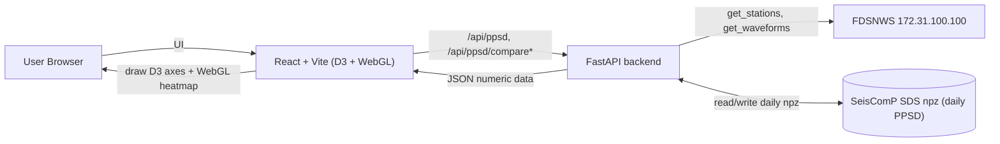
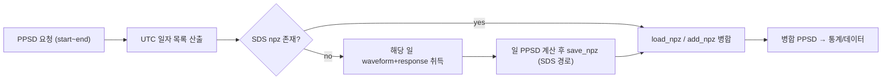

# PPSD 확장: SDS 저장 · D3/WebGL 렌더링 · 음압 소음모델

초기 PPSD Web Viewer 구축(원 계획: `plan.html`) 이후 추가된 세 가지 기능의 계획과 구현 결과입니다.

- 상태 표기: [x] 구현 완료
- 스택: FastAPI + ObsPy (백엔드), React + Vite + TypeScript + D3.js + WebGL (프론트엔드)

---

## 아키텍처 변경 요약



- 백엔드는 더 이상 matplotlib PNG를 렌더링하지 않고 수치 데이터(JSON)를 반환합니다.
- 캐시는 단일 해시 npz에서 SeisComP SDS 구조의 일 단위 npz로 변경되었습니다.

---

## Feature 1 — SeisComP SDS 구조로 일 단위 PPSD npz 저장/재사용

요청 시간창을 UTC 하루 단위로 나눠 각 날짜 PPSD를 한 번만 계산해 SDS 경로에 저장하고,
이후 요청은 저장된 일자 파일을 재사용/병합합니다.



- [x] `backend/app/config.py`: `PPSD_SDS_DIR`(기본 `backend/sds`) 추가.
- [x] `backend/app/services/sds_store.py` 신규: `sds_npz_path(...)`, `iter_utc_days(start, end)`.
- [x] SDS 경로 형식:
  `<SDS>/<YEAR>/<NET>/<STA>/<CHAN>.D/<NET>.<STA>.<LOC>.<CHAN>.D.<YEAR>.<JULDAY>.npz`
  (예: `IU.ANMO..BHZ.D.2024.001.npz`).
- [x] `backend/app/services/ppsd_service.py`의 `compute_or_load` 재작성:
  일자별 계산·저장 → `PPSD.load_npz` + `add_npz` 병합. 데이터 없는 일자는 건너뜀.
- [x] Multi / Compare Station / Compare Time 모두 `compute_or_load`를 통해 일 단위 캐시 재사용.

동작 노트: 부분 일(day) 요청도 교차하는 UTC 하루 전체를 계산/재사용하므로, 결과는
요청과 겹치는 날짜들의 PPSD 통계입니다(IRIS/SeisComP 일 PPSD 관행과 동일).

---

## Feature 2 — D3.js + WebGL 프론트엔드 렌더링 (백엔드 PNG 제거)

백엔드는 수치 데이터(JSON)만 제공하고, 브라우저가 동일한 형식으로 그립니다.
밀집 히트맵(pcolormesh)은 WebGL, 축/그리드/곡선/컬러바/범례는 D3가 담당합니다.

### 백엔드
- [x] `backend/app/services/ppsd_data.py` 신규:
  `ppsd_heatmap_data(...)`(히트맵 셀·오버레이·소음모델·축), `compare_curves_data(...)`(비교 라인).
- [x] `backend/app/models/schemas.py`: `PPSDResponse.image_url` → `data`,
  `BatchPPSDItem.image_url` → `data`, `CompareResponse.image_url` → `data`.
- [x] `backend/app/api/ppsd.py`: matplotlib 렌더링·PNG 캐시·이미지 GET 엔드포인트 제거, 데이터 반환.
- [x] `backend/app/services/plotting.py` 삭제(matplotlib 의존 렌더러 제거).

### 프론트엔드
- [x] 의존성 `d3` 추가.
- [x] `frontend/src/charts/colormap.ts`: viridis/plasma/inferno/magma/cividis/gray LUT.
- [x] `frontend/src/charts/webglHeatmap.ts`: 순수 WebGL quad 배치 렌더러.
- [x] `frontend/src/charts/exportPng.ts`: WebGL 캔버스 + SVG 오버레이 합성 → PNG 다운로드.
- [x] `frontend/src/components/PPSDChart.tsx`(히트맵), `CompareChart.tsx`(라인) 신규.
- [x] `PPSDResult.tsx` / `BatchResultGrid.tsx` / `CompareStationTab.tsx` / `CompareTimeTab.tsx`에서
  `` 제거 → 차트 컴포넌트 사용. `client.ts`는 데이터 타입으로 교체(`imageUrl` 제거).

---

## Feature 3 — 음압(pressure) 국제표준 인프라사운드 소음모델 / 인프라사운드 채널 처리

인프라사운드 채널(SEED 계기코드 `D`: `BDF`, `HDF`, `LDF` 등)을 지진계처럼 처리하면
응답 제거 시 가속도로 이중 미분되어 왜곡됩니다. 이를 압력 PSD로 올바르게 처리합니다.

- [x] `yaxis_units.is_infrasound_channel`: 채널 계기코드로 인프라사운드 판별.
- [x] `ppsd_service._compute_day`: 인프라사운드 채널은 `special_handling="infrasound"` +
  압력용 `db_bins=(-120, 80, 1)`로 PPSD 생성(미분 없음). 그 외는 기존 지진계 처리.
- [x] `ppsd_service._get_or_build_day`: 저장된 npz의 `special_handling`이 채널 기대값과
  다르면(구버전 캐시) 자동 재계산.
- [x] `ppsd_data.py`: 인프라사운드 채널은 Y축을 `pressure`로 강제, 히스토그램을
  확률[%]로 정규화(`count*100/n_segments`), 소음모델은 ObsPy 내장
  **IDC 전지구 인프라사운드 Low/High 모델**(Brown et al. 2012) 사용.
- [x] 프론트 컬러바 도메인을 `[0, vmax]`(=%)로 수정.

---

## 검증

- [x] 프론트엔드 `npm run build`(tsc + vite) 통과.
- [x] 백엔드 conda 환경(`PPSD`) 모듈 import 통과.
- [x] `iter_utc_days` / `sds_npz_path` / 음압 모델 스모크 테스트 통과.

## 실행 방법

```powershell
# 백엔드 (conda env PPSD)
cd backend
uvicorn app.main:app --reload --host 0.0.0.0 --port 8000

# 프론트엔드
cd frontend
npm run dev
```
