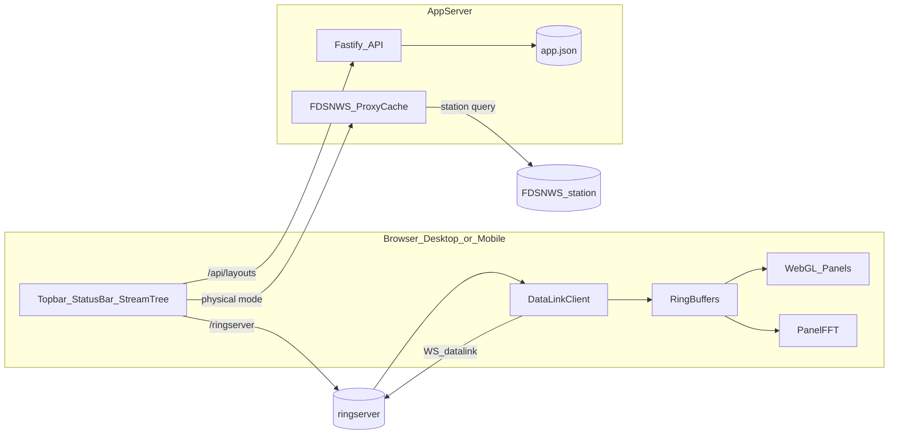

# RingWave — ringserver 실시간 WebGL 파형 뷰어 (v1.2)

| 항목 | 내용 |
|------|------|
| 앱 / 문서 버전 | **1.2.0** |
| 작성일 | 2026-07-31 |
| 최종 갱신 | 2026-08-07 |
| 프로젝트 경로 | `C:\Users\bikim\Dev\ringserver_seedlink_websocket` |
| 개발 Conda 환경 | `ringserver_seedlink_websocket` (Python 3.12) |
| 참고 | [EarthScope/ringserver](https://github.com/EarthScope/ringserver) |

---

## 1. 목표

특정 서버에서 동작 중인 **ringserver**의 WebSocket(**DataLink**)으로 실시간 miniSEED를 수신하고, 웹 브라우저에서 **고성능 WebGL 파형**으로 표출하는 모니터링 애플리케이션(**RingWave**)을 구축한다.

핵심 요구 (v1.0 충족):

1. Network → Station → Channel 트리에서 다중 선택 후 Plot
2. 사용자 지정 레이아웃 목록으로 즉시 표출
3. 레이아웃 생성 / 수정 / 삭제
4. 웨이브폼 길이(duration) 지정 및 타임윈도우 줌 스텝
5. 웨이브폼 갱신 인터벌 설정
6. 파형 패널 삭제 및 위치 이동(DnD)
7. 웨이브폼 일시정지(화면 freeze) + 일시정지 중 마우스 줌
8. 선택 채널 현재 구간의 FFT (패널 내 Log–Log)
9. 데이터 공백(갭) 배지 표시
10. 설정 모달에서 ringserver/FDSNWS URL, X축 앵커, 색상, 패널 상한 등 제어
11. WebSocket 끊김 시 자동 재연결 (상태바에 상태 표시)
12. 모바일 반응형 열람

---

## 2. 확정 결정 사항 (v1.0 as-built)

| 항목 | 결정 |
|------|------|
| 접속 | 백엔드 **동적 프록시** (`/ringserver`, `/fdsnws`, `/api`). ringserver·FDSNWS URL은 `.env` 시드 + **설정 모달** |
| 프로토콜 | **DataLink 전용** (SeedLink UI/클라이언트 미포함) |
| UI 배치 | 탑바: 브랜드 · 레이아웃 · 설정 아이콘 / 상태바: 연결·타임윈도우·줌·일시정지·Raw/Physical / 좌측: Stream 트리 (모바일 드로어) |
| 레이아웃·설정 저장 | Fastify + **JSON** (`backend/data/app.json`). 레거시 SQLite는 1회 마이그레이션만 |
| 차트 | **webgl-plot** (공유 WebGL 캔버스 1개) |
| 진폭 | 기본 **Raw counts** / 토글 **Physical** (FDSNWS StationXML 감도) |
| X축 오른쪽 기준 | `now` \| `lastData` (기본 `lastData`, 설정 모달) |
| 일시정지 | 화면만 freeze, 버퍼·수신 유지 → 재개 시 최신 윈도우로 점프 |
| 일시정지 줌 | 좌클릭 드래그=줌인, 좌클릭 더블클릭=줌아웃(스택), 재개 시 원복 |
| 연결 직후 | ringserver ring의 최근 구간부터 채운 뒤 live |
| FFT | 우클릭으로 패널 전환, Hann 창, **Log F × Log Power(dB)** |
| 갭 알림 | 패널 헤더 `GAP N` 배지 |
| Auth | 1차 미구현 (확장 자리만) |
| 기본 duration / interval | **300초 / 0.5초 (500ms)** |
| duration UI 스텝 | 15 … **7200초** (백엔드 상한 86400 유지) |
| 최대 패널 | 설정 변경 가능, **하드 상한 50** (초기 기본 16) |
| FDSNWS 기본 URL | `http://172.31.100.100/fdsnws` |
| 개발 환경 | Conda `ringserver_seedlink_websocket`, Python 3.12 (문서·보조 스크립트). 앱 런타임은 Node.js |

---

## 3. 시스템 아키텍처



### 3.1 구성 요소

| 계층 | 기술 | 역할 |
|------|------|------|
| Frontend | React 18, Vite, TypeScript, webgl-plot, seisplotjs(miniseed) | UI, DataLink WS, WebGL 렌더, FFT |
| Backend | Node.js, Fastify, JSON 저장소 (`backend/data/app.json`) | 레이아웃/설정 API, ringserver·FDSNWS 동적 프록시(HTTP/WS), 메타 캐시 |
| 외부 | ringserver | `/streams/json`, `/datalink` |
| 외부 | FDSNWS | `station/1/query` (InstrumentSensitivity) |
| 도구 | Conda env `ringserver_seedlink_websocket` (Python 3.12) | 계획서 HTML 생성, 추후 유틸/검증 스크립트 |

브라우저는 ringserver·fdsnws에 직접 연결하지 않는다. Fastify가 `settings`에 저장된 URL로 **HTTP·WebSocket을 동적 프록시**한다.

---

## 4. 기능 상세

### 4.1 Stream 트리 · Plot

- `GET /ringserver/streams/json`으로 스트림 목록 수집
- Network → Station → Channel 그룹 트리, 다중 선택
- Plot으로 메인 영역에 패널 추가 및 구독
- 패널 수 ≥ `maxPanels`(최대 50)이면 Plot 차단 + 안내
- 데이터 없을 때 패널에 `데이터 없음` 표시, 평탄선 숨김

### 4.2 사용자 레이아웃 (CRUD)

- `app.json`의 `layouts` 배열에 저장 (이름, payload JSON, 생성/수정 시각)
- payload: 채널 순서, duration, interval, amplitudeMode, xAxisRightAnchor, 색상 등
- 탑바 **레이아웃** 드롭다운: 생성 · 수정 · 삭제 · 목록 선택 · 불러오기
- 목록 더블클릭 또는 불러오기로 파형 일괄 로드

### 4.3 설정 모달

탑바 **설정 아이콘(톱니)** 으로 연다. 배경 클릭으로 닫히지 않으며 ✕ / 저장 / 닫기만 가능.

| 설정 | 설명 |
|------|------|
| ringserver URL | `.env` 시드, 모달 수정 → 저장소 반영 → 프록시 즉시 반영, WS 재연결 |
| FDSNWS URL | 동일 패턴 |
| durationSec | 기본 300, UI 스텝 상한 7200, 백엔드 clamp 86400 |
| refreshIntervalMs | 기본 500 |
| maxPanels | 1–50 |
| xAxisRightAnchor | `now` / `lastData` |
| waveformColors | 팔레트 · 갭색 · 선택 하이라이트 |
| 연결 테스트 | `/streams/json` 헬스체크 |

대용량 duration×채널 조합 시 예상 메모리 표시 및 임계값 초과 경고.

> Raw / Physical은 설정 모달이 아니라 **상태바 우측 토글**로 전환한다 (기본 Raw).

### 4.4 상태바 · 타임윈도우 · 일시정지

| 컨트롤 | 동작 |
|--------|------|
| 연결 pill | connecting / connected / reconnecting / disconnected / error |
| ⏱ 타임윈도우 | 모달에서 직접 지정 |
| 줌인 / 줌아웃 | `TIME_WINDOW_STEPS`(15…7200초) 스텝 |
| 일시정지 / 재개 | 화면 freeze / 최신 윈도우 점프 |
| Raw ↔ Physical | 진폭 모드 토글 (기본 Raw) |

### 4.5 일시정지 중 마우스 줌

- **좌클릭 드래그**: 선택 구간으로 줌인 (스택 push). 해당 시각의 파형이 버퍼에서 정확히 잘려 표출됨
- **좌클릭 더블클릭**: 줌아웃 (스택 pop)
- **우클릭 드래그**: FFT용 구간 선택(기존) — 줌과 분리
- 재개(재생) 시 줌 스택 클리어 후 라이브 윈도우로 복귀

### 4.6 FFT

- 패널 우클릭으로 해당 패널 FFT 토글
- 현재 표시 윈도우 구간, Hann window
- **Log 주파수 × Log Power(dB)** 축·눈금
- 샘플 부족 / 무데이터 시 안내 문구

### 4.7 데이터 공백(갭)

- 연속 패킷 `end → start` 간격 > `1.5 / sampleRate` 이면 갭
- 패널 헤더 `GAP N` 배지 (파형 위 빨간 구간 오버레이는 v1.0 미포함)

### 4.8 WebSocket 끊김 · 재연결

| 상태 | 의미 |
|------|------|
| connecting | 연결 시도 중 |
| connected | 정상 |
| reconnecting | 자동 재연결 중 |
| disconnected | 연결 끊김 |
| error | 오류 |

- **자동 재연결**: 지수 백오프 (1s → 2s → 4s … 상한 30s)
- 성공 시 이전 구독 SCNL 복원 + 가능 범위 과거 채움 후 live
- 상태바에 상태·상세 문구 표시 (재접속 모달 / 수동 재접속 버튼은 v1.0에서 제거)
- `online` 이벤트 시 재연결 시도
- 사용자 의도적 disconnect는 자동 재연결하지 않음 (Pause와 구분)

### 4.9 웨이브폼 색상 · 시간축

- 팔레트 모드: N색 순환, 설정에서 편집 가능
- 갭색 · FFT 선택 하이라이트색
- X축: 차트 하단 라벨 한 줄 + 중간 tick + 세로 보조선
- 패널 오버레이 높이는 WebGL 균등 분할(`flex: 1`)과 일치

### 4.10 모바일

- 좁은 화면: 햄버거 + 풀스크린 드로어(Stream 트리)
- 레이아웃 드롭다운은 viewport 기준 fixed로 잘림 방지
- 파형 세로 스크롤, 터치 타깃 확보
- WebGL `devicePixelRatio` 보정(상한 2), 회전 시 리레이아웃

---

## 5. 프로토콜 계층

공통 인터페이스 `RealtimeClient` (구현체: **DataLink only**):

- `connect()` / `disconnect()`
- `subscribe(channels: SCNL[])` / `unsubscribe`
- `onPacket(scnl, samples, startTime, sampleRate)`
- 연결 직후 ring **과거 채움** 후 live (DataLink MATCH/위치)

seisplotjs `miniseed` 디코드와 DataLink WebSocket을 활용한다.

---

## 6. 데이터 · 렌더 파이프라인

1. `/ringserver/streams/json` → 트리
2. Plot / 레이아웃 로드 → 구독 + 과거 채움 (ringserver ring 한도 내)
3. 채널별 ring buffer + 갭 메타
4. `refreshIntervalMs`(기본 500ms)마다 표시용 버퍼 → WebGL 업로드
5. Pause / Resume / 줌 뷰, raw/physical, FFT, 갭 배지

`copyAlignedWindow(windowEndMs, durationSec)`는 줌으로 과거 구간을 볼 때도 `windowStart`까지 lookback하여 해당 시각 샘플을 추출한다.

### 6.1 성능 · 메모리 (100 sps × 50 ch × 긴 윈도우)

| 시나리오 | 샘플 수 | 원본 Float32 (대략) |
|----------|---------|---------------------|
| 16ch × 100sps × 300s | 4.8e5 | ≈ 2 MB |
| 50ch × 100sps × 600s | 3.0e6 | ≈ 12 MB |
| 50ch × 100sps × 86400s | 4.32e8 | ≈ **1.7 GB** (경고 대상) |

**확정 전략**

1. **공유 WebGL 캔버스 1개** — 패널당 WebGL 컨텍스트 금지
2. **픽셀 다운샘플**만 GPU 업로드 (duration과 무관하게 ~채널당 수천 점)
3. ring capacity는 **현재 duration×sampleRate** 기준 할당
4. 샘플을 React state에 넣지 않음; TypedArray 재사용; 단일 타이머/rAF — **메모리 누수 방지**

---

## 7. 백엔드 · 저장소

### 7.1 저장 구조 (`backend/data/app.json`)

- `settings` — ringserverUrl, fdsnwsUrl, duration, interval, maxPanels, amplitudeMode, xAxisRightAnchor, colors 등
- `layouts[]` — id, name, created_at, updated_at, payload_json
- `meta_cache` — SCNL별 sensitivity / input_units 캐시

레거시 `app.db`(SQLite)가 있으면 최초 기동 시 JSON으로 마이그레이션할 수 있다.

### 7.2 API

- `GET/POST /api/layouts`, `GET/PUT/DELETE /api/layouts/:id`
- `GET/PUT /api/settings`
- `POST /api/settings/test-ringserver`
- `GET /api/settings/limits`
- `GET /api/meta/sensitivity?net&sta&loc&cha`
- 프록시: `/ringserver/*` → `settings.ringserverUrl`, `/fdsnws/*` → `settings.fdsnwsUrl` (WS 포함)

### 7.3 물리량

```
physical = counts / sensitivity
```

StationXML InstrumentSensitivity 기준. 메타 실패 시 패널 경고 + raw fallback. FDSNWS URL 변경 시 캐시 무효화.

---

## 8. 디렉터리 구조 (요약)

```
ringserver_seedlink_websocket/
  plan.md / plan.html / README.md
  .env.example
  frontend/src/
    api/client.ts
    realtime/{datalinkClient,reconnectController,timeWindow,miniseed}.ts
    buffer/ringBuffer.ts
    render/{sharedWebglPlot,downsample,fft}.ts
    store/appStore.ts
    components/
      layout/{AppShell,LayoutMenu}.tsx
      connection/StatusBar.tsx
      Sidebar/{StreamTree,SettingsPanel}.tsx
      Waveform/{WaveformStack,PanelFftCanvas}.tsx
  backend/src/
    index.ts, db.ts, defaults.ts
    routes/{layouts,meta,settings}.ts
    proxy*.ts
  backend/data/app.json
  scripts/build_plan_html.py
```

---

## 9. 환경 변수 · 런타임 기본값

```env
RINGSERVER_URL=http://localhost:18000
FDSNWS_URL=http://172.31.100.100/fdsnws
DATABASE_PATH=backend/data/app.json
PORT=8787
```

| 키 | 기본값 |
|----|--------|
| ringserverUrl | env `RINGSERVER_URL` 시드 |
| fdsnwsUrl | env `FDSNWS_URL` 시드 |
| durationSec | 300 (백엔드 상한 86400) |
| refreshIntervalMs | 500 |
| maxPanels | 16 (상한 50) |
| amplitudeMode | **raw** |
| protocol | datalink (고정) |
| xAxisRightAnchor | lastData |
| waveformColors | 팔레트 + gapColor + selectionColor |

### Conda 환경

```bash
conda activate ringserver_seedlink_websocket
python --version   # Python 3.12.x
```

앱 서버/프론트 실행에는 Node.js를 사용한다. Conda는 계획서 빌드·보조 Python 스크립트용이다.

---

## 10. 제외 · 이후 확장

- SeedLink 프로토콜 UI/클라이언트
- ringserver Auth UI
- FDSNWS 전체 response stage 체인 정밀 보정 (1차는 InstrumentSensitivity 스케일)
- 갭 빨간 구간 파형 오버레이
- 재접속 경고 모달 / 수동 재접속 버튼 UI
- 채널별 색상 피커 UI
- Docker 배포 패키징 (요청 시)

---

## 11. 성공 기준 (v1.0)

- DataLink로 실시간 파형이 버벅임 없이 스크롤됨
- 16채널·100–200Hz·300s·0.5s 갱신에서 안정 동작; 50채널·긴 duration에서도 다운샘플·공유 WebGL로 표출 가능
- 레이아웃 CRUD 및 설정 모달 URL/색상/패널상한/X앵커 변경 반영
- WS 끊김 시 자동 재연결 및 상태바 표시
- 일시정지 중 구간 줌 시 해당 시각 파형 표출
- 데스크톱·모바일에서 주요 기능 사용 가능
- 레이아웃/패널 반복 토글 후 명확한 메모리 누수 없음

---

## 12. 히스토리

### v1.2.0 — 2026-08-07

밴드패스 필터 UI·DSP.

- 상태바 필터 아이콘, 기본 Off
- 지진 3 + 공중음파 3 builtin 프리셋, 커스텀 추가/삭제 (`app.json`)
- Butterworth 4차 zero-phase(filtfilt)를 draw-time에 적용 — 파형·FFT 공통

### v1.1.0 — 2026-08-04

상태바·모바일 제스처·Y축 스케일 UX 보강.

- 모바일 일시정지: 핀치 아웃/인 줌, 더블탭 초기화, 줌 후 한손가락 좌우 팬
- Y축 Scale 아이콘: Auto(기본) / Uniform(최대 진폭 패널 기준)
- Raw/Physical → Calibration 아이콘으로 변경, 상태바 좌측 배치
- 전체 스트림 닫기(✕✕), 확인 후 `clearAllPanels`
- 모바일 설정 모달 safe-area·글꼴 밀도 조정으로 하단 버튼 잘림 완화
- `copyAlignedWindow` lookback으로 줌 구간 파형 표출 보정

### v1.0.0 — 2026-08-04

첫 정식 릴리스. 계획 대비 프로토콜·저장소·UI를 as-built로 정리하고 문서·버전을 동기화했다.

**핵심**

- DataLink 실시간 수신 + 공유 WebGL 파형 스택
- Stream 트리 Plot, 레이아웃 CRUD (`app.json`)
- 설정 모달(톱니 아이콘), 상태바 타임윈도우/줌/일시정지/Raw·Physical
- X축 앵커(`now`/`lastData`), 시간축 눈금·보조선
- 일시정지 중 마우스 줌(해당 시각 파형 표출), 패널 FFT(Log–Log dB)
- 갭 배지, 자동 재연결, 모바일 드로어

**계획 대비 변경 요약**

| 당초 계획 | v1.0 |
|-----------|------|
| DataLink + SeedLink | DataLink 전용 |
| SQLite | JSON (`app.json`) |
| 사이드바 설정/레이아웃 | 탑바 레이아웃 + 설정 모달 |
| 재접속 모달·수동 재접속 UI | 자동 재연결 + 상태바만 |
| FFT 별도 패널 | 패널 내 우클릭 FFT |
| 갭 빨간 오버레이 | 배지만 |
| amplitudeMode 설정창 | 상태바 토글 (기본 Raw) |

### 개발 타임라인 (요약)

| 시기 | 내용 |
|------|------|
| 2026-07-31 | 최종 계획서 작성, monorepo·Fastify 프록시·DataLink·WebGL 스캐폴드 |
| 2026-08-01~02 | Stream 트리, ring buffer, 다중 패널, duration/interval, 레이아웃 CRUD, 색상 |
| 2026-08-02~03 | FDSNWS 물리량, FFT, 갭 배지, X축 앵커, 상태바 UX, JSON 저장 확정 |
| 2026-08-03~04 | 타임윈도우 스텝, Raw/Physical 토글, 설정 아이콘, 일시정지 마우스 줌, 줌 구간 파형 보정, 문서 v1.0 |

### 변경 상세 (기능 단위)

1. **저장소**: SQLite → `backend/data/app.json` (네이티브 빌드 도구 불필요)
2. **프로토콜**: SeedLink 제거, DataLink 고정
3. **레이아웃 API**: 빈 body DELETE, JSON create 등 오류 수정
4. **X축**: `xAxisRightAnchor` (`now` / `lastData`), 하단 라벨·tick·그리드
5. **설정 UI**: 사이드바 → 모달, 배경 클릭 닫기 방지, 탑바 톱니 아이콘
6. **상태바**: 타임윈도우 모달, 줌인/아웃 스텝(15…7200s), 전역 일시정지, Raw/Physical 토글
7. **진폭 기본값**: `amplitudeMode = raw`
8. **FFT**: Log F × Log Power(dB), 패널 우클릭 토글
9. **빈 데이터**: `데이터 없음` + 평탄선 숨김
10. **일시정지 줌**: 드래그 줌인 / 더블클릭 줌아웃 / 재개 시 원복
11. **줌 데이터**: `copyAlignedWindow` lookback으로 과거 구간 샘플 정확히 추출
12. **재접속 UI**: 모달·수동 버튼 제거, 자동 재연결 유지
13. **모바일**: 드로어, 레이아웃 드롭다운 fixed 위치 보정
14. **패널**: HTML5 DnD 순서 변경, 오버레이·WebGL 높이 정렬
