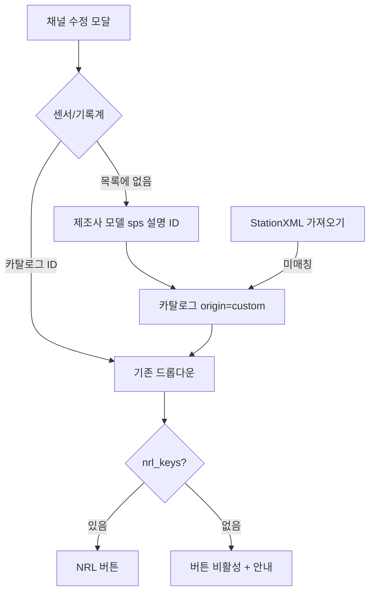

# NRL에 없는 장비 — 사용자 정의 메타데이터

상태: **결정 확정, 구현 완료**.

2026-08-17 사용자 확인: Q1–Q9 모두 제안값.  
Q1-A, Q2-A, Q3-A, Q4-A, Q5-B, Q6-A, Q7-C, Q8-A, Q9-A.

NRL 사전에 없는 센서·기록계도 제조사·모델·일련번호 등을 넣고, StationXML 장비 칸에 나가게 한다. 채널의 `extra` 키-값은 만들지 않는다 (v1 결정 4). 이 단계에서는 **메타데이터만** 다룬다. 응답을 처음부터 만드는 화면은 두지 않는다.

구현 순서(Q7-C): **이 문서 → 응답 곡선 → dataless SEED**. 세 단계 모두 구현 완료.

---

## 지금 빈칸

카탈로그에는 이미 NRL 키 없는 항목을 넣을 수 있다 (`nrl_keys` 빈 값, 카탈로그 탭 추가). 그래도 아래가 막혀 있다.

| 상황 | 지금 |
|------|------|
| 채널 수정 | 카탈로그 ID 드롭다운만. 목록에 없으면 제조사·모델을 채널에서 바로 못 넣음 |
| StationXML 가져오기 | 제조사·모델이 카탈로그와 안 맞으면 `sensor_id`/`datalogger_id`가 비고, **제조사·모델 문자열은 버려짐**. 일련번호·유형만 채널에 남음 |
| 엑셀 | 카탈로그에 없는 ID는 거절 |
| NRL 버튼 | 키가 없으면 400 |
| 응답 | NRL 키가 없으면 응답을 새로 만들 방법이 없음 (가져오기 blob 또는 이후 PZ 편집) |

시드 YAML에도 키가 빈 장비가 있다 (`Trillium120QA`, `Centaur`, `Episensor` 등). 메타데이터는 되지만 NRL·곡선·dataless는 응답이 따로 있어야 한다.

---

## 확정 결정

| # | 결정 | 이유 |
|---|------|------|
| C1 | 채널 장비 FK는 계속 카탈로그 ID만. 제조사·모델을 채널에 두지 않음 (Q1-A) | v1 결정 4, 엑셀 드롭다운, 재사용 |
| C2 | 카탈로그에 `origin` (`seed` / `custom`)과 선택 `description` | NRL 시드와 현장 장비를 구분. 임의 키-값은 없음 |
| C3 | NRL 키는 선택. 없으면 NRL 적용 불가 | 지금 `apply_nrl`과 같음 |
| C4 | 채널 모달에 **목록에 없음** → 제조사·모델·(기록계 sps)·설명·ID(선택) | 카탈로그 탭을 몰라도 입력 가능 |
| C5 | StationXML/SEED 미매칭 장비는 custom 카탈로그로 승격 (Q3-A) | 제조사·모델이 사라지지 않게 |
| C6 | 엑셀 채널 시트에 제조사·모델 열을 열지 않음. 없는 ID는 거절 (Q4-A) | 스키마 고정. 카탈로그 시트 / 웹으로만 추가 |
| C7 | 이 단계는 메타데이터만 (Q2-A). `POST .../custom-response` 없음 | 응답 생성은 이후 PZ(`edited`) 또는 가져오기/`nrl` |
| C8 | `response_source`에 `custom`을 추가하지 않음 | 출처는 `none` / `imported` / `nrl` / (이후) `edited` |
| C9 | ID를 비우면 `CUSTOM_{제조사}_{모델}` (기록계는 `_100sps`). 충돌 시 `_2`. 사용자가 쓰면 그 값 (Q5-B) | 입력 부담을 줄이되 덮어쓰기는 허용 |
| C10 | NRL 키 없으면 버튼 비활성 (Q6-A) | 눌러서 400을 내지 않음. API 가드는 유지 |
| C11 | 카탈로그에 NRL 키를 나중에 넣어도 채널 응답은 덮지 않음 (Q9-A) | 명시적 NRL 버튼만 응답을 바꿈 |
| C12 | 응답 곡선 겹치기 최대 8채널 (Q8-A) | [`RESPONSE_CHART.md`](RESPONSE_CHART.md) R3 |

채택하지 않은 것: 채널에 제조사·모델 직접 저장(Q1-B/C), 같은 화면에서 응답 생성·Response 조각 업로드(Q2-B/C/D), 엑셀 채널 행으로 장비 자동 생성(Q4-B/C), NRL 키 저장 시 전 채널 재적용(Q9-B).

---

## 화면

채널 수정:

- 센서/기록계 `<select>` 마지막에 `목록에 없음…`.
- 고르면 같은 모달에 제조사·모델 필수, 기록계는 sps 필수, 설명·ID 선택.
- ID를 비우면 `CUSTOM_{제조사}_{모델}` (기록계는 `CUSTOM_REFTEK_RT130_100sps`처럼 sps를 붙임). 이미 있으면 `_2`.
- 저장 시 카탈로그 POST 후 그 ID를 채널에 넣는다. 제조사·모델·sps가 이미 있으면 그 행을 쓰고 새로 만들지 않는다 (대소문자 무시, 기록계는 sps 포함).
- 드롭다운 라벨: NRL 키가 있으면 `Guralp_CMG-3T (NRL)`, 없으면 `Acme_Geophone (사용자 정의)`.
- NRL 키가 센서 또는 기록계 중 하나라도 없으면 NRL 버튼 비활성. 안내: `이 장비는 NRL 키가 없습니다. StationXML/SEED로 응답을 가져오거나, 카탈로그에 키를 넣은 뒤 적용하세요.`

카탈로그 탭:

- `origin` 열: 시드 / 사용자 정의.
- 설명 칸. NRL 키는 계속 선택. 키를 나중에 넣어도 사용 중 채널의 `response_xml`은 그대로 (C11).
- 사용 중 삭제 금지는 그대로.

관측소 탭에는 장비 입력을 두지 않는다.

---

## 데이터

`equipment_catalog`에 열 추가 (SQLite는 앱 시작 시 `ALTER` 또는 재생성 안내).

| 열 | 형 | 설명 |
|----|----|------|
| `origin` | `String(16)` 기본 `seed` | `seed` 또는 `custom` |
| `description` | `Text` 선택 | 비고. 응답 수식은 넣지 않음 |

기존 시드 행은 `origin=seed`. YAML 시드에도 `origin`은 넣지 않고 적재 시 `seed`로 둔다.

채널 테이블은 그대로다. 일련번호·유형·설치/철거일은 지금처럼 채널 칸.

허용 메타데이터 (고정 스키마, extra 없음):

- 카탈로그: ID, 제조사, 모델, 기록계 sps, NRL 키(선택), 설명, origin
- 채널: 일련번호, 유형, 설치일, 철거일

넣지 않는 것: 임의 JSON, 벤더 URL, 채널별 제조사 덮어쓰기.

---

## API

기존 `POST /api/catalog`에 `origin` (웹에서 만들면 기본 `custom`, 시드만 `seed`), `description`. ID가 비면 서버가 C9 규칙으로 채운다.

채널 저장은 지금처럼 `sensor_id` / `datalogger_id`만. “목록에 없음”은 프론트가 카탈로그를 만든 뒤 ID를 넣는다.

가져오기 경고 예: `KG.SEO.--.HHZ: 카탈로그에 없는 센서 Guralp / CMG-3ESP를 사용자 정의 항목 CUSTOM_Guralp_CMG-3ESP로 추가했습니다`.

NRL 키가 없는데 `POST .../apply-nrl` → 400 유지. UI는 버튼을 비활성한다.

`POST /api/channels/{id}/custom-response`는 두지 않는다.

---

## 가져오기 · 내보내기

StationXML / SEED (C5):

1. 지금처럼 제조사·모델·(기록계 sps)로 카탈로그 매칭.
2. 실패하고 제조사·모델이 있으면 custom 항목 생성/재사용 후 ID 연결.
3. 장비 칸이 비어 있으면 ID는 비움 (지금과 같음).
4. 응답 blob이 있으면 `imported` (장비 origin과 무관).

엑셀 (C6): 카탈로그 시트에 `origin`, `description` 열을 추가. 채널 시트는 그대로 ID만. 없는 ID는 400.

내보내기: 카탈로그 제조사·모델이 StationXML `Equipment`로 나간다. custom도 seed와 같다. NRL 키는 StationXML에 쓰지 않는다.

dataless S8: B33 문자열은 카탈로그 제조사·모델. custom도 동일.

---

## 응답 곡선 · SEED와의 관계

- 사용자 정의 장비 + 응답 없음 → 곡선 안내, dataless S11 실패 목록에 그 NSLC.
- 응답을 처음부터 만드는 일은 PZ 구현 때 연다 (`RESPONSE_CHART.md`, `response_source=edited`).
- 겹치기 상한 8은 C12 = R3.

---

## 구현 단계

- [x] `origin` / `description` 열, 카탈로그 API·엑셀 시트, 시드 행은 `seed`.
- [x] 채널 모달 “목록에 없음”, 중복 제조사·모델 재사용, ID 자동(C9).
- [x] StationXML 미매칭 → custom 승격 + 경고 (C5).
- [x] NRL 버튼 비활성 안내 (C10). 카탈로그 키 수정은 채널 blob을 건드리지 않음 (C11).
- [x] README·카탈로그 탭 라벨, 이 문서 체크리스트.

그다음 [`RESPONSE_CHART.md`](RESPONSE_CHART.md), 그다음 [`DATALESS_SEED.md`](DATALESS_SEED.md).

---

## 테스트 (구현 시)

- 목록에 없음 → 카탈로그 `origin=custom` + 채널 ID. ID 생략 시 `CUSTOM_…`.
- 같은 제조사·모델 두 번째 채널은 행을 재사용.
- StationXML 미매칭 장비가 재내보내기에서 제조사·모델이 살아 있음.
- 엑셀에 없는 센서ID는 계속 400.
- NRL 키 없는 항목에 apply-nrl → 400. 키를 나중에 넣어도 기존 `response_xml` 불변.
- 사용 중 custom 항목 삭제 불가.

---

## 이번 범위 밖

- 채널 `extra` 키-값, 알 수 없는 엑셀 열 흡수
- 채널에 제조사·모델 직접 저장
- 같은 화면에서 PZ/게인으로 응답 생성, Response 조각 업로드
- NRL 트리를 앱 안에서 탐색하는 브라우저
- 제조사 로고·데이터시트 파일 첨부
- NRL 키 저장 시 전 채널 자동 재적용
- FIR 계수를 손으로 넣는 기록계 응답 설계기

---

## 위험

| 위험 | 대응 |
|------|------|
| 자동 생성 ID가 시드 ID와 충돌 | 충돌 시 `_2`. 시드 코드와 `CUSTOM_` 접두로 구분 |
| 가져오기마다 custom 행이 늘어남 | 제조사·모델·sps로 재사용 |
| custom만 있고 응답 없음인데 dataless 요청 | S11·S12가 NSLC를 보여 줌 |
| 채널에 제조사 저장으로 바꾸면 엑셀·내보내기 분기 | C1로 고정, 분기 없음 |
