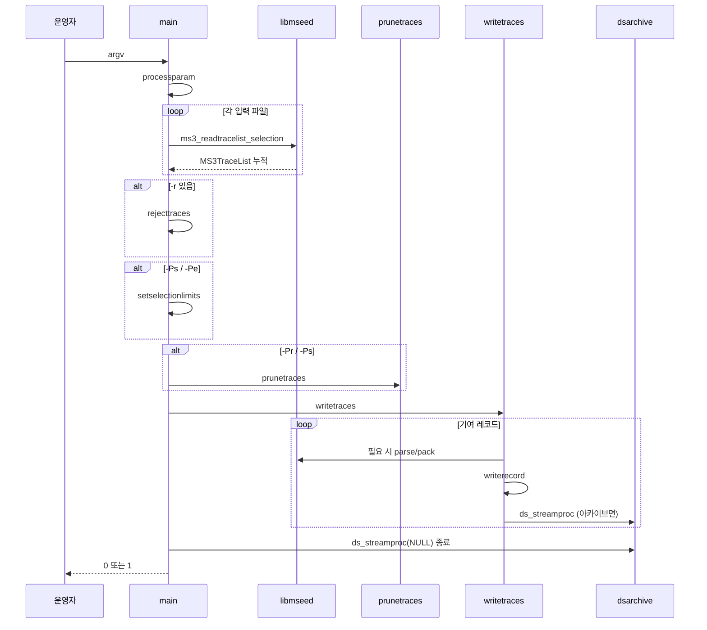

# arc42 — dataselect

이 문서는 [arc42](https://arc42.org/) 12절을 이 포크의 dataselect에 맞춰 채운 것입니다. 다이어그램은 [c4.md](c4.md), 결정의 이유와 결과는 [adr/](adr/) 를 봅니다.

버전: 로컬 4.4.0 (`local.h`). upstream 표시 버전은 4.3.2 (`dataselect.c`).

---

## 1. Introduction and Goals

### 1.1 요구사항

dataselect는 **시크 가능한 miniSEED 파일**에서 부분집합을 고르고, 채널별로 시간 정렬하며, 선택적으로 overlap을 제거한 뒤 새 파일 또는 아카이브 트리로 씁니다. 입력은 변경하지 않습니다.

이 포크의 추가 목표:

* 출력 레코드/블록 크기를 `-B bytes`로 지정 (2의 거듭제곱, 128–131072).
* 샘플 시각·값은 입력과 동일. 바뀌는 것은 프레이밍뿐.
* EarthScope 원본을 다시 가져올 수 있게 `-B`를 `local.c`에 분리.

### 1.2 품질 목표

| 우선 | 품질 | 측정 |
|------|------|------|
| 1 | 시계열 보존 | `compare-series`: 샘플 시각·값이 입력과 동일 |
| 2 | 출력 계약 | `-B`이면 v2 레코드 길이가 모두 요청값. pack 실패 시 원본을 섞지 않음 |
| 3 | 원본 추적성 | `dataselect.c`의 LOCAL 훅만 다르고 `UPSTREAM.md`로 재적용 가능 |
| 4 | 호환 | `-B` 없으면 복사 경로가 byte-identical (시퀀스 포함) |
| 5 | 관측 | 치명 오류는 `ERROR:` 접두사, 종료 코드 1. 성공은 0 |

### 1.3 이해관계자

| 역할 | 관심 |
|------|------|
| 관측망 운영 | SDS/BUD 등 아카이브, 고정 512 블록, 채널별 시퀀스 |
| 분석 사용자 | `-ts/-te`, `-Ps` overlap 제거, 시계열이 안 바뀌는 것 |
| 유지보수 | EarthScope 머지, `make test` |
| EarthScope 원본 | 이 포크와 독립. 훅이 원본 API를 전제로 함 |

---

## 2. Constraints

* **언어/빌드:** C99, GNU make. libmseed는 트리 안에 포함.
* **입력:** 정규 파일만. 파이프, stdin 데이터, URL 입력은 불가. `@list`와 `file:start-end` 바이트 범위는 가능.
* **포맷:** miniSEED 2와 3. v3 CRC 불일치는 `-snd` 없으면 치명.
* **라이선스:** Apache 2.0.
* **프로세스 모델:** 단일 스레드, 한 번의 실행이 입력을 모두 읽은 뒤 씁니다.
* **메모리:** 메인 `MS3TraceList`는 종료 시 free하지 않습니다 (의도적, 프로파일러에는 누수로 보일 수 있음).
* **의존:** 선택적 libcurl은 libmseed URL용. dataselect 자체는 파일 경로만 사용.

---

## 3. Context and Scope

### 3.1 비즈니스 맥락

운영자가 여러 파일·날짜의 miniSEED를 한 채널 시계열로 모으거나, overlap을 제거하고, 저장소가 요구하는 블록 크기(예: 512)로 다시 담습니다.

기술 맥락 다이어그램은 [C4 L1](c4.md#l1--system-context).

### 3.2 범위 밖

실시간 수신, SeedLink, 파형 디스플레이, 메타데이터(StationXML) 편집. 그런 일은 이 모노레포의 다른 트리에서 합니다.

---

## 4. Solution Strategy

1. **레코드 인덱스 먼저, 샘플은 나중** — [ADR 0001](adr/0001-record-list-not-unpacked-samples.md). libmseed가 SourceID·연속성(`-tt/-rt`)으로 세그먼트를 만듭니다.
2. **가지치기는 표시만** — `reclen = 0` 또는 `TimeRange` 경계. 바이트 변경은 쓰기 단계.
3. **한 출력 경로** — `writerecord()`가 `-o`, `-A*`, `-out`을 모두 처리합니다.
4. **로컬 확장 격리** — [ADR 0002](adr/0002-isolate-local-hooks.md). `-B`는 trim과 같은 unpack/pack을 강제하고, 실패는 fatal ([ADR 0004](adr/0004-fatal-repack-no-fallback.md)).
5. **입력 레코드 단위 재패킹** — [ADR 0003](adr/0003-repack-per-input-record.md). 연속 샘플을 모아 채우지 않습니다.
6. **v2 시퀀스 재부여** — `-B`일 때만, 채널별 출력 순 ([ADR 0005](adr/0005-v2-sequence-per-channel.md)).

---

## 5. Building Block View

### 5.1 전체

[C4 L3](c4.md#l3--component) 와 동일합니다.

```
dataselect          실행 파일
├── src/dataselect.c    오케스트레이션, 가지치기, 훅
├── src/dsarchive.c     아카이브 경로와 열린 파일
├── src/local.c         -B 상태와 정책
└── libmseed/           파싱, 트레이스, pack
```

### 5.2 `dataselect.c` 내부 블록

| 블록 | 함수 | 역할 |
|------|------|------|
| CLI | `processparam`, `usage`, `addfile`, `addarchive` | 옵션, 파일 리스트, 아카이브 체인 |
| 읽기 | `main` → `ms3_readtracelist_selection` | 선택 적용하며 트레이스 구성 |
| 거절 | `rejecttraces` | `-r` SourceID 제거 |
| 선택 경계 | `setselectionlimits` | `-Pe/-Ps`용 레코드 `TimeRange` |
| 가지치기 | `prunetraces`, `findcoverage`, `trimtrace` | SourceID 그룹 overlap, 우선순위 |
| 쓰기 | `writetraces`, `trimrecord`, `writerecord` | seek, trim/`-B`, 출력 |
| 요약 | `printwritten` | `-out` / `-outprefix` |

가지치기 우선순위(기본): 높은 publication version(또는 v2 quality), 같으면 긴 세그먼트. `-E`는 버전 동등, `-F`는 파일 순.

### 5.3 `local.c` API

호출부는 훅에서만 이 함수들을 씁니다.

| 함수 | 의미 |
|------|------|
| `local_set_blocksize` | `-B` 파싱 |
| `local_should_unpack` | trim 또는 `-B`이면 unpack |
| `local_encoding_can_pack` / `local_reject_*` | 인코딩 게이트 |
| `local_prepare_pack` | `msr->reclen`을 요청 길이로 |
| `local_incomplete_pack` | 모든 샘플이 나갔는지 |
| `local_discard_original` / `local_pack_fail_is_fatal` | fallback 금지 |
| `local_stamp_v2_sequence` | FSDH 앞 6바이트 |
| `local_note_write` / `local_write_counted` | `-B`일 때 출력 레코드 수 |
| `local_should_parse_packed` | 아카이브/`-out`용 출력 레코드 파싱 |

### 5.4 데이터 구조

[C4 L4](c4.md#l4--code-쓰기-경로) 트리. 프로그램 전용 구조:

* `Filelink` — 입력 경로, 열린 `FILE*`
* `Archive` — `DataStream` 연결 리스트
* `TimeRange` / `Coverage` — 가지치기 경계
* `SidGroup` — 같은 SourceID의 세그먼트 인덱스 (overlap 스캔)
* `WriterData` — `writerecord` 콜백 상태
* `SidSeq` (`local.c`) — 채널 → 다음 v2 시퀀스

---

## 6. Runtime View

### 6.1 정상 실행



### 6.2 `-B` 재패킹

`local_should_unpack`이 참이 되어 모든 기여 레코드가 `trimrecord`로 갑니다. trim 경계가 없어도 unpack합니다. pack 핸들러는 `writerecord`입니다. 한 입력이 여러 출력을 만들면 시퀀스·카운트·아카이브 경로가 **각 출력 레코드** 기준입니다 (`msr3_parse`로 start time을 다시 읽음).

### 6.3 실패

| 상황 | 동작 |
|------|------|
| 파일 읽기/CRC (`-snd` 없음) | 즉시 1 |
| 선택 결과 데이터 없음 | 0, “No data selected” |
| trim 불가, `-B` 없음 | 원본 쓰기, 경고 |
| `-B` pack/인코딩/부분 pack | `-3` → `writetraces` errflag → 1, 원본 미기록 |
| 출력 fwrite/fclose 실패 | errflag, 1 |

---

## 7. Deployment View

빌드 호스트에서 정적 링크된 CLI를 만듭니다. 런타임 서비스는 없습니다.

```
make                 # libmseed + src → ./dataselect
make test            # compare-series + python3 test/run-tests.py
```

배포: 바이너리와 `doc/dataselect.1`을 PATH/MANPATH에 복사. 설치 타깃은 없습니다.

실행 환경: POSIX, 충분한 열린 파일 수 (`setofilelimit`: 입력 수 + 아카이브 50 + 여유). 작업 디렉터리에 `-A`/`-SDS` 트리를 만듭니다.

윤초: `LIBMSEED_LEAPSECOND_FILE`이 있으면 시작 시 로드. 샘플 시각 계산에 영향을 줍니다.

---

## 8. Cross-cutting Concepts

### 8.1 시간 연속성

기본 시간 허용: 샘플 주기의 1/2 (`-tt`). 샘플레이트 허용: 상대 0.0001 (`-rt`). 읽기와 가지치기가 같은 허용을 씁니다 (`MS3Tolerance`, `segtolerance()`).

### 8.2 로깅

`ms_log`. 레벨 2는 `ERROR:` 접두사. `-v`를 반복하면 상세. `-out`은 쓴 구간의 SID, 버전, 시각, 바이트, 샘플 수.

### 8.3 엔디안 / CRC

v2 헤더는 big-endian, v3는 little-endian. `-Q`로 v3 pubversion을 바꾸면 CRC를 다시 계산합니다. v2 시퀀스 스탬프는 CRC가 없는 FSDH 필드입니다.

### 8.4 동시성

없음. 아카이브 열린 파일만 `ds_maxopenfiles`(50)로 제한하고 idle close 합니다.

### 8.5 국제화

CLI 메시지는 영어. 이 포크의 운영 문서(`README.ko.md`, 이 디렉터리)는 한국어입니다.

---

## 9. Architecture Decisions

요약. 전문은 [adr/](adr/).

1. 레코드 리스트 인덱스, 샘플은 쓰기 때 unpack.
2. `-B`는 `local.c`, 원본에는 LOCAL 훅만.
3. 입력 레코드 단위 재패킹, 레코드 병합 없음.
4. `-B` 실패는 fatal, 원본 길이 혼합 금지.
5. v2 시퀀스는 `-B`일 때 채널별 출력 순, 1부터.

---

## 10. Quality Requirements

| ID | 시나리오 | 기대 |
|----|----------|------|
| Q1 | `-B` 없이 복사 | 출력 바이트 = 입력 (`InputForms.test_passthrough_is_byte_identical`) |
| Q2 | `-B 512` 후 시계열 | `compare-series` 성공 |
| Q3 | 지원 안 하는 인코딩 + `-B` | 종료 1, `ERROR` |
| Q4 | 한 4096 장을 `-B 512` | 모든 레코드 512바이트, 시퀀스 1..N |
| Q5 | `-o`와 `-A` 동시 | 같은 페이로드 (레이아웃이 한 파일이면) |
| Q6 | 원본 머지 | `UPSTREAM.md` 훅 재적용 후 `make test` |

테스트 범위와 비범위는 [test/README.md](../../test/README.md).

---

## 11. Risks and Technical Debt

| 리스크 | 설명 | 완화 |
|--------|------|------|
| 훅 누락 | 원본 머지 후 `-B`가 빠짐 | `UPSTREAM.md`, `BlockSize` 테스트 |
| 짧은 꼬리 | 입력 장마다 flush ([ADR 0003](adr/0003-repack-per-input-record.md)) | 현재 의도. 모아서 채우면 ADR 재작성 |
| 시퀀스 × 파일 | 맵이 채널만 키로 씀. SDS 일자 파일에서 번호가 이어질 수 있음 | [ADR 0005](adr/0005-v2-sequence-per-channel.md) 단점 |
| Steim 재압축 | 파형에 따라 장당 샘플 수가 달라짐. 시계열은 유지 | `compare-series`가 샘플을 봄 |
| 부분 출력 | fatal 전에 이미 fwrite된 레코드 | 호출 측에서 출력 파일 처리 |
| 리스트 미해제 | 종료 시 mstl free 없음 | 프로세스가 곧 끝남. 라이브러리 임베드는 비권장 |
| extra header | 리스트에 EH를 안 넣음. trim/`-B` 때 파일을 다시 읽어 파싱 | 입력 파일이 쓰기 동안 그대로여야 함 |
| 테스트 데이터 | `libmseed/test/data`에 의존 | libmseed를 같이 업그레이드 |

---

## 12. Glossary

| 용어 | 의미 |
|------|------|
| SourceID | FDSN 식별자. 예: `FDSN:XX_TEST__B_H_Z` |
| 레코드 / 블록 | 하나의 miniSEED 프레임. `-B`의 bytes |
| 세그먼트 | 허용 오차 안에서 시간 연속인 레코드 열 |
| 가지치기 (prune) | overlap 제거. `-Pr` 레코드, `-Ps` 샘플, `-Pe` 창 가장자리 |
| publication version | v3 필드. v2 quality R/D/Q/M ↔ 1–4 |
| pack / unpack | 샘플 ↔ 인코딩된 레코드 페이로드 |
| SDS | SeisComP Data Structure. `%Y/%n/%s/%c.D/...` |
| LOCAL 훅 | `dataselect.c`의 `>>> LOCAL` 구간 |
| 시퀀스 | v2 FSDH 앞 6자리 ASCII 번호 |
