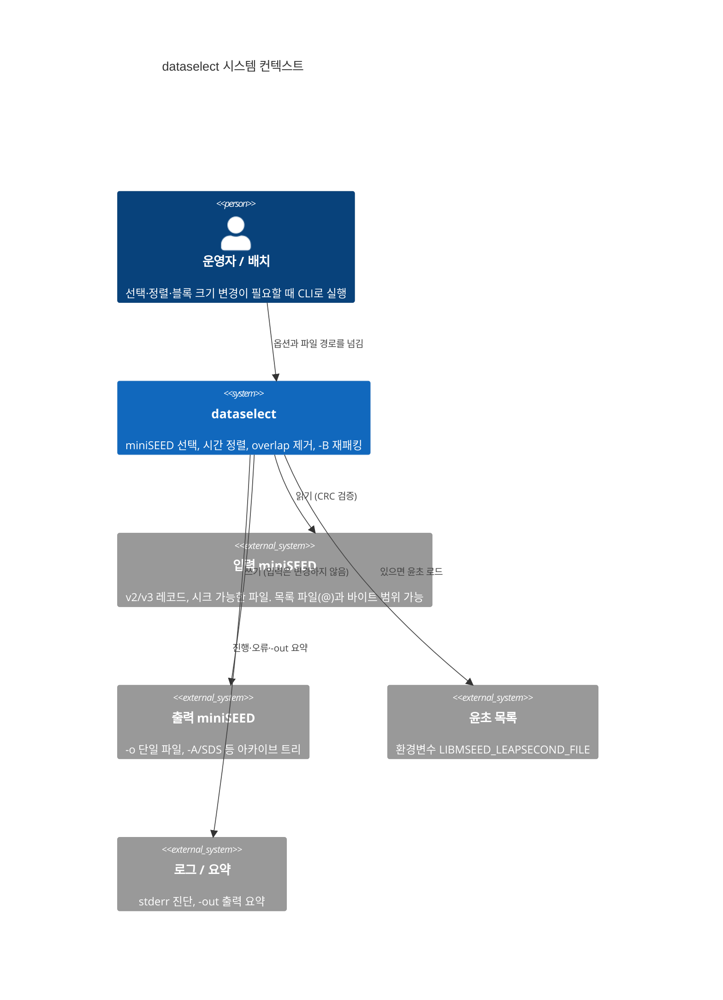
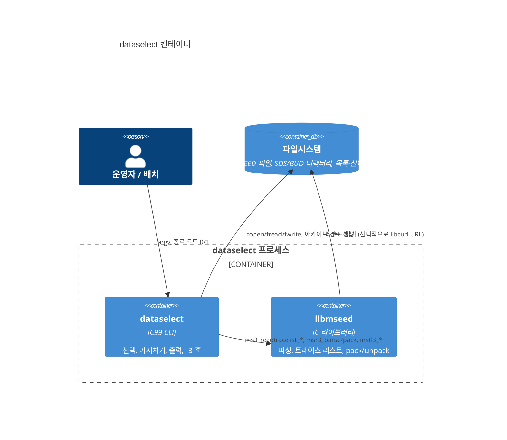
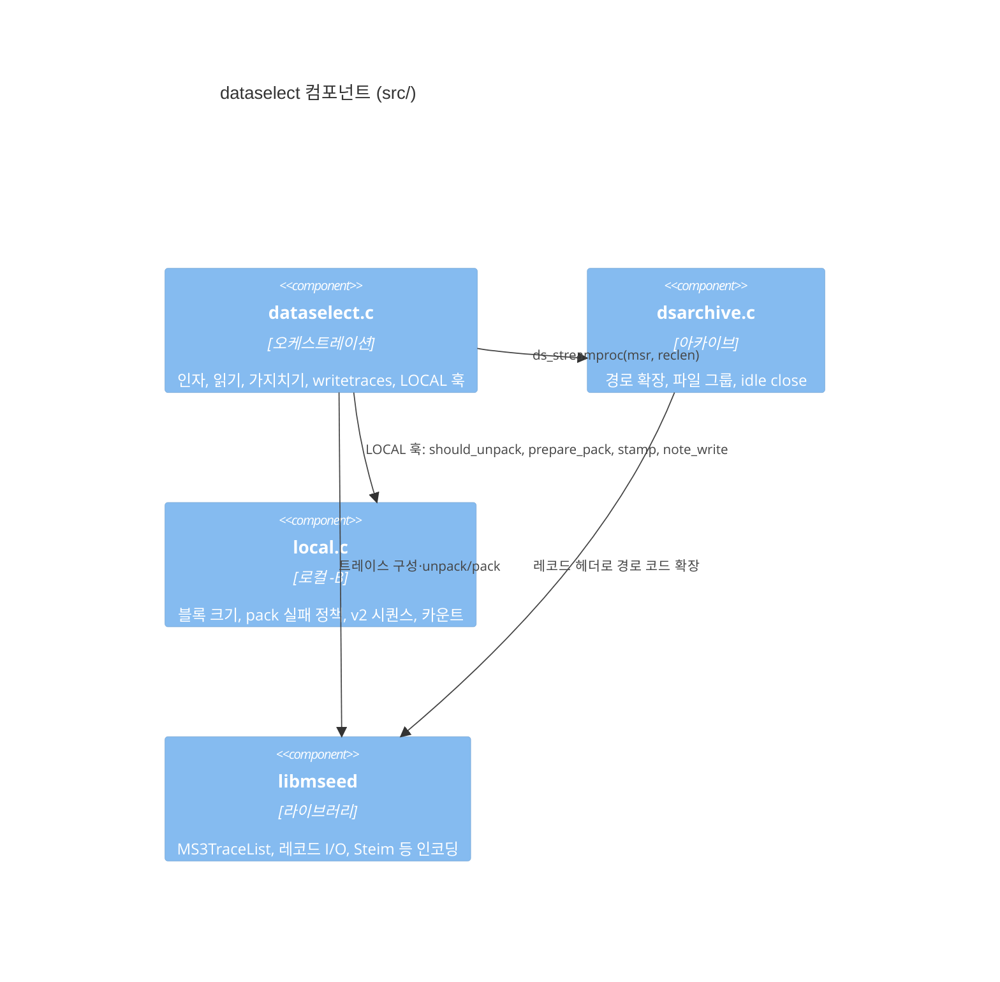
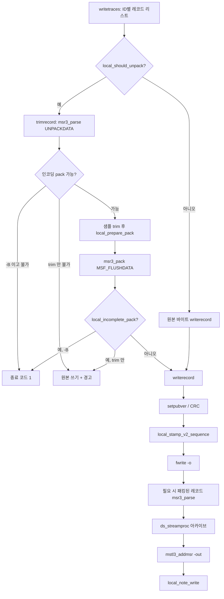

# C4 모델 — dataselect

C4는 같은 시스템을 네 단계로 확대합니다. 이 프로그램은 **단일 CLI 프로세스**이므로 컨테이너(L2)와 컴포넌트(L3)가 파일/라이브러리 경계와 거의 같습니다.

범위: 이 저장소의 `dataselect/` 트리. 입력은 시크 가능한 로컬 miniSEED 파일입니다. 파이프·stdin·URL 입력은 지원하지 않습니다.

---

## L1 — System Context

운영자 또는 배치 스크립트가 dataselect를 실행합니다. 프로그램은 여러 입력 파일을 한 덩어리로 읽고, 선택·정렬·(선택적) overlap 제거 후 출력 파일 또는 아카이브 레이아웃으로 씁니다. 입력 파일은 수정하지 않습니다.



**이 경계 밖:** 네트워크 수신, 실시간 링버퍼, 웹 UI. 이 바이너리는 배치 변환기입니다.

---

## L2 — Container

배포 단위는 `dataselect` 실행 파일 하나와, 링크된 `libmseed` 정적 라이브러리입니다. 선택적으로 libcurl로 libmseed URL 기능을 켤 수 있으나 **이 프로그램은 시크 가능한 파일만** 읽습니다.



테스트 컨테이너는 빌드 산출물에만 있습니다. `test/run-tests.py`가 바이너리를 실행하고, `test/compare-series`가 샘플 시계열을 비교합니다.

---

## L3 — Component

소스 경계는 원본에 가깝게 유지하기 위해 **세 개의 C 번역 단위 + vendored libmseed** 입니다.



| 컴포넌트 | 책임 | 하지 않는 일 |
|----------|------|----------------|
| `dataselect.c` | CLI, 선택/거절, overlap 가지치기, 출력 루프 | `-B` 상태와 시퀀스 맵 |
| `dsarchive.c` | `%n.%s…` 레이아웃, 열린 파일 제한 | 샘플 unpack |
| `local.c` | `-B` 파싱, 인코딩 허용, pack 실패가 fatal인지, v2 시퀀스 | 가지치기 알고리즘 |
| `libmseed` | 포맷, 연속 세그먼트, pack | 출력 정책·아카이브 레이아웃 |

원본 `dataselect.c` 변경은 `/* >>> LOCAL */` … `/* <<< LOCAL */` 훅으로만 남깁니다. 머지 절차는 [UPSTREAM.md](../../UPSTREAM.md).

---

## L4 — Code (쓰기 경로)

핵심 런타임 객체는 libmseed의 **레코드 리스트 인덱스**입니다. 샘플은 읽기 단계에서 풀지 않고, trim 또는 `-B`가 필요할 때만 unpack합니다.

```
MS3TraceList
  └─ MS3TraceID          (SourceID, 예: FDSN:XX_TEST__B_H_Z)
       └─ MS3TraceSeg    (연속 구간)
            └─ MS3RecordList
                 └─ MS3RecordPtr  → 파일 오프셋 + 헤더, 샘플은 아직 없음
                      └─ prvtptr: TimeRange (가지치기/선택으로 정한 새 경계)
```

쓰기 시퀀스 (`writetraces` → `trimrecord` / `writerecord`):



`-B`일 때 한 입력 레코드는 여러 출력 레코드가 될 수 있습니다. 각 출력 레코드마다 `writerecord`가 호출됩니다. 입력 레코드끼리는 합치지 않습니다.

허용 pack 인코딩 (`local.c`): text, int16/32, float32/64, Steim-1/2.
