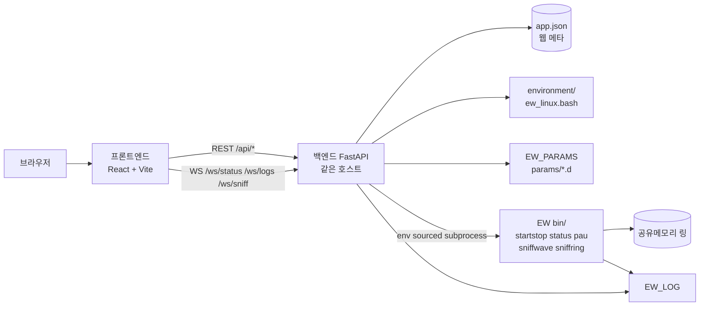
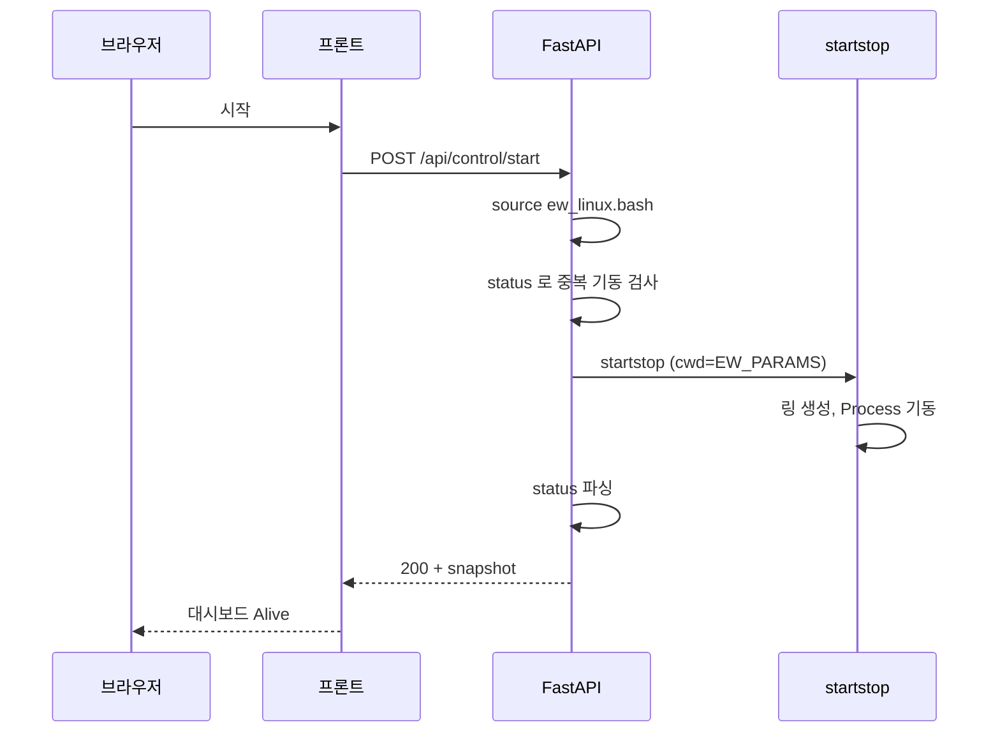
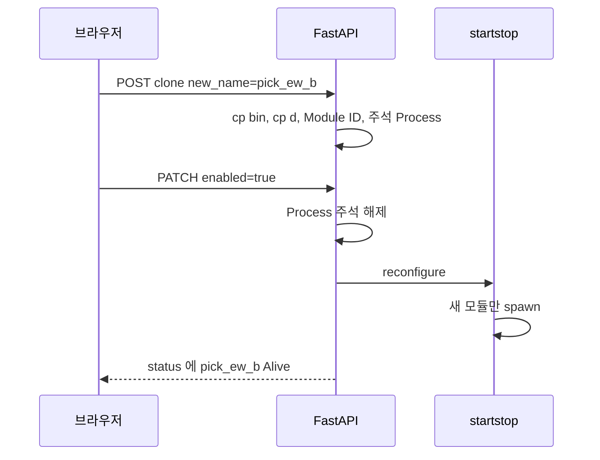
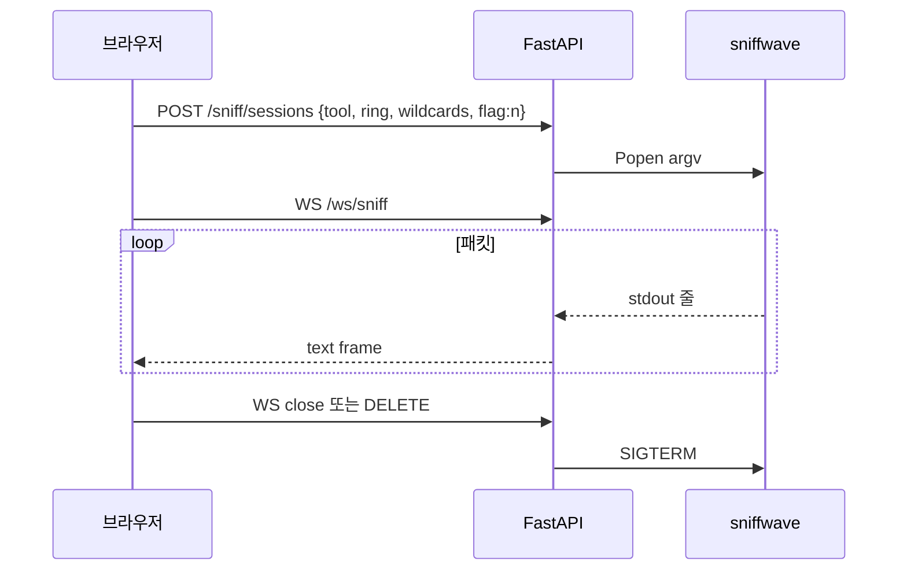
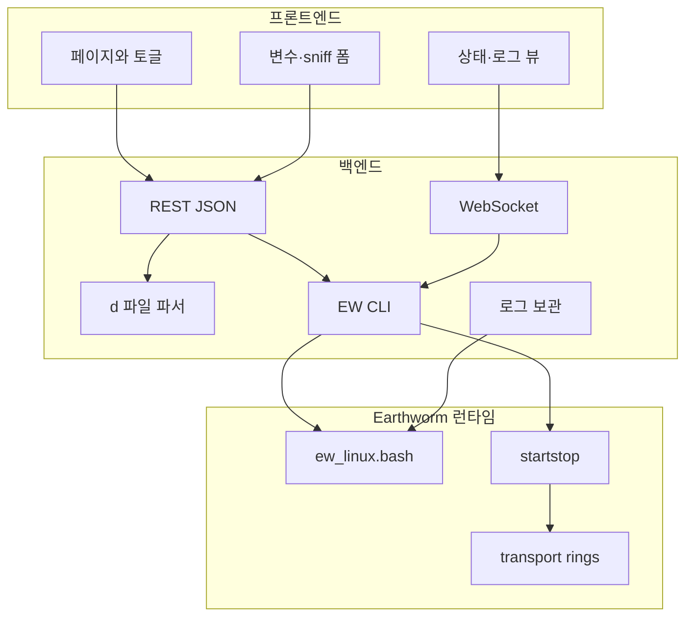

# Earthworm Web Control — 계획서

Earthworm **v8.0b17** 기준으로, 이미 컴파일된 Rocky Linux 9 바이너리를 웹에서 설정·기동·감시하는 콘솔의 **확정 계획**입니다. 구현은 이 문서를 따른다.

| 항목 | 내용 |
|------|------|
| 대상 소스 | [seismic-software/earthworm](https://gitlab.com/seismic-software/earthworm.git) 태그 `v8.0b17` |
| 바이너리 | [earthworm_v8-0b8_rockylinux9_4.tar.gz](http://www.earthwormcentral.org/distribution/earthworm_v8-0b8_rockylinux9_4.tar.gz) (컴파일 완료본) |
| 매뉴얼 | 소스 `doc/WEB_DOC` ([raw](https://gitlab.com/seismic-software/earthworm/-/raw/master/doc/WEB_DOC), 시작점 `index.html` / `modules.html`) |
| 환경 스크립트 | `environment/ew_linux.bash` 만 사용 |
| UI 언어 | 한국어 |
| 스택 | 백엔드 FastAPI · 프론트엔드 React + Vite + TypeScript (이 저장소 PPSD / StationXML 과 동일) |

상태: 계획만. 구현 체크리스트는 [구현 단계](#12-구현-단계)에 둔다.

---

## 1. 목표

운영자가 SSH와 `startstop` 콘솔 없이, 브라우저에서 다음을 한다.

1. `ew_linux.bash` 로 런타임 환경을 고정한다.
2. `params/` · `environment/` 파일을 웹에서 읽고 고친다.
3. `bin` 모듈과 대응하는 `params` 를 토글로 켜고 끈다.
4. 켜 둔 모듈을 복제해 **같은 기능, 다른 이름**으로 돌린다.
5. 공통 변수를 한 화면에서 넣고, 각 `.d` 에 자동 반영한다.
6. Earthworm 전체를 시작 / 종료 / 일시중지한다.
7. 실행 중 모듈 상태를 대시보드로 본다.
8. 로그 디렉터리를 설정하고 모듈별 로그를 본다.
9. 로그 보관 기간을 설정한다.
10. `sniffwave` · `sniffring` 결과를 옵션과 함께 실시간으로 본다.

백엔드와 프론트엔드는 **프로세스·저장소·API 계약**으로 완전히 분리한다. 프론트는 Earthworm 바이너리를 직접 호출하지 않는다.

---

## 2. 전제와 버전 정합

### 2.1 디렉터리 (v8.0b17 `ew_linux.bash`)

```
${EW_HOME}                          # 기본 /opt/earthworm
  ${EW_VERSION}/                    # 기본 earthworm_8.0  (타르볼 풀면 실제 폴더명으로 맞춤)
    bin/                            # startstop, status, pau, sniffwave, …
    environment/                    # ew_linux.bash, earthworm.d, earthworm_global.d, …
  run_working/                      # EW_RUN_DIR
    params/                         # EW_PARAMS  (모듈 .d / .desc, startstop_unix.d)
    log/                            # EW_LOG
    data/                           # EW_DATA_DIR
```

웹 앱은 Earthworm **과 같은 호스트**에서만 동작한다. transport ring 은 System V 공유 메모리이므로, 원격 호스트에서 `sniffwave` / `status` 를 호출해도 링에 붙을 수 없다.

### 2.2 바이너리 vs 소스 태그

배포 tarball 은 **v8.0b8**, Git 태그는 **v8.0b17** 이다. 계획은 다음과 같이 고정한다.

- 실행 파일: tarball `bin/` 을 그대로 쓴다. 이 호스트에서 재컴파일하지 않는다.
- 설정 템플릿·매뉴얼: v8.0b17 `params/`, `environment/`, `doc/WEB_DOC` 를 기준으로 파서·카탈로그를 만든다.
- v8.0b17 에만 있는 모듈은 `bin` 에 실행 파일이 없으면 UI 에서 **바이너리 없음** 으로 표시하고 활성화를 막는다.
- `ew_linux.bash` 의 `EW_VERSION` 은 tarball 을 푼 실제 디렉터리명으로 맞춘다.

### 2.3 Earthworm 이 이미 제공하는 제어 명령

웹 컨트롤은 새 프로토콜을 만들지 않고, 환경이 잡힌 셸에서 아래 CLI 만 호출한다.

| 웹 동작 | CLI | 비고 |
|---------|-----|------|
| 전체 시작 | `startstop` | `EW_PARAMS/startstop_unix.d` 를 읽고 링 생성 후 자식 기동 |
| 전체 종료 | `pau` | TERMINATE 메시지. `quit` 과 동등 |
| 상태 | `status` | startstop 콘솔에서 Enter 친 것과 동일 표 |
| 모듈 재시작 | `restart <pid\|name>` | TYPE_RESTART |
| 모듈 일시중지 | `stopmodule <pid\|name>` | 종료 후 Status=`Stop`. statmgr 가 다시 올리지 않음 |
| 모듈 재개 | `restart <pid\|name>` | Stop 된 모듈을 다시 기동 |
| 설정 반영(기동 중) | `reconfigure` | `startstop_unix.d` · `earthworm.d` 재독. **이미 도는 모듈은 안 죽임**. 새 링/모듈만 추가 |
| 파형 링 | `sniffwave` | TRACEBUF / TRACEBUF2 |
| 임의 메시지 링 | `sniffring` | 사용자가 말한 “sniffing” 은 공식 이름 **sniffring** 으로 매핑 |

Earthworm 에는 **시스템 전체 pause** 가 없다. 웹의 “일시중지” 는 기본값으로 **모든 업무 모듈 `stopmodule`** (startstop · statmgr 는 유지) 이다. 개별 모듈 중지는 대시보드의 행 액션으로 둔다.

---

## 3. 확정 결정

| # | 결정 | 이유 |
|---|------|------|
| 1 | 백엔드 FastAPI, 프론트 React/Vite/TS, 프록시 `/api` · `/ws` | 이 저장소 기존 웹 앱과 운영·개발 방식이 같음 |
| 2 | 웹 앱 상태(토글, 복제 메타, 보관기간)는 `backend/data/app.json` | Earthworm 원본 `.d` 와 웹 전용 메타를 분리 |
| 3 | 공통 변수 원본은 `params/earthworm_commonvars.d` 의 `SetEnvVariable` | v8 가 `.d` 안에서 `${VAR}` 확장을 이미 지원 |
| 4 | 모듈 on/off 는 `startstop_unix.d` 의 `Process` 블록 주석 처리 | startstop 이 읽는 유일한 기동 목록 |
| 5 | 복제는 **params `.d` 복사 + `earthworm.d` 새 Module ID + 같은 `bin` 을 다른 명령 이름으로 복사** | 사용자 요구 4. 실행은 `Process "newname newname.d"` |
| 6 | 기동 중 토글 off → `stopmodule`. 토글 on → `startstop_unix.d` 주석 해제 후 `reconfigure` | 문서화된 안전 경로 |
| 7 | 링 뷰는 서브프로세스 stdout 을 WebSocket 으로 중계 | sniff 도구는 공유메모리에 붙는 대화형 CLI |
| 8 | 인증은 1차에 로컬 단일 API 키 (`X-API-Key`). 세션/SSO 는 후속 | 내부망 운영 가정 |
| 9 | `earthworm_global.d` 는 읽기 전용(경고 후 고급 편집만) | Installation / Message Type 전역 계약 |
| 10 | `FLAG_RING` 은 startstop 링 목록에 넣지 않음 | 공식 주석. startstop 이 숨은 링으로 씀 |
| 11 | 모든 EW CLI 는 `source ew_linux.bash` 된 환경에서 `argv` 리스트로만 실행 | 셸 문자열 조립 금지 (명령 주입 방지) |

---

## 4. 아키텍처 (백엔드 / 프론트엔드 분리)



역할 경계:

- **프론트엔드**: 화면, 토글, 폼, 대시보드 표, 로그 뷰어, sniff 옵션 UI. Earthworm 경로·프로세스를 모름.
- **백엔드**: `ew_linux.bash` 로드, 파일 CRUD, `startstop_unix.d` / `earthworm.d` 합성, CLI 실행, `status` 파싱, 로그 tail, sniff 프로세스 수명, 로그 보관 청소.
- **Earthworm**: 기존 바이너리와 `.d` 포맷을 그대로 사용. 웹 앱이 EW 소스를 패치하지 않음.

개발 시 Vite 가 `/api`·`/ws` 를 FastAPI(`:8000`)로 프록시한다. 배포 시 백엔드가 빌드된 `frontend/dist` 를 서빙하거나 nginx 가 둘을 붙인다.

---

## 5. 백엔드 설계

프로젝트 경로: `earthworm_web/backend/`

```
backend/
  app/
    main.py                 # FastAPI, CORS, 라우터, WS
    config.py               # EW_HOME, ew_linux.bash 경로, API 키
    env.py                  # ew_linux.bash 파싱·적용·재기록
    security.py             # API 키
    models/schemas.py
    api/
      health.py
      environment.py        # ew_linux.bash, environment/* 파일
      params.py             # params 파일 목록·읽기·쓰기
      modules.py            # 카탈로그, 토글, 복제
      variables.py          # 통합 변수
      control.py            # start / stop / pause / resume / reconfigure
      status.py             # status 스냅샷
      logs.py               # 디렉터리 설정, 목록, 내용, 보관기간
      sniff.py              # sniff 세션 시작/중지 (REST) + WS 는 main
    services/
      ew_process.py         # sourced env + argv 실행, 타임아웃
      startstop_file.py     # startstop_unix.d 파서/시리얼라이저
      earthworm_d.py        # Ring / Module 할당
      commonvars.py         # earthworm_commonvars.d
      module_catalog.py     # bin × params 조인
      clone.py              # 모듈 복제
      status_parser.py      # `status` 텍스트 → JSON
      log_store.py          # 경로, tail, 보관 청소
      sniff_broker.py       # sniffwave/sniffring Popen + 브로드캐스트
    data/
      app.json              # 웹 메타 (런타임 생성)
      module_fields.yaml    # 모듈별 운영자 입력 필드 카탈로그
  requirements.txt
```

### 5.1 환경 로더 (`env.py`)

매 CLI 호출 전에 `ew_linux.bash` 를 **login-free bash** 로 소스하고 `env -0` 으로 변수를 가져온다.

```bash
bash -lc 'source /path/to/ew_linux.bash >/dev/null; env -0'
```

필수 확인: `EW_HOME`, `EW_VERSION`, `EW_PARAMS`, `EW_LOG`, `EW_DATA_DIR`, `PATH` 에 `$EW_HOME/$EW_VERSION/bin`.

웹에서 고칠 `ew_linux.bash` 키 (1차 폼):

| 변수 | 기본 (스크립트) | UI |
|------|-----------------|-----|
| `EW_HOME` | `/opt/earthworm` | 경로 |
| `EW_VERSION` | `earthworm_8.0` | 문자열 |
| `EW_RUN_DIR` | `${EW_HOME}/run_working` | 경로 |
| `EW_INSTALLATION` | `INST_UNKNOWN` | 선택/`earthworm_global.d` 목록 |
| `EW_PARAMS` | `${EW_RUN_DIR}/params/` | 읽기 위주. RUN_DIR 로부터 유도 |
| `EW_LOG` | `${EW_RUN_DIR}/log/` | **요구 8**: 설정 창에서 변경. 디렉터리 생성 |
| `EW_DATA_DIR` | `${EW_RUN_DIR}/data/` | 경로 |

쓰기는 스크립트 내 `export EW_*` / `EW_RUN_DIR=` 할당 줄만 치환한다. 컴파일 플래그(`CC`, `WARNFLAGS`)는 고급 원문 편집으로만 연다.

`environment/` 나머지 파일(`earthworm.d`, `earthworm_commonvars.d`, …)은 파일 트리 편집 API 로 다룬다. 운영 사본은 `EW_PARAMS` 에 복사돼 있어야 하므로, 백엔드는 “버전 트리 `environment/`” 와 “런타임 `params/` 의 동명 파일” 을 구분해 보여 주고, **저장 시 런타임 `params/` 를 우선** 한다. `ew_linux.bash` 만 버전 트리 쪽을 직접 수정한다.

### 5.2 모듈 카탈로그 (`module_catalog.py`)

한 행 = 기동 가능한 모듈 인스턴스.

```
id            : "pick_ew" | "export_generic__picks"   # 웹 ID
binary        : "pick_ew"                             # bin/ 파일명
binary_exists : true
param_file    : "pick_ew.d"
desc_file     : "pick_ew.desc" | null
module_id     : "MOD_PICK_EW"                         # .d 의 MyModuleId
enabled       : true                                  # startstop_unix.d 주석 여부
clone_of      : null | "export_generic"
display_name  : "pick_ew"
doc_url       : "/api/docs/module/pick_ew"            # WEB_DOC 프록시
```

스캔:

1. `$EW_HOME/$EW_VERSION/bin` 실행 파일 (ELF, 스크립트).
2. `EW_PARAMS` 의 `*.d` (`startstop_*.d`, `earthworm*.d` 제외).
3. `startstop_unix.d` 의 `Process "cmd args"` — 활성/비활성(주석).
4. 이름 매칭: `pick_ew.d` ↔ `bin/pick_ew`. 복제본은 `app.json` 의 `clones[]` 로 연결.

`params` 에만 있고 `bin` 에 없으면 활성화 불가. 그 반대(바이너리만 있음)는 카탈로그에 **설정 파일 없음** 으로 두고, 토글 전에 `.d` 템플릿을 고르게 한다.

### 5.3 `startstop_unix.d` 편집 (`startstop_file.py`)

v8.0b17 샘플은 구버전 문서의 `nRing` 없이 `Ring` 줄을 나열한다. 파서는 둘 다 읽는다. 기록은 **현재 파일 스타일을 유지** 한다 (있는 `nRing` 을 임의로 지우지 않음).

블록 단위:

```
# Process          "coaxtoring coaxtoring.d"
# Class/Priority    OTHER 0

Process          "pick_ew pick_ew.d"
 Class/Priority    OTHER 0
```

토글 off: 해당 `Process` / `Class/Priority` / 옵션 `Stderr` / `Agent` 앞에 `# ` 를 붙인다.  
토글 on: 그 주석을 벗긴다.  
복제 추가: 파일 끝에 새 블록을 **주석 상태**로 넣고, 사용자가 켜면 주석을 벗긴다.

`statmgr` 는 기본 강제 활성. 끄면 경고.

기동 중 변경:

- 새 모듈 on → 파일 저장 + `reconfigure` (새 프로세스만 기동).
- 모듈 off → `stopmodule` 후 파일에서 주석. 다음 전체 시작 때 안 올라옴.
- Ring 추가 → `earthworm.d` 키 확인 후 `startstop_unix.d` 에 `Ring` 추가 + `reconfigure`.
- Ring 삭제·크기 변경 → **전체 재시작 필요**. UI 에서 명시.

### 5.4 모듈 복제 (`clone.py`)

요청: 활성 모듈을 복제해 다른 이름으로 같은 기능을 쓴다.

절차:

1. 원본 `foo` (`bin/foo`, `foo.d`, 선택 `foo.desc`).
2. 새 이름 `foo_bar` (문자·숫자·`_`, 기존 bin/params/Module 문자열과 충돌 없음).
3. `cp bin/foo bin/foo_bar` (동일 호스트, 실행 비트 유지). 심볼릭 링크는 쓰지 않는다. 이름은 다르고 내용은 같다.
4. `foo.d` → `foo_bar.d`. `MyModuleId` 를 새 값으로 바꾼다.
5. `earthworm.d` 에 `Module  MOD_FOO_BAR  <미사용 1–255>` 를 추가한다. 빈 ID 는 200번대부터 채워 배포 기본값과 겹침을 줄인다.
6. `foo.desc` 가 있으면 복사하고 내부 모듈명을 갱신. `statmgr.d` 가 desc 목록을 나열하면 한 줄 추가.
7. `startstop_unix.d` 에 `Process "foo_bar foo_bar.d"` 를 주석으로 추가.
8. `app.json.clones` 에 `{ id, clone_of, binary, param_file, module_id }` 기록.

복제 삭제: 기동 중이면 `stopmodule` → 주석/블록 제거 → 복사한 bin·d·desc 삭제. 원본은 건드리지 않는다. `earthworm.d` 의 Module 줄은 주석 처리(숫자 재사용 혼란 방지).

### 5.5 통합 변수 (`variables.py` + `commonvars.py`)

두 층:

**A. 사이트 공통 (`earthworm_commonvars.d`)**  
Earthworm 이 `.d` 에서 `${EW_INST_ID}` 처럼 확장한다. 웹 통합 입력의 **저장 위치** 는 여기다.

```
SetEnvVariable EW_INST_ID INST_UNKNOWN
SetEnvVariable HEARTBEAT_INT 30
SetEnvVariable STATIONFILE "${EW_PARAMS}/stations.hinv"
```

**B. 운영자 필드 카탈로그 (`module_fields.yaml`)**  
모듈마다 “한 곳에서 넣을 값” 을 선언한다. 저장 시:

1. 공통이면 `SetEnvVariable` 로 넣고, 대상 `.d` 해당 키를 `${NAME}` 으로 바꾼다 (아직 리터럴이면 치환).
2. 모듈 전용이면 그 `.d` 의 해당 명령 값만 바꾼다.

1차 통합 폼 필드 (모든 활성 모듈에 전파 가능한 것):

| 키 | 전파 대상 |
|----|-----------|
| `EW_INST_ID` / `EW_INSTALLATION` | `GetStatusFrom`, `GetWavesFrom` 등의 Installation |
| `HeartbeatInt` | 각 `.d` 의 `HeartbeatInt` (모듈이 키를 가질 때) |
| `LogFile` | 각 `.d` 의 `LogFile` |
| 기본 `RingName` 매핑 | 역할별: waveform=`WAVE_RING`, pick=`PICK_RING`, hypo=`HYPO_RING`, status=`STATUS_RING` |
| 관측소 파일 경로 | `site_file`, `StationFile` 류 |
| 로그 디렉터리 | `ew_linux.bash` 의 `EW_LOG` (모듈 `.d` 가 아니라 환경) |

모듈별 나머지(그리드, 포트, SCNL 리스트)는 **모듈 상세 편집기** 에서 다룬다. `.d` 는 INI 가 아니라 명령 문법이다. 1차는 줄 단위 키/값 파서 + 원문 편집을 병행하고, WEB_DOC `cmd/` HTML 을 사이드에 띄운다. 완전 스키마화는 2차.

`@include` (`@ncal_model.d`) 는 따라가서 보여주고, 포함 파일도 같은 편집 API 로 연다.

### 5.6 프로세스 제어 (`ew_process.py`, `control.py`)

- **시작**: 이미 Alive 인 startstop 이 있으면 거부. 없으면  
  `cwd=EW_PARAMS`, env=sourced, `startstop` 를 백그라운드로 띄우고 pid·로그 경로를 `app.json` 에 저장. stdout/stderr 는 `EW_LOG/web_startstop.out` 으로 리다이렉트 (콘솔이 없는 서비스 모드).
- **종료**: `pau`. KillDelay 대기 후 `status` 실패를 정상 종료로 본다.
- **일시중지**: 카탈로그에서 startstop/statmgr 제외 활성 모듈에 `stopmodule`.
- **재개**: Status=`Stop` 인 모듈에 `restart`.
- **개별**: 대시보드에서 `restart` / `stopmodule`.

동시 제어는 asyncio Lock. 진행 중이면 409.

### 5.7 상태 (`status_parser.py`)

주기(기본 2초)로 `status` 를 실행해 파싱한다.

```
Hostname-OS, Start time, Current time, Disk space,
Ring n name/key/size, Log Dir, Params Dir, Bin Dir, Version
rows: name, pid, status, class/priority, cpu, argument
```

`Alive` / `Stop` / `Dead` / 공백을 enum 으로. 웹 메타의 `enabled` 와 조인:

| enabled | status | 대시보드 |
|---------|--------|----------|
| true | Alive | 정상 |
| true | Dead / 없음 | 장애 |
| false | Stop / 없음 | 꺼짐 |
| false | Alive | 설정과 불일치 (경고) |

WebSocket `/ws/status` 가 스냅샷 JSON 을 푸시한다. REST `GET /api/status` 는 마지막 스냅샷.

### 5.8 로그 (`log_store.py`)

- 경로: `EW_LOG`. 설정 창에서 바꾸면 `ew_linux.bash` 의 `EW_LOG` 를 쓰고 디렉터리를 만든다. **기동 중 변경은 재시작 후 유효** 함을 UI 에 표시.
- 파일명 관례: `{config}_YYYYMMDD.log`, stderr 는 `.err`.
- `GET /api/logs` : 모듈(설정 파일 basename)별 파일 목록, 날짜, 크기.
- `GET /api/logs/{name}?date=&tail=` : 본문. 큰 파일은 tail.
- `WS /ws/logs?file=` : `tail -F` 와 동일한 폴링 append.
- **보관 기간**: `app.json.log_retention_days` (기본 14). 백그라운드 태스크가 UTC 날짜 스탬프가 기간 밖인 `*_YYYYMMDD.log` / `.err` 를 삭제. `web_startstop.out` 은 크기 상한으로 로테이트.

Earthworm 자체는 일 단위 파일을 무한히 남긴다. 보관 정책은 웹 앱이 파일 시스템에서 집행한다.

### 5.9 링 스니프 (`sniff_broker.py`)

동시 세션 상한 2 (링 부하). 세션당 하나의 Popen.

**sniffwave** (v8.0b17 `sniffwave.c`):

```
sniffwave <Ring>
sniffwave <Ring> <Sta> <Comp> <Net> <y|n|s|seconds> [verbose]
sniffwave <Ring> <Sta> <Comp> <Net> <Loc> <y|n|s|seconds> [verbose]
```

- `Sta/Comp/Net/Loc`: 값 또는 `wild` / `*`
- 데이터 플래그: `n` 헤더만, `y` 샘플, `s` min/max/avg, 숫자는 초 단위 후 종료
- `verbose`: 설치·모듈·타입 이름

**sniffring**:

```
sniffring [-n] <ringname>
sniffring [-n] <ringname> verbose
sniffring [-n] <ringname> <instid> <mod> <type>
sniffring [-n] <ringname> <instid> <mod> <type> verbose
```

`-n` 은 기존 메시지 flush 생략.

백엔드는 옵션 JSON 을 검증한 뒤 argv 만 만든다. stdout 줄을 WS 로 보낸다. 바이너리 덤프(`y`)는 텍스트가 폭주하므로 기본 `n` 또는 `s`, `y` 는 확인 후. 버퍼 상한(예: 2000줄) 초과 시 오래된 줄 폐기 + `overflow` 이벤트.

링 이름 목록: `startstop_unix.d` 의 `Ring` ∪ `earthworm.d` 의 `Ring`. `FLAG_RING` 은 목록에서 숨기거나 경고.

WS 종료 시 프로세스에 SIGTERM, 수 초 후 SIGKILL.

### 5.10 보안

- 파일 API 는 `EW_PARAMS`, `environment/`, `ew_linux.bash`, 복제 대상 `bin/` 밖으로의 `..` 를 거부.
- CLI 인자: 링 이름·모듈명·SCNL 은 `[A-Za-z0-9_.*\-]` .
- 원문 저장은 텍스트만. 실행 비트 부여 API 없음.
- 컨트롤 API 는 모두 API 키.

---

## 6. 프론트엔드 설계

프로젝트 경로: `earthworm_web/frontend/`

기존 `PPSD_v1/frontend` 와 같이 React 18 + Vite + TypeScript. 상태: 간단한 Context + fetch/WS. 1차에 Redux 없음.

### 6.1 화면 구성

```
┌─ 탑바: 로고 · EW 버전 · startstop 상태 뱃지 · 시작/종료/일시중지/재개 · 설정 ─────────┐
├─ 사이드 (데스크톱) / 드로어 (모바일) ──────────────────────────────────────────────┤
│  대시보드                                                                         │
│  모듈 설정 (토글·복제)                                                            │
│  통합 변수                                                                        │
│  파일 편집 (params / environment)                                                 │
│  로그                                                                            │
│  링 모니터 (sniffwave / sniffring)                                                │
└──────────────────────────────────────────────────────────────────────────────────┘
```

| 화면 | 요구 | 내용 |
|------|------|------|
| **대시보드** | 7, 6 | 링 카드(이름·키·크기). 모듈 테이블: 이름, pid, Status, CPU, 인자, 활성, 정상/장애. 행 메뉴: 재시작 / 중지. 상단 전체 제어 버튼 |
| **모듈 설정** | 3, 4 | `bin`×`params` 리스트. 토글. 복제 다이얼로그(새 이름). 바이너리 없음 비활성. 클릭 시 `.d` 폼+원문 |
| **통합 변수** | 5 | 공통 키 폼. 저장 시 영향받는 파일 미리보기 후 적용 |
| **파일 편집** | 2 | 좌: `params/` · `environment/` 트리. 우: 텍스트 에디터, 저장 전 diff. `ew_linux.bash` 경로 폼은 설정에도 있음 |
| **로그** | 8, 9 | 설정: 로그 디렉터리, 보관 일수. 모듈 선택 → 날짜 파일 → 뷰어(팔로우) |
| **링 모니터** | 10 | 도구 탭 sniffwave / sniffring. 링·옵션 폼. 시작/중지. 스크롤 로그. CSV 다운로드(현재 버퍼) |
| **설정** | 1, 8, 9 | `ew_linux.bash` 핵심 변수, API 동작(상태 주기, sniff 상한), 로그 경로·보관 |

### 6.2 프론트 모듈 구조

```
frontend/src/
  api/client.ts           # REST + API 키
  ws/status.ts
  ws/logs.ts
  ws/sniff.ts
  pages/Dashboard.tsx
  pages/Modules.tsx
  pages/Variables.tsx
  pages/Files.tsx
  pages/Logs.tsx
  pages/Sniff.tsx
  pages/Settings.tsx
  components/Toggle.tsx
  components/StatusBadge.tsx
  components/ConfirmApply.tsx
  App.tsx
```

프론트는 `.d` 문법을 해석하지 않는다. 폼 스키마는 `GET /api/variables` · `GET /api/modules/{id}` JSON 을 따른다. 원문 편집은 textarea.

제어 버튼은 확인 모달 후 `POST /api/control/{action}`. 응답 전까지 비활성.

### 6.3 UX 규칙

- 토글 on 이 기동 중 `reconfigure` 를 부르면 토스트로 결과 status 를 보여 준다.
- 통합 변수 저장은 항상 “변경될 파일 N개” 목록을 먼저 보여 준다.
- sniff `y`(샘플 덤프) 는 경고.
- `earthworm_global.d` 저장은 “전역 ID 파일” 경고.

---

## 7. 요구사항 매핑

| # | 요구 | 백엔드 | 프론트 |
|---|------|--------|--------|
| 1 | `ew_linux.bash` 로 운영 | 매 CLI 소스. 핵심 변수 읽기/쓰기 | 설정 폼 |
| 2 | params · environment 웹 편집 | 트리 + 읽기/쓰기, 경로 샌드박스 | 파일 트리 에디터 |
| 3 | 모듈 토글 | `startstop_unix.d` 주석 + stopmodule/reconfigure | 설정 메뉴 토글 |
| 4 | 모듈 복제 | bin 복사, `.d`/Module ID/`Process`/app.json | 복제 다이얼로그 |
| 5 | 통합 변수 → 각 params | commonvars + module_fields.yaml 치환 | 통합 입력 페이지 |
| 6 | 시작/종료/일시중지 | startstop / pau / stopmodule+restart | 탑바 버튼 |
| 7 | 상태 대시보드 | `status` 파싱, `/ws/status` | 대시보드 표 |
| 8 | 로그 경로·조회 | EW_LOG 변경, 파일 목록, tail WS | 설정 + 로그 화면 |
| 9 | 로그 보관 기간 | retention 태스크 | 설정 숫자 입력 |
| 10 | 링 실시간 | sniffwave/sniffring argv + WS | 옵션 폼 + 스트림 |
| 11 | BE/FE 분리 | FastAPI only I/O·프로세스 | React only UI |

---

## 8. API 계약 (초안)

베이스: `/api`. 헤더 `X-API-Key`. WS 는 쿼리 `?key=`.

### 환경·파일

| 메서드 | 경로 | 설명 |
|--------|------|------|
| GET | `/health` | 앱·EW env 로드 여부, `EW_VERSION`, startstop 생존 |
| GET | `/environment` | 파싱된 `EW_*` |
| PUT | `/environment` | `ew_linux.bash` 핵심 변수 |
| GET | `/files?root=params\|environment` | 트리 |
| GET | `/files/content?root=&path=` | 본문 |
| PUT | `/files/content` | 본문 저장 (백업 `*.bak.<ts>`) |

### 모듈·변수

| 메서드 | 경로 | 설명 |
|--------|------|------|
| GET | `/modules` | 카탈로그 |
| PATCH | `/modules/{id}` | `{ enabled: bool }` |
| POST | `/modules/{id}/clone` | `{ new_name }` |
| DELETE | `/modules/{id}` | 복제본만 |
| GET | `/variables` | 통합 필드 + 현재 값 + 사용처 |
| PUT | `/variables` | 일괄 적용 |

### 제어·상태

| 메서드 | 경로 | 설명 |
|--------|------|------|
| POST | `/control/start` | startstop |
| POST | `/control/stop` | pau |
| POST | `/control/pause` | 업무 모듈 stopmodule |
| POST | `/control/resume` | Stop 모듈 restart |
| POST | `/control/reconfigure` | reconfigure |
| POST | `/control/modules/{id}/restart` | restart |
| POST | `/control/modules/{id}/stop` | stopmodule |
| GET | `/status` | 마지막 스냅샷 |
| WS | `/ws/status` | 주기 푸시 |

### 로그·스니프

| 메서드 | 경로 | 설명 |
|--------|------|------|
| GET/PUT | `/logs/settings` | `{ directory, retention_days }` |
| GET | `/logs` | 모듈별 파일 |
| GET | `/logs/content` | `file`, `tail` |
| WS | `/ws/logs` | follow |
| GET | `/rings` | 링 목록 |
| POST | `/sniff/sessions` | `{ tool: sniffwave\|sniffring, args }` → `session_id` |
| DELETE | `/sniff/sessions/{id}` | 종료 |
| WS | `/ws/sniff?session=` | 줄 단위 |

에러: 400 검증, 403 키, 409 제어 잠금/이미 기동, 422 `.d` 파서, 503 EW env 미설정.

---

## 9. `app.json` 스키마

```json
{
  "version": 1,
  "log_retention_days": 14,
  "status_interval_sec": 2,
  "clones": [
    {
      "id": "export_generic_picks",
      "clone_of": "export_generic",
      "binary": "export_generic_picks",
      "param_file": "export_generic_picks.d",
      "module_id": "MOD_EXPORT_GENERIC_PICKS",
      "module_id_num": 201
    }
  ],
  "disabled_process_names": [],
  "startstop_pid": null
}
```

진실의 원천은 여전히 `startstop_unix.d` 이다. `app.json` 은 복제 계보·보관일수 등 EW 파일이 담지 못하는 웹 메타만 넣는다. 토글 상태는 파일을 다시 읽어 복원한다.

저장 전 백엔드가 `EW_PARAMS` 아래 `web_backup/YYYYMMDD_HHMMSS/` 로 `startstop_unix.d`, `earthworm.d`, `earthworm_commonvars.d` 를 복사한다.

---

## 10. 런타임 시퀀스

### 10.1 전체 시작



### 10.2 토글 후 복제 모듈 기동



### 10.3 sniffwave



---

## 11. 구현 단계

Earthworm 을 실제로 기동하지 않고도 1단계는 파일 파서·UI 로 진행할 수 있다. 제어·스니프는 같은 호스트의 공유 메모리가 필요하다.

### 1단계 — 기반

- `ew_linux.bash` 로드, `/api/health`, `/api/environment`
- params/environment 파일 트리 CRUD
- `startstop_unix.d` · `earthworm.d` 파서
- 모듈 카탈로그 + 토글(파일만, 프로세스 없음)
- 프론트: 설정, 파일 편집, 모듈 토글 뼈대

### 2단계 — 제어와 대시보드

- start / pau / status 파싱
- `/ws/status`, 대시보드
- 기동 중 토글 ↔ stopmodule / reconfigure
- 일시중지 / 재개

### 3단계 — 복제와 통합 변수

- clone API, Module ID 할당, bin 복사
- `earthworm_commonvars.d` + `module_fields.yaml`
- 통합 변수 페이지, 적용 미리보기

### 4단계 — 로그와 링

- 로그 디렉터리·보관·뷰어·follow
- sniffwave / sniffring 세션 + WS
- 링 목록, 옵션 폼, overflow 처리

### 5단계 — 다듬기

- API 키, 백업, 감사 로그(누가 토글/pau 했는지)
- WEB_DOC 정적 제공 (`/docs/ew/`)
- README, systemd 유닛 예시 (`ew-web.service` + Earthworm 은 웹에서만 기동)

각 단계마다 백엔드 pytest (파서·argv 생성·경로 샌드박스) 와 프론트 타입체크를 둔다.

---

## 12. 백엔드 / 프론트엔드 책임 요약



프론트는 JSON/WS 만 다룬다. 백엔드는 파일과 프로세스만 다룬다. 공유 타입은 OpenAPI(`/api/openapi.json`)로 맞춘다.

---

## 13. 위험과 완화

| 위험 | 완화 |
|------|------|
| tarball v8.0b8 vs 소스 v8.0b17 | 카탈로그가 bin 존재 여부를 강제. 없는 모듈은 활성화 불가 |
| 잘못된 `.d` 로 startstop 기동 실패 | 저장 시 구문 검사, 저장 전 백업, 시작 실패 시 `web_startstop.out` 표시 |
| `reconfigure` 가 이미 도는 모듈의 `.d` 변경을 안 읽음 | UI: “기동 중 모듈은 restart 필요”. 통합 변수 적용 후 해당 모듈 restart 옵션 |
| sniff 가 링을 느리게 함 | 세션 2개, 기본 헤더만, 서버측 줄 상한 |
| 로그 삭제 오동작 | 삭제 패턴 `*_YYYYMMDD.log` 만. 미리보기 API |
| 여러 startstop | `status` 로 기존 인스턴스 거부. 링 키 충돌 방지 |
| 명령 주입 | argv 리스트, 화이트리스트 |
| `MyModuleId` 중복 | clone 시 `earthworm.d` 유일성 검사 |

---

## 14. 운영 시 웹이 만지는 파일

| 파일 | 읽기 | 쓰기 | 조건 |
|------|------|------|------|
| `environment/ew_linux.bash` | ○ | ○ | 경로·설치 ID·`EW_LOG` |
| `EW_PARAMS/startstop_unix.d` | ○ | ○ | 토글·복제·링 |
| `EW_PARAMS/*.d`, `*.desc` | ○ | ○ | 편집·복제·변수 전파 |
| `EW_PARAMS/earthworm.d` | ○ | ○ | Module/Ring 추가 |
| `EW_PARAMS/earthworm_commonvars.d` | ○ | ○ | 통합 변수 |
| `EW_PARAMS/earthworm_global.d` | ○ | △ | 기본 읽기 전용 |
| `$EW_HOME/$EW_VERSION/bin/*` | ○ | 복제 시 `cp` 만 | 원본 삭제 없음 |
| `EW_LOG/*` | ○ | 보관 청소 시 삭제 | 패턴 제한 |
| `backend/data/app.json` | ○ | ○ | 웹 메타 |

---

## 15. 참고

- 설치·`EW_*`·run/params/log: `doc/WEB_DOC/USER_GUIDE/Inst_config_guide.htm`
- 시작·status·pau: `doc/WEB_DOC/USER_GUIDE/start-stop-status.html`
- Linux startstop 파일: 구버전 `nRing` 문서와 v8 `startstop_unix.d` 실파일 차이 주의
- sniffwave: `src/diagnostic_tools/sniffwave/sniffwave.c` (Usage, VERSION 3.0.1)
- sniffring: `src/diagnostic_tools/sniffring/sniffring.c`
- 제어: `src/system_control/{startstop_unix,status,pau,restart,stopmodule,reconfigure}`
- 공통 변수: `environment/earthworm_commonvars.d`
- 모듈 목록·명령: `doc/WEB_DOC/modules.html`, `doc/WEB_DOC/cmd/`, `doc/WEB_DOC/ovr/`

동일 저장소의 분리 웹 앱 선례: `PPSD_v1/` (FastAPI + React), `stationxml_manager/` (FastAPI `app/` + React).
