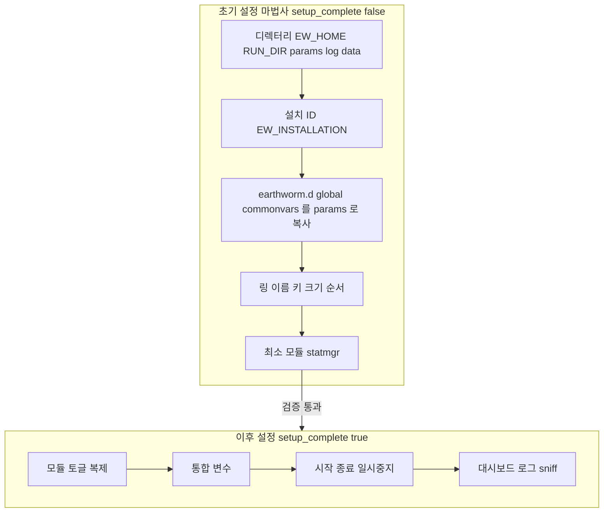
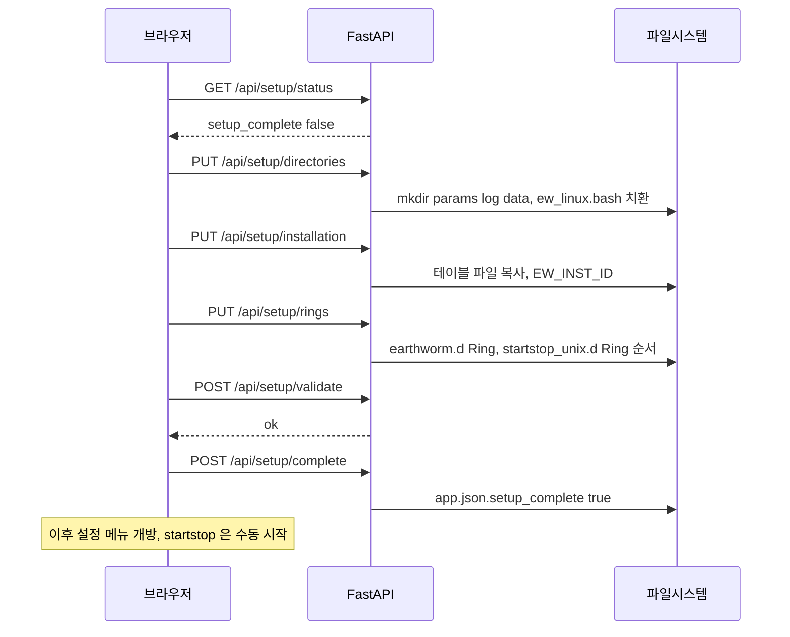
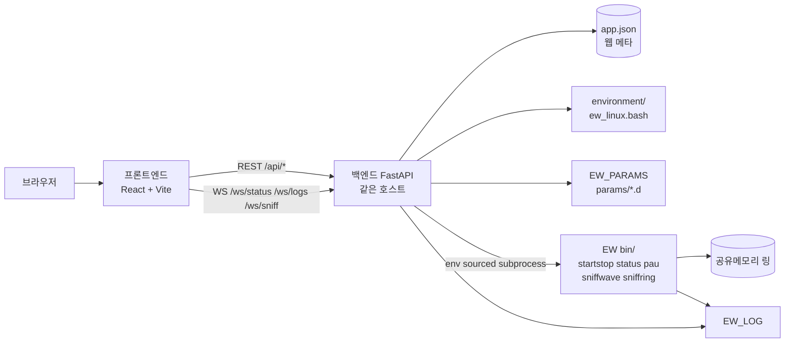
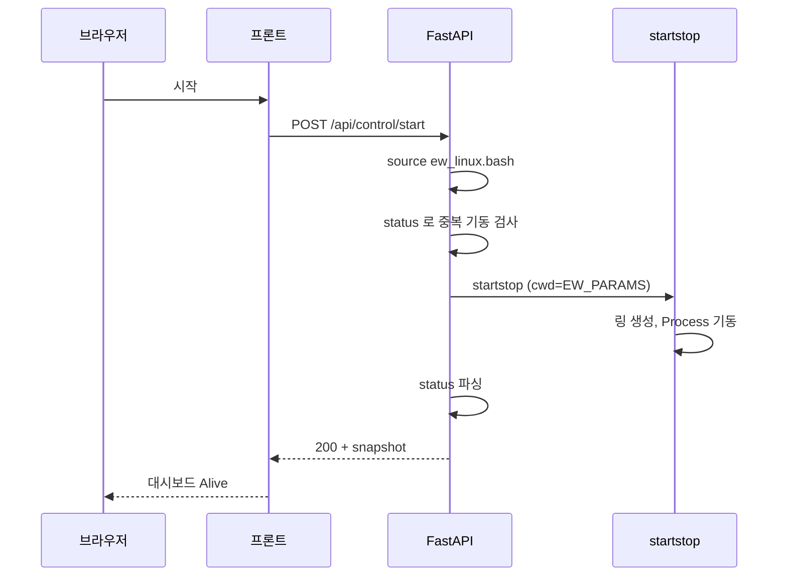
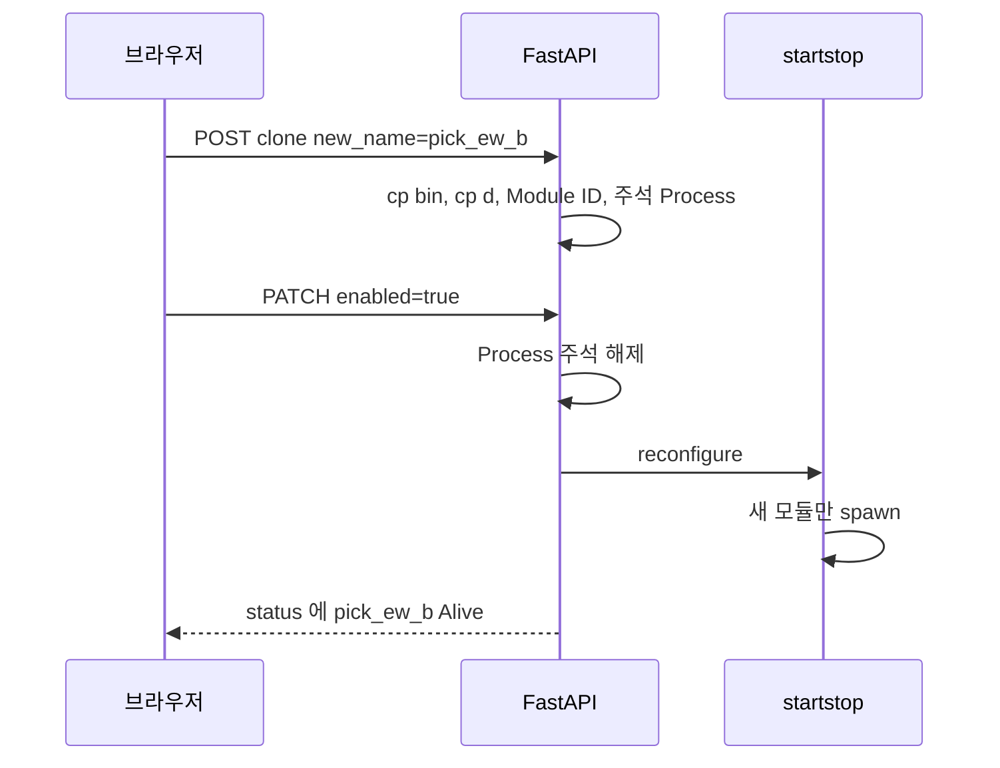
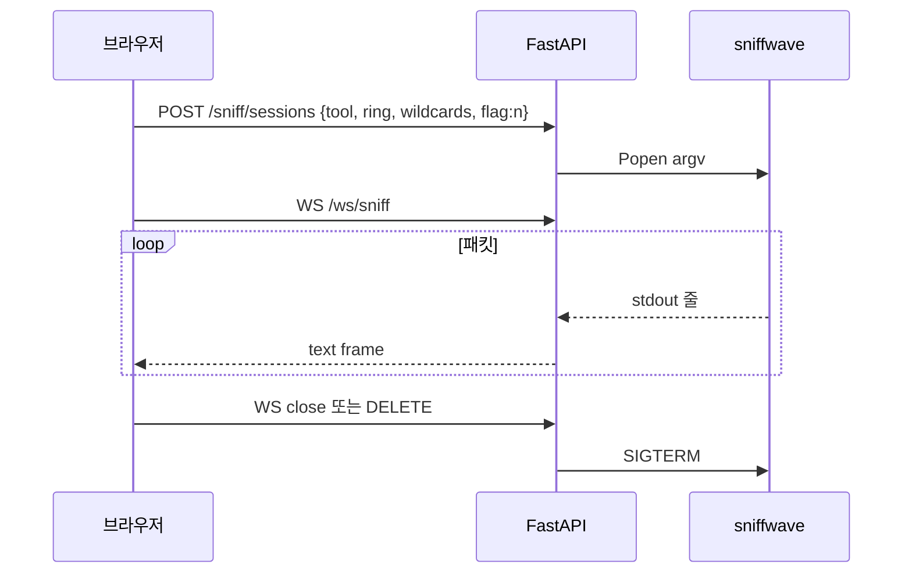
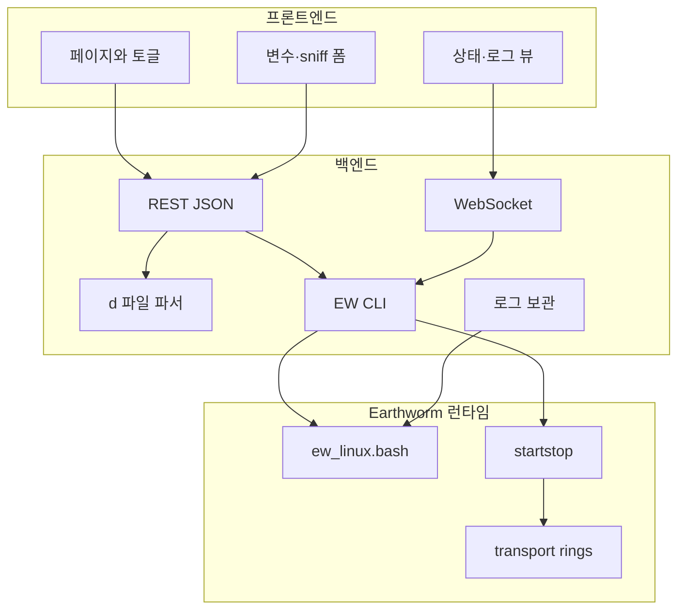

# Earthworm Web Control — 계획서

Earthworm **v8.0b17** 기준으로, 이미 컴파일된 Rocky Linux 9 바이너리를 웹에서 설정·기동·감시하는 콘솔의 **확정 계획**입니다. 구현은 이 문서를 따른다.

| 항목 | 내용 |
|------|------|
| 대상 소스 | [seismic-software/earthworm](https://gitlab.com/seismic-software/earthworm.git) 태그 `v8.0b17` |
| 바이너리 | [earthworm_v8-0b8_rockylinux9_4.tar.gz](http://www.earthwormcentral.org/distribution/earthworm_v8-0b8_rockylinux9_4.tar.gz) (컴파일 완료본) |
| 매뉴얼 | 소스 `doc/WEB_DOC` ([raw](https://gitlab.com/seismic-software/earthworm/-/raw/master/doc/WEB_DOC), 시작점 `index.html` / `modules.html`) |
| 환경 스크립트 | `environment/ew_linux.bash` 만 사용 |
| UI 언어 | 한국어 |
| 스택 | 백엔드 FastAPI · 프론트엔드 React + Vite + TypeScript (이 저장소 PPSD / StationXML 과 동일) |

상태: 계획만. 구현 체크리스트는 [구현 단계](#12-구현-단계)에 둔다. 웹 흐름은 **초기 설정**(디렉터리·링)과 **이후 설정**(모듈·운영)으로 나눈다. 근거는 [17절](#17-소스매뉴얼-분석-근거).

---

## 1. 목표

운영자가 SSH와 `startstop` 콘솔 없이, 브라우저에서 다음을 한다.

1. `ew_linux.bash` 로 런타임 환경을 고정한다.
2. `params/` · `environment/` 파일을 웹에서 읽고 고친다.
3. `bin` 모듈과 대응하는 `params` 를 토글로 켜고 끈다.
4. 켜 둔 모듈을 복제해 **같은 기능, 다른 이름**으로 돌린다.
5. 공통 변수를 한 화면에서 넣고, 각 `.d` 에 자동 반영한다.
6. Earthworm 전체를 시작 / 종료 / 일시중지한다.
7. 실행 중 모듈 상태를 대시보드로 본다.
8. 로그 디렉터리를 설정하고 모듈별 로그를 본다.
9. 로그 보관 기간을 설정한다.
10. `sniffwave` · `sniffring` 결과를 옵션과 함께 실시간으로 본다.
11. **초기 설정 마법사**로 기본 디렉터리(`params`/`log`/`data`)와 링 이름·키·크기·순서를 웹에서 한 번에 만든다.
12. 초기 설정이 끝난 뒤에만 모듈 토글·복제·기동·로그·스니프를 연다 (**이후 설정**).

백엔드와 프론트엔드는 **프로세스·저장소·API 계약**으로 완전히 분리한다. 프론트는 Earthworm 바이너리를 직접 호출하지 않는다.

---

## 2. 전제와 버전 정합

### 2.1 디렉터리 (v8.0b17 `ew_linux.bash`)

```
${EW_HOME}                          # 기본 /opt/earthworm
  ${EW_VERSION}/                    # 기본 earthworm_8.0  (타르볼 풀면 실제 폴더명으로 맞춤)
    bin/                            # startstop, status, pau, sniffwave, …
    environment/                    # ew_linux.bash, earthworm.d, earthworm_global.d, …
  run_working/                      # EW_RUN_DIR
    params/                         # EW_PARAMS  (모듈 .d / .desc, startstop_unix.d)
    log/                            # EW_LOG
    data/                           # EW_DATA_DIR
```

웹 앱은 Earthworm **과 같은 호스트**에서만 동작한다. transport ring 은 System V 공유 메모리이므로, 원격 호스트에서 `sniffwave` / `status` 를 호출해도 링에 붙을 수 없다.

### 2.2 바이너리 vs 소스 태그

배포 tarball 은 **v8.0b8**, Git 태그는 **v8.0b17** 이다. 계획은 다음과 같이 고정한다.

- 실행 파일: tarball `bin/` 을 그대로 쓴다. 이 호스트에서 재컴파일하지 않는다.
- 설정 템플릿·매뉴얼: v8.0b17 `params/`, `environment/`, `doc/WEB_DOC` 를 기준으로 파서·카탈로그를 만든다.
- v8.0b17 에만 있는 모듈은 `bin` 에 실행 파일이 없으면 UI 에서 **바이너리 없음** 으로 표시하고 활성화를 막는다.
- `ew_linux.bash` 의 `EW_VERSION` 은 tarball 을 푼 실제 디렉터리명으로 맞춘다.

### 2.3 Earthworm 이 이미 제공하는 제어 명령

웹 컨트롤은 새 프로토콜을 만들지 않고, 환경이 잡힌 셸에서 아래 CLI 만 호출한다.

| 웹 동작 | CLI | 비고 |
|---------|-----|------|
| 전체 시작 | `startstop` | `EW_PARAMS/startstop_unix.d` 를 읽고 링 생성 후 자식 기동 |
| 전체 종료 | `pau` | TERMINATE 메시지. `quit` 과 동등 |
| 상태 | `status` | startstop 콘솔에서 Enter 친 것과 동일 표 |
| 모듈 재시작 | `restart <pid>` | 외부 CLI 는 **PID 만**. 이름은 startstop 콘솔 전용 |
| 모듈 일시중지 | `stopmodule <pid>` | Status=`Stop`. **`pidpau` 금지** (statmgr 가 다시 올림) |
| 모듈 재개 | `restart <pid>` | Stop 된 모듈을 다시 기동 |
| 설정 반영(기동 중) | `reconfigure` | `startstop_unix.d` · `earthworm.d` 재독. **이미 도는 모듈은 안 죽임**. 새 링/모듈만 추가 |
| 파형 링 | `sniffwave` | TRACEBUF / TRACEBUF2 |
| 임의 메시지 링 | `sniffring` | 사용자가 말한 “sniffing” 은 공식 이름 **sniffring** 으로 매핑 |

Earthworm 에는 **시스템 전체 pause** 가 없다. 웹의 “일시중지” 는 기본값으로 **모든 업무 모듈 `stopmodule`** (startstop · statmgr 는 유지) 이다. 개별 모듈 중지는 대시보드의 행 액션으로 둔다. `pidpau` 는 쓰지 않는다. 소스 근거는 [17절](#17-소스매뉴얼-분석-근거).

---

## 3. 확정 결정

| # | 결정 | 이유 |
|---|------|------|
| 1 | 백엔드 FastAPI, 프론트 React/Vite/TS, 프록시 `/api` · `/ws` | 이 저장소 기존 웹 앱과 운영·개발 방식이 같음 |
| 2 | 웹 앱 상태(토글, 복제 메타, 보관기간)는 `backend/data/app.json` | Earthworm 원본 `.d` 와 웹 전용 메타를 분리 |
| 3 | 공통 변수 원본은 `params/earthworm_commonvars.d` 의 `SetEnvVariable` | v8 가 `.d` 안에서 `${VAR}` 확장을 이미 지원 |
| 4 | 모듈 on/off 는 `startstop_unix.d` 의 `Process` 블록 주석 처리 | startstop 이 읽는 유일한 기동 목록 |
| 5 | 복제는 **params `.d` 복사 + `earthworm.d` 새 Module ID + 같은 `bin` 을 다른 명령 이름으로 복사** | 사용자 요구 4. 실행은 `Process "newname newname.d"` |
| 6 | 기동 중 토글 off → `stopmodule`. 토글 on → `startstop_unix.d` 주석 해제 후 `reconfigure` | 문서화된 안전 경로 |
| 7 | 링 뷰는 서브프로세스 stdout 을 WebSocket 으로 중계 | sniff 도구는 공유메모리에 붙는 대화형 CLI |
| 8 | 인증은 1차에 로컬 단일 API 키 (`X-API-Key`). 세션/SSO 는 후속 | 내부망 운영 가정 |
| 9 | `earthworm_global.d` 는 읽기 전용(경고 후 고급 편집만) | Installation / Message Type 전역 계약 |
| 10 | `FLAG_RING` 은 startstop 링 목록에 넣지 않음 | 공식 주석. startstop 이 숨은 링으로 씀 |
| 11 | 모든 EW CLI 는 `source ew_linux.bash` 된 환경에서 `argv` 리스트로만 실행 | 셸 문자열 조립 금지 (명령 주입 방지) |
| 12 | UI 를 **초기 설정** / **이후 설정** 으로 분리. `app.json.setup_complete` 가 false 면 마법사만 | 링·경로는 startstop 이 shm 을 만들기 전에 고정해야 함 |
| 13 | 기본 첫 링은 `STATUS_RING` (작음). `FLAG_RING` 은 startstop 목록에 넣지 않음 | 제어 메시지(`status`/`pau`)가 WAVE_RING 에서 덮이지 않게 |
| 14 | 최소 기동 세트는 `statmgr` + `CheckAllRings 1` (또는 모든 링→STATUS_RING `copystatus`) | 샘플 설정은 하트비트가 statmgr 에 안 닿을 수 있음 |
| 15 | 외부 CLI 재시작/중지는 **PID 숫자만**. 일시중지는 `stopmodule` 만 | 콘솔 이름/`pidpau` 는 웹에서 오동작 |
| 16 | 복제 시 `.d` + Module ID + `.desc` + `statmgr.d` Descriptor 를 한 트랜잭션으로 | 로고 충돌·하트비트 미감시 방지 |

---

## 4. 초기 설정과 이후 설정

Earthworm 은 **한 번 기동하면 공유메모리 링이 고정**되고, 모듈은 `EW_PARAMS` 의 테이블을 기동 시점에 읽는다. 웹도 이 경계를 그대로 따른다.



### 4.1 왜 나누는가

| 구분 | 초기 설정에서만 | 이후 설정에서 | 기동 중 반영 |
|------|-----------------|---------------|--------------|
| `EW_HOME` / `EW_VERSION` / `EW_RUN_DIR` | ○ | 고급만. 기동 중 잠금 | 전체 재시작 |
| `params/` `log/` `data/` 생성 | ○ | 로그 경로 변경은 이후 설정 | 재시작 후 유효 |
| `earthworm.d` Ring 키 할당 | ○ (기본 세트) | 새 링 추가 가능 | 추가는 `reconfigure`, 삭제·크기·순서 변경은 **전체 재시작** |
| `startstop_unix.d` 링 목록·첫 링 | ○ | 동일 | 위와 같음 |
| `FLAG_RING` 키 | ○ (earthworm.d 만, startstop 제외) | 잠금 권장 | 재시작 |
| `EW_INSTALLATION` | ○ | 이후에도 가능 | 모듈 restart |
| 모듈 Process 토글 | 최소 `statmgr` 만 | ○ 본 작업 | on=`reconfigure`, off=`stopmodule` |
| 모듈 `.d` 값, 통합 변수 | 기본값만 | ○ | 해당 모듈 `restart` |
| 복제 | × | ○ | 켜면 `reconfigure` |
| 로그 보관 일수 | 기본 14 | ○ | 즉시 (웹 청소 태스크) |
| sniffwave / sniffring | × (링이 있어야 함) | ○ | 즉시 |

초기 설정을 건너뛰고 배포 샘플 `startstop_unix.d` 를 그대로 쓰면, 첫 링이 `WAVE_RING` 이고 `copystatus` 가 `HYPO_RING` 으로만 가서 **status 유실 + 하트비트 미감시** 가 나올 수 있다. 마법사가 이 두 가지를 고친 기본값을 쓴다.

### 4.2 초기 설정 마법사 (프론트: `SetupWizard`)

`GET /api/setup/status` 의 `setup_complete === false` 이면 사이드의 이후 메뉴는 잠그고 마법사만 연다. 이미 `params/earthworm.d` 와 `startstop_unix.d` 가 있고 링이 정의돼 있으면 “기존 구성 가져오기” 로 마법사 값을 채운 뒤 확인만 받는다.

#### 단계 A — 기본 디렉터리

화면에서 받는 값:

| 필드 | 기본 | 백엔드 동작 |
|------|------|-------------|
| `EW_HOME` | `/opt/earthworm` | `ew_linux.bash` 치환. tarball 이 풀린 경로인지, `$EW_HOME/$EW_VERSION/bin/startstop` 존재 검사 |
| `EW_VERSION` | tarball 디렉터리명 자동 탐지 | `bin/` 존재 확인. 없으면 목록에서 고름 |
| `EW_RUN_DIR` | `$EW_HOME/run_working` | `params/`, `log/`, `data/` 생성 (이미 있으면 유지) |
| 로그 보관 일수 | 14 | `app.json` |

생성하는 트리:

```
${EW_RUN_DIR}/
  params/     # EW_PARAMS
  log/        # EW_LOG   (끝 슬래시 유지)
  data/       # EW_DATA_DIR
```

권한: 웹 백엔드 유저 = Earthworm 유저. root 거부.

#### 단계 B — 설치 ID 와 테이블 파일

1. `environment/earthworm_global.d` 의 `Inst` 목록을 콤보로. 기본 `INST_UNKNOWN`.
2. `ew_linux.bash` 의 `EW_INSTALLATION` 과 `earthworm_commonvars.d` 의 `EW_INST_ID` 를 같은 값으로.
3. 없을 때만 복사:
   - `environment/earthworm.d` → `EW_PARAMS/earthworm.d`
   - `environment/earthworm_global.d` → `EW_PARAMS/`
   - `environment/earthworm_commonvars.d` → `EW_PARAMS/`
   - 배포 `params/*.d` `*.desc` 템플릿 (이미 있으면 덮지 않음)
4. `GetLocalInst` 가 성공할 수 있는지 문자열 검증.
5. `SYS_NAME` 은 `hostname` (스크립트가 이미 export). 화면에 읽기 전용 표시.

`GetUtil_LoadTable` 은 **`EW_PARAMS` 만** 본다. 이 복사를 빼면 이후 모든 모듈이 기동 실패한다.

#### 단계 C — 링 구성과 크기

링 편집 표 (추가/삭제/위아래 순서). **첫 행 = startstop 이 제어 메시지를 넣는 링.**

기본 프리셋 (마법사 “표준 관측망”):

| 순서 | 이름 | 키 (`earthworm.d`) | 크기 KiB | `startstop_unix.d` | 설명 |
|------|------|-------------------|----------|-------------------|------|
| 1 | `STATUS_RING` | 1040 | 128 | ○ 첫 줄 | `status` / `pau` / `stopmodule` 교통. 작게 |
| 2 | `WAVE_RING` | 1000 | 1024 (권장: 채널 수에 따라 4096–32768) | ○ | 파형. sniffwave 대상 |
| 3 | `PICK_RING` | 1005 | 1024 | ○ | 피크 |
| 4 | `HYPO_RING` | 1015 | 1024 | ○ | 위치·이벤트 |
| — | `BINDER_RING` | 1020 | 256 | **넣지 않음** | binder 전용. earthworm.d 에만 |
| — | `FLAG_RING` | 2000 | (startstop 자동) | **넣지 않음** | 종료 플래그. 숨김 |

제약 (소스 `startstop_lib.h`, `earthworm_defs.h`):

- 공개 링 개수 ≤ `MAX_RING` **50**
- 이름 ≤ 32자, `[A-Za-z0-9_]`
- 키는 `earthworm.d` 에서 유일. 1차 웹은 단일 startstop 만
- 크기: 정수 KiB. UI 범위 1–1048576, 큰 값은 램 경고
- `FLAG_RING` 을 startstop 목록에 넣으려 하면 거부

크기 가이드 (Inst_config 매뉴얼 + `startstop_unix.d` 주석):

- 관측소 10 전후: WAVE 1024–5120
- 관측소 수백: WAVE 16384–32768
- PICK/HYPO: 보통 1024
- STATUS: 128

저장 시 백엔드가:

1. `earthworm.d` 의 `Ring NAME KEY` 를 맞춘다 (없는 이름만 추가. 키 변경은 고급·재시작 확인)
2. `startstop_unix.d` 의 `Ring` 블록을 **마법사 순서대로** 다시 쓴다
3. `statmgr.d` 의 `RingName` 을 `STATUS_RING`, `CheckAllRings 1` 로 맞춘다
4. 샘플 `copystatus … HYPO_RING` 은 CheckAllRings 가 켜지면 주석 처리하고 안내

#### 단계 D — 최소 모듈과 검증

마법사가 `startstop_unix.d` Process 를 다음만 **활성**으로 남긴다.

- `statmgr statmgr.d` (강제)
- 나머지는 주석 (tankplayer 등 샘플은 이후 설정에서 켜기)

검증 (`POST /api/setup/validate`):

- `bin/startstop`, `status`, `pau`, `statmgr` 존재
- `EW_PARAMS` 에 세 테이블 파일 존재
- `EW_INSTALLATION` ∈ global Inst
- 링 이름 ⊆ earthworm.d
- 첫 링이 `FLAG_RING` 이 아님
- `MAX_RING` / 이름 길이 / 키 중복 없음
- `log/` 쓰기 가능

통과 시 `app.json.setup_complete = true`, `setup_at` 기록. 이후 설정 메뉴를 연다. **이 시점에 startstop 을 자동 기동하지는 않는다.** 운영자가 대시보드에서 시작한다.

### 4.3 이후 설정

초기 설정이 끝난 뒤의 일상 화면이다. 요구 2–10 이 여기 해당한다.

| 메뉴 | 하는 일 | 기동 중 |
|------|---------|---------|
| 기반 설정 (재진입) | 디렉터리·링 표. 기동 중이면 읽기 전용 + “종료 후 수정” | 링 크기/순서/경로 변경은 pau 후 |
| 모듈 설정 | 토글, 복제, `.d`/`.desc` | 토글 on=`reconfigure`(statmgr 재시작됨), off=`stopmodule` |
| 통합 변수 | commonvars + HeartbeatInt→desc `tsec` | 영향 모듈 restart 옵션 |
| 파일 편집 | params / environment 원문 | 저장은 되나 동작은 restart 후 |
| 제어 | 시작/종료/일시중지/재개 | PID 만 CLI 에 전달 |
| 대시보드 | 프로세스 + 하트비트 + 디스크 + 락/IPC | 2초 폴링 |
| 로그 | 경로·보관·뷰어. `*.lock`·`EW_DATA_DIR` 제외 | 경로 변경은 재시작 후 |
| 링 모니터 | sniffwave / sniffring | 세션 2개 |
| 네트워크 (P2) | export/import/wave_server 포트 | 모듈 restart |

이후 설정에서 **링 추가**: earthworm.d 키 확인 → startstop 에 Ring 줄 → `reconfigure`.  
**링 삭제·크기 변경·순서(첫 링) 변경**: 같은 폼을 열되, startstop 이 Alive 면 저장을 막고 pau 를 요구한다.

### 4.4 초기 설정 시퀀스



---

## 5. 아키텍처 (백엔드 / 프론트엔드 분리)



역할 경계:

- **프론트엔드**: 화면, 토글, 폼, 대시보드 표, 로그 뷰어, sniff 옵션 UI. Earthworm 경로·프로세스를 모름.
- **백엔드**: `ew_linux.bash` 로드, 파일 CRUD, `startstop_unix.d` / `earthworm.d` 합성, CLI 실행, `status` 파싱, 로그 tail, sniff 프로세스 수명, 로그 보관 청소.
- **Earthworm**: 기존 바이너리와 `.d` 포맷을 그대로 사용. 웹 앱이 EW 소스를 패치하지 않음.

개발 시 Vite 가 `/api`·`/ws` 를 FastAPI(`:8000`)로 프록시한다. 배포 시 백엔드가 빌드된 `frontend/dist` 를 서빙하거나 nginx 가 둘을 붙인다.

---

## 6. 백엔드 설계

프로젝트 경로: `earthworm_web/backend/`

```
backend/
  app/
    main.py                 # FastAPI, CORS, 라우터, WS
    config.py               # EW_HOME, ew_linux.bash 경로, API 키
    env.py                  # ew_linux.bash 파싱·적용·재기록
    security.py             # API 키
    models/schemas.py
    api/
      health.py
      setup.py              # 초기 설정 마법사 (디렉터리·링)
      diagnostics.py        # 락파일·잔류 IPC
      params.py             # params 파일 목록·읽기·쓰기
      modules.py            # 카탈로그, 토글, 복제
      variables.py          # 통합 변수
      control.py            # start / stop / pause / resume / reconfigure
      status.py             # status 스냅샷
      logs.py               # 디렉터리 설정, 목록, 내용, 보관기간
      sniff.py              # sniff 세션 시작/중지 (REST) + WS 는 main
    services/
      setup_wizard.py       # mkdir, 테이블 복사, 링 프리셋 기록
      ipc_diag.py           # lockfile, ipcs 요약
      ew_process.py         # sourced env + argv 실행, 타임아웃
      startstop_file.py     # startstop_unix.d 파서/시리얼라이저
      earthworm_d.py        # Ring / Module 할당
      commonvars.py         # earthworm_commonvars.d
      module_catalog.py     # bin × params 조인
      clone.py              # 모듈 복제
      status_parser.py      # `status` 텍스트 → JSON
      log_store.py          # 경로, tail, 보관 청소
      sniff_broker.py       # sniffwave/sniffring Popen + 브로드캐스트
    data/
      app.json              # 웹 메타 (런타임 생성)
      module_fields.yaml    # 모듈별 운영자 입력 필드 카탈로그
  requirements.txt
```

### 6.1 환경 로더 (`env.py`)

매 CLI 호출 전에 `ew_linux.bash` 를 **login-free bash** 로 소스하고 `env -0` 으로 변수를 가져온다.

```bash
bash -lc 'source /path/to/ew_linux.bash >/dev/null; env -0'
```

필수 확인: `EW_HOME`, `EW_VERSION`, `EW_PARAMS`, `EW_LOG`, `EW_DATA_DIR`, `PATH` 에 `$EW_HOME/$EW_VERSION/bin`.

웹에서 고칠 `ew_linux.bash` 키 (1차 폼):

| 변수 | 기본 (스크립트) | UI |
|------|-----------------|-----|
| `EW_HOME` | `/opt/earthworm` | 경로 |
| `EW_VERSION` | `earthworm_8.0` | 문자열 |
| `EW_RUN_DIR` | `${EW_HOME}/run_working` | 경로 |
| `EW_INSTALLATION` | `INST_UNKNOWN` | 선택/`earthworm_global.d` 목록 |
| `EW_PARAMS` | `${EW_RUN_DIR}/params/` | 읽기 위주. RUN_DIR 로부터 유도 |
| `EW_LOG` | `${EW_RUN_DIR}/log/` | **요구 8**: 설정 창에서 변경. 디렉터리 생성 |
| `EW_DATA_DIR` | `${EW_RUN_DIR}/data/` | 경로 |

쓰기는 스크립트 내 `export EW_*` / `EW_RUN_DIR=` 할당 줄만 치환한다. 컴파일 플래그(`CC`, `WARNFLAGS`)는 고급 원문 편집으로만 연다.

`environment/` 나머지 파일(`earthworm.d`, `earthworm_commonvars.d`, …)은 파일 트리 편집 API 로 다룬다. 운영 사본은 `EW_PARAMS` 에 복사돼 있어야 하므로, 백엔드는 “버전 트리 `environment/`” 와 “런타임 `params/` 의 동명 파일” 을 구분해 보여 주고, **저장 시 런타임 `params/` 를 우선** 한다. `ew_linux.bash` 만 버전 트리 쪽을 직접 수정한다.

### 6.2 모듈 카탈로그 (`module_catalog.py`)

한 행 = 기동 가능한 모듈 인스턴스.

```
id            : "pick_ew" | "export_generic__picks"   # 웹 ID
binary        : "pick_ew"                             # bin/ 파일명
binary_exists : true
param_file    : "pick_ew.d"
desc_file     : "pick_ew.desc" | null
module_id     : "MOD_PICK_EW"                         # .d 의 MyModuleId
enabled       : true                                  # startstop_unix.d 주석 여부
clone_of      : null | "export_generic"
display_name  : "pick_ew"
doc_url       : "/api/docs/module/pick_ew"            # WEB_DOC 프록시
```

스캔:

1. `$EW_HOME/$EW_VERSION/bin` 실행 파일 (ELF, 스크립트).
2. `EW_PARAMS` 의 `*.d` (`startstop_*.d`, `earthworm*.d` 제외).
3. `startstop_unix.d` 의 `Process "cmd args"` — 활성/비활성(주석).
4. 이름 매칭: `pick_ew.d` ↔ `bin/pick_ew`. 복제본은 `app.json` 의 `clones[]` 로 연결.

`params` 에만 있고 `bin` 에 없으면 활성화 불가. 그 반대(바이너리만 있음)는 카탈로그에 **설정 파일 없음** 으로 두고, 토글 전에 `.d` 템플릿을 고르게 한다.

### 6.3 `startstop_unix.d` 편집 (`startstop_file.py`)

v8.0b17 샘플은 구버전 문서의 `nRing` 없이 `Ring` 줄을 나열한다. 파서는 둘 다 읽는다. 기록은 **현재 파일 스타일을 유지** 한다 (있는 `nRing` 을 임의로 지우지 않음).

블록 단위:

```
# Process          "coaxtoring coaxtoring.d"
# Class/Priority    OTHER 0

Process          "pick_ew pick_ew.d"
 Class/Priority    OTHER 0
```

토글 off: 해당 `Process` / `Class/Priority` / 옵션 `Stderr` / `Agent` 앞에 `# ` 를 붙인다.  
토글 on: 그 주석을 벗긴다.  
복제 추가: 파일 끝에 새 블록을 **주석 상태**로 넣고, 사용자가 켜면 주석을 벗긴다.

`statmgr` 는 기본 강제 활성. 끄면 경고.

기동 중 변경:

- 새 모듈 on → 파일 저장 + `reconfigure` (새 프로세스만 기동).
- 모듈 off → `stopmodule` 후 파일에서 주석. 다음 전체 시작 때 안 올라옴.
- Ring 추가 → `earthworm.d` 키 확인 후 `startstop_unix.d` 에 `Ring` 추가 + `reconfigure`.
- Ring 삭제·크기 변경 → **전체 재시작 필요**. UI 에서 명시.

### 6.4 모듈 복제 (`clone.py`)

요청: 활성 모듈을 복제해 다른 이름으로 같은 기능을 쓴다.

절차:

1. 원본 `foo` (`bin/foo`, `foo.d`, 선택 `foo.desc`).
2. 새 이름 `foo_bar` (문자·숫자·`_`, 기존 bin/params/Module 문자열과 충돌 없음).
3. `cp bin/foo bin/foo_bar` (동일 호스트, 실행 비트 유지). 심볼릭 링크는 쓰지 않는다. 이름은 다르고 내용은 같다.
4. `foo.d` → `foo_bar.d`. `MyModuleId` 를 새 값으로 바꾼다.
5. `earthworm.d` 에 `Module  MOD_FOO_BAR  <미사용 1–255>` 를 추가한다. 빈 ID 는 200번대부터 채워 배포 기본값과 겹침을 줄인다.
6. `foo.desc` 가 있으면 복사하고 내부 모듈명을 갱신. `statmgr.d` 가 desc 목록을 나열하면 한 줄 추가.
7. `startstop_unix.d` 에 `Process "foo_bar foo_bar.d"` 를 주석으로 추가.
8. `app.json.clones` 에 `{ id, clone_of, binary, param_file, module_id }` 기록.
9. `.desc` 의 `modId`/`modName` 과 `statmgr.d` `Descriptor` 줄을 빼먹으면 하트비트 감시와 `restartMe` 가 동작하지 않는다 ([17.2](#172-프로세스-alive--모듈-생존--statmgr--desc-가-본-감시)).

복제 삭제: 기동 중이면 `stopmodule` → 주석/블록 제거 → 복사한 bin·d·desc 삭제. 원본은 건드리지 않는다. `earthworm.d` 의 Module 줄은 주석 처리(숫자 재사용 혼란 방지).

### 6.5 통합 변수 (`variables.py` + `commonvars.py`)

두 층:

**A. 사이트 공통 (`earthworm_commonvars.d`)**  
Earthworm 이 `.d` 에서 `${EW_INST_ID}` 처럼 확장한다. 웹 통합 입력의 **저장 위치** 는 여기다.

```
SetEnvVariable EW_INST_ID INST_UNKNOWN
SetEnvVariable HEARTBEAT_INT 30
SetEnvVariable STATIONFILE "${EW_PARAMS}/stations.hinv"
```

**B. 운영자 필드 카탈로그 (`module_fields.yaml`)**  
모듈마다 “한 곳에서 넣을 값” 을 선언한다. 저장 시:

1. 공통이면 `SetEnvVariable` 로 넣고, 대상 `.d` 해당 키를 `${NAME}` 으로 바꾼다 (아직 리터럴이면 치환).
2. 모듈 전용이면 그 `.d` 의 해당 명령 값만 바꾼다.

1차 통합 폼 필드 (모든 활성 모듈에 전파 가능한 것):

| 키 | 전파 대상 |
|----|-----------|
| `EW_INST_ID` / `EW_INSTALLATION` | `GetStatusFrom`, `GetWavesFrom` 등의 Installation |
| `HeartbeatInt` | 각 `.d` 의 `HeartbeatInt` (모듈이 키를 가질 때) |
| `LogFile` | 각 `.d` 의 `LogFile` |
| 기본 `RingName` 매핑 | 역할별: waveform=`WAVE_RING`, pick=`PICK_RING`, hypo=`HYPO_RING`, status=`STATUS_RING` |
| 관측소 파일 경로 | `site_file`, `StationFile` 류 |
| 로그 디렉터리 | `ew_linux.bash` 의 `EW_LOG` (모듈 `.d` 가 아니라 환경) |

모듈별 나머지(그리드, 포트, SCNL 리스트)는 **모듈 상세 편집기** 에서 다룬다. `.d` 는 INI 가 아니라 명령 문법이다. 1차는 줄 단위 키/값 파서 + 원문 편집을 병행하고, WEB_DOC `cmd/` HTML 을 사이드에 띄운다. 완전 스키마화는 2차.

통합 변수로 `HeartbeatInt` 를 바꾸면 해당 모듈 `.desc` 의 `tsec` 도 `max(현재, HeartbeatInt×3)` 으로 올린다 ([17.2](#172-프로세스-alive--모듈-생존--statmgr--desc-가-본-감시)).

`@include` (`@ncal_model.d`) 는 `EW_PARAMS` 상대 경로로 따라가서 보여주고, 포함 파일도 같은 편집 API 로 연다.

`${VAR}` 확장: 셸 env 가 먼저, 그다음 `SetEnvVariable`. 같은 파일 안 재귀 확장 없음. `EW_HOME`/`EW_LOG`/`EW_PARAMS` 는 commonvars 에 넣지 않음 ([17.7](#177-var-확장-규칙-komc--통합-변수-함정)).

### 6.6 프로세스 제어 (`ew_process.py`, `control.py`)

- **시작**: `setup_complete` 가 아니면 409. 락파일 `EW_LOG/startstop_unix.d.lock` 이 있으면 진단 JSON 과 함께 거부 (확인 후 강제 해제 API 는 별도). 이미 Alive 인 startstop 이 있으면 거부. 없으면 `cwd=EW_PARAMS`, env=sourced, `startstop` 백그라운드. stdout 은 `EW_LOG/web_startstop.out`.
- **종료**: `pau`. `KillDelay`+`HardKillDelay` 동안 `status` 폴링. 잔류 프로세스/IPC 는 진단에 남김.
- **일시중지**: startstop/statmgr 제외 활성 모듈에 **`stopmodule <pid>` 만**. `pidpau` 금지. 각 pid 는 `status` 에서 얻음. 이름 문자열을 CLI 에 넣지 않음.
- **재개**: Status=`Stop` 인 모듈에 `restart <pid>`.
- **개별**: 대시보드에서 pid 로 `restart` / `stopmodule`. 직후 Alive 일 수 있으므로 KillDelay 동안 폴링.

동시 제어는 asyncio Lock. 진행 중이면 409.

### 6.7 상태 (`status_parser.py`)

주기(기본 2초)로 `status` 를 실행해 파싱한다.

```
Hostname-OS, Start time, Current time, Disk space,
Ring n name/key/size, Log Dir, Params Dir, Bin Dir, Version
rows: name, pid, status, class/priority, cpu, argument
```

`Alive` / `Stop` / `Dead` / 공백을 enum 으로. 웹 메타의 `enabled` 와 조인하고, **하트비트 열**을 따로 둔다 (`statmgr.d` Descriptor 등록 여부, `restartMe`, statmgr.log 의 dead 알림).

| enabled | process | heartbeat | 대시보드 |
|---------|---------|-----------|----------|
| true | Alive | ok | 정상 |
| true | Alive | missing / no desc | 하트비트 장애 (프로세스는 있음) |
| true | Dead / 없음 | — | 프로세스 장애 |
| false | Stop / 없음 | — | 꺼짐 |
| false | Alive | — | 설정과 불일치 (경고) |

헤더의 Disk space, 링 name/key/size, Log/Params/Bin Dir 도 카드로 표시. 락파일·IPC 요약은 진단 배지.

WebSocket `/ws/status` 가 스냅샷 JSON 을 푸시한다. REST `GET /api/status` 는 마지막 스냅샷.

### 6.8 로그 (`log_store.py`)

- 경로: `EW_LOG`. 설정 창에서 바꾸면 `ew_linux.bash` 의 `EW_LOG` 를 쓰고 디렉터리를 만든다. **기동 중 변경은 재시작 후 유효** 함을 UI 에 표시.
- 파일명 관례: `{config}_YYYYMMDD.log`, stderr 는 `.err`.
- `GET /api/logs` : 모듈(설정 파일 basename)별 파일 목록, 날짜, 크기.
- `GET /api/logs/{name}?date=&tail=` : 본문. 큰 파일은 tail.
- `WS /ws/logs?file=` : `tail -F` 와 동일한 폴링 append.
- **보관 기간**: `app.json.log_retention_days` (기본 14). UTC 날짜 스탬프가 기간 밖인 `*_YYYYMMDD.log` / `.err` 만 삭제. **`*.lock` 과 `EW_DATA_DIR` 아래 tank/waveserver 파일은 삭제하지 않음.** `web_startstop.out` 은 크기 상한으로 로테이트.

Earthworm 자체는 일 단위 파일을 무한히 남긴다. 보관 정책은 웹 앱이 파일 시스템에서 집행한다.

### 6.9 링 스니프 (`sniff_broker.py`)

동시 세션 상한 2 (링 부하). 세션당 하나의 Popen.

**sniffwave** (v8.0b17 `sniffwave.c`):

```
sniffwave <Ring>
sniffwave <Ring> <Sta> <Comp> <Net> <y|n|s|seconds> [verbose]
sniffwave <Ring> <Sta> <Comp> <Net> <Loc> <y|n|s|seconds> [verbose]
```

- `Sta/Comp/Net/Loc`: 값 또는 `wild` / `*`
- 데이터 플래그: `n` 헤더만, `y` 샘플, `s` min/max/avg, 숫자는 초 단위 후 종료
- `verbose`: 설치·모듈·타입 이름

**sniffring**:

```
sniffring [-n] <ringname>
sniffring [-n] <ringname> verbose
sniffring [-n] <ringname> <instid> <mod> <type>
sniffring [-n] <ringname> <instid> <mod> <type> verbose
```

`-n` 은 기존 메시지 flush 생략.

백엔드는 옵션 JSON 을 검증한 뒤 argv 만 만든다. stdout 줄을 WS 로 보낸다. 바이너리 덤프(`y`)는 텍스트가 폭주하므로 기본 `n` 또는 `s`, `y` 는 확인 후. 버퍼 상한(예: 2000줄) 초과 시 오래된 줄 폐기 + `overflow` 이벤트.

링 이름 목록: `startstop_unix.d` 의 `Ring` ∪ `earthworm.d` 의 `Ring`. `FLAG_RING` 은 목록에서 숨기거나 경고.

WS 종료 시 프로세스에 SIGTERM, 수 초 후 SIGKILL.

### 6.10 보안

- 파일 API 는 `EW_PARAMS`, `environment/`, `ew_linux.bash`, 복제 대상 `bin/` 밖으로의 `..` 를 거부.
- CLI 인자: 링 이름·모듈명·SCNL 은 `[A-Za-z0-9_.*\-]` .
- 원문 저장은 텍스트만. 실행 비트 부여 API 없음.
- 컨트롤 API 는 모두 API 키.

---

## 7. 프론트엔드 설계

프로젝트 경로: `earthworm_web/frontend/`

기존 `PPSD_v1/frontend` 와 같이 React 18 + Vite + TypeScript. 상태: 간단한 Context + fetch/WS. 1차에 Redux 없음.

### 7.1 화면 구성

```
┌─ 탑바: 로고 · EW 버전 · startstop 뱃지 · 시작/종료/일시중지/재개 · 설정 ─────────────┐
├─ 사이드 (setup_complete 전에는 마법사만) ──────────────────────────────────────────┤
│  초기 설정 마법사 (디렉터리 · 설치 ID · 링 구성/크기)  ← setup_complete 전 필수     │
│  기반 설정 (마법사 재진입: 링·경로, 기동 중 잠금)                                    │
│  대시보드                                                                            │
│  모듈 설정 (토글·복제)                                                               │
│  통합 변수                                                                           │
│  파일 편집 (params / environment)                                                    │
│  로그                                                                                │
│  링 모니터 (sniffwave / sniffring)                                                   │
│  진단 (락파일 · IPC)                                                                 │
└──────────────────────────────────────────────────────────────────────────────────┘
```

| 화면 | 단계 | 요구 | 내용 |
|------|------|------|------|
| **초기 설정 마법사** | 초기 | 신규 11–12 | 디렉터리, Inst ID, 링 표(이름·키·크기·순서), 검증. [4절](#4-초기-설정과-이후-설정) |
| **기반 설정** | 이후 | 1, 링 | 같은 폼 재진입. Alive 면 링 크기/순서 잠금 |
| **대시보드** | 이후 | 6, 7 | 링 카드, 프로세스+하트비트, 디스크, 행별 restart/stop(pid) |
| **모듈 설정** | 이후 | 3, 4 | 토글, 복제, `.d`+`.desc`. 바이너리 없음 비활성 |
| **통합 변수** | 이후 | 5 | 공통 키. HeartbeatInt→tsec. 적용 미리보기 |
| **파일 편집** | 이후 | 2 | params/environment 트리 |
| **로그** | 이후 | 8, 9 | 경로·보관. lock/data 제외 |
| **링 모니터** | 이후 | 10 | sniffwave / sniffring |
| **진단** | 이후 | P0 | `*.lock`, ipcs 요약, 강제 해제 확인 |
| **설정** | 이후 | 1, 8, 9 | 상태 주기, sniff 상한, NTP 표시(P2) |

### 7.2 프론트 모듈 구조

```
frontend/src/
  api/client.ts           # REST + API 키
  ws/status.ts
  ws/logs.ts
  ws/sniff.ts
  pages/SetupWizard.tsx
  pages/Foundation.tsx
  pages/Dashboard.tsx
  pages/Modules.tsx
  pages/Variables.tsx
  pages/Files.tsx
  pages/Logs.tsx
  pages/Sniff.tsx
  pages/Settings.tsx
  components/Toggle.tsx
  components/StatusBadge.tsx
  components/ConfirmApply.tsx
  App.tsx
```

프론트는 `.d` 문법을 해석하지 않는다. 폼 스키마는 `GET /api/variables` · `GET /api/modules/{id}` JSON 을 따른다. 원문 편집은 textarea.

제어 버튼은 확인 모달 후 `POST /api/control/{action}`. 응답 전까지 비활성.

### 7.3 UX 규칙

- `setup_complete === false` 이면 마법사 외 메뉴는 비활성.
- 링 크기/순서 저장은 startstop Alive 이면 막고 pau 를 안내한다.
- 토글 on 이 기동 중 `reconfigure` 를 부르면 statmgr 재시작 토스트를 보여 준다.
- 통합 변수 저장은 항상 “변경될 파일 N개” 목록을 먼저 보여 준다.
- sniff `y`(샘플 덤프) 는 경고.
- `earthworm_global.d` 저장은 “전역 ID 파일” 경고.

---

## 8. 요구사항 매핑

| # | 요구 | 백엔드 | 프론트 |
|---|------|--------|--------|
| 1 | `ew_linux.bash` 로 운영 | 매 CLI 소스. 핵심 변수 읽기/쓰기 | 초기 마법사 + 기반 설정 |
| 1b | 디렉터리·링 초기 구성 | `/api/setup/*`, 테이블 복사, 링 프리셋 | 초기 설정 마법사 |
| 2 | params · environment 웹 편집 | 트리 + 읽기/쓰기, 경로 샌드박스 | 파일 트리 에디터 |
| 3 | 모듈 토글 | `startstop_unix.d` 주석 + stopmodule/reconfigure | 이후 · 모듈 설정 |
| 4 | 모듈 복제 | bin+`.d`+Module ID+`.desc`+Descriptor | 이후 · 복제 다이얼로그 |
| 5 | 통합 변수 → 각 params | commonvars + tsec 연동 | 이후 · 통합 입력 |
| 6 | 시작/종료/일시중지 | startstop / pau / stopmodule(pid) | 탑바 (setup 완료 후) |
| 7 | 상태 대시보드 | status + 하트비트 + 디스크 | 대시보드 |
| 8 | 로그 경로·조회 | EW_LOG, tail WS, lock 제외 | 이후 · 로그 |
| 9 | 로그 보관 기간 | retention 태스크 | 설정 숫자 입력 |
| 10 | 링 실시간 | sniffwave/sniffring argv + WS | 이후 · 링 모니터 |
| 11 | BE/FE 분리 | FastAPI only I/O·프로세스 | React only UI |

---

## 9. API 계약 (초안)

베이스: `/api`. 헤더 `X-API-Key`. WS 는 쿼리 `?key=`. `setup_complete` 가 false 이면 `/api/setup/*` 와 `/health` 외의 쓰기·제어는 409.

### 초기 설정

| 메서드 | 경로 | 설명 |
|--------|------|------|
| GET | `/setup/status` | `setup_complete`, 탐지된 `EW_HOME`/`EW_VERSION`, 기존 params 여부 |
| GET | `/setup/defaults` | 링 프리셋, Inst 목록, 디렉터리 기본값 |
| PUT | `/setup/directories` | `EW_*` 기록, `params`/`log`/`data` mkdir |
| PUT | `/setup/installation` | Inst ID, 테이블 파일 복사 |
| PUT | `/setup/rings` | 링 행 배열 → earthworm.d + startstop_unix.d |
| POST | `/setup/validate` | 바이너리·테이블·링·권한 검사 |
| POST | `/setup/complete` | validate 통과 시에만 `setup_complete=true` |
| POST | `/setup/import-existing` | 이미 있는 params 를 마법사 값으로 로드 |

### 환경·파일

| 메서드 | 경로 | 설명 |
|--------|------|------|
| GET | `/health` | 앱·EW env 로드 여부, `EW_VERSION`, startstop 생존 |
| GET | `/environment` | 파싱된 `EW_*` |
| PUT | `/environment` | `ew_linux.bash` 핵심 변수 |
| GET | `/files?root=params\|environment` | 트리 |
| GET | `/files/content?root=&path=` | 본문 |
| PUT | `/files/content` | 본문 저장 (백업 `*.bak.<ts>`) |

### 모듈·변수

| 메서드 | 경로 | 설명 |
|--------|------|------|
| GET | `/modules` | 카탈로그 |
| PATCH | `/modules/{id}` | `{ enabled: bool }` |
| POST | `/modules/{id}/clone` | `{ new_name }` |
| DELETE | `/modules/{id}` | 복제본만 |
| GET | `/variables` | 통합 필드 + 현재 값 + 사용처 |
| PUT | `/variables` | 일괄 적용 |

### 제어·상태

| 메서드 | 경로 | 설명 |
|--------|------|------|
| POST | `/control/start` | startstop |
| POST | `/control/stop` | pau |
| POST | `/control/pause` | 업무 모듈 stopmodule |
| POST | `/control/resume` | Stop 모듈 restart |
| POST | `/control/reconfigure` | reconfigure |
| POST | `/control/modules/{id}/restart` | restart |
| POST | `/control/modules/{id}/stop` | stopmodule |
| GET | `/status` | 마지막 스냅샷 |
| WS | `/ws/status` | 주기 푸시 |

### 로그·스니프

| 메서드 | 경로 | 설명 |
|--------|------|------|
| GET/PUT | `/logs/settings` | `{ directory, retention_days }` |
| GET | `/logs` | 모듈별 파일 |
| GET | `/logs/content` | `file`, `tail` |
| WS | `/ws/logs` | follow |
| GET | `/rings` | 링 목록 |
| POST | `/sniff/sessions` | `{ tool: sniffwave\|sniffring, args }` → `session_id` |
| DELETE | `/sniff/sessions/{id}` | 종료 |
| WS | `/ws/sniff?session=` | 줄 단위 |

| GET | `/diagnostics/lock` | `startstop_unix.d.lock` 존재·pid |
| POST | `/diagnostics/lock/unlock` | 운영자 확인 후 락 해제 |
| GET | `/diagnostics/ipc` | 해당 유저 shm/세마포어 요약 (자동 삭제 없음) |

에러: 400 검증, 403 키, 409 제어 잠금/이미 기동/`setup_complete` 아님, 422 `.d` 파서, 503 EW env 미설정.

---

## 10. `app.json` 스키마

```json
{
  "version": 1,
  "setup_complete": false,
  "setup_at": null,
  "log_retention_days": 14,
  "status_interval_sec": 2,
  "clones": [],
  "disabled_process_names": [],
  "startstop_pid": null
}
```

진실의 원천은 여전히 `startstop_unix.d` 이다. `app.json` 은 복제 계보·보관일수 등 EW 파일이 담지 못하는 웹 메타만 넣는다. 토글 상태는 파일을 다시 읽어 복원한다.

저장 전 백엔드가 `EW_PARAMS` 아래 `web_backup/YYYYMMDD_HHMMSS/` 로 `startstop_unix.d`, `earthworm.d`, `earthworm_commonvars.d` 를 복사한다.

---

## 11. 런타임 시퀀스

### 11.1 전체 시작



### 11.2 토글 후 복제 모듈 기동



### 11.3 sniffwave



---

## 12. 구현 단계

Earthworm 을 실제로 기동하지 않고도 1단계는 마법사·파일 파서·UI 로 진행할 수 있다. 제어·스니프는 같은 호스트의 공유 메모리가 필요하다. [17.12](#1712-웹-기능으로-승격할-항목-요구-110-밖-구현-시-포함) 의 P0 는 1–2단계에 포함한다.

### 1단계 — 초기 설정 마법사와 파일 기반

- `ew_linux.bash` 로드, `/api/health`, `/api/setup/*`
- `params`/`log`/`data` 생성, 테이블 파일 복사, Inst 검증
- 링 편집(이름·키·크기·순서), `STATUS_RING` 첫 줄, `FLAG_RING` 제외
- `startstop_unix.d` · `earthworm.d` 파서/기록
- 모듈 카탈로그 + 토글(파일만)
- 프론트: SetupWizard, 이후 메뉴 잠금

### 2단계 — 제어와 대시보드 (P0)

- setup_complete 후에만 start / pau / status
- CLI 는 pid 만. 일시중지는 stopmodule 만
- 락파일·IPC 진단
- `/ws/status`, 프로세스 + 하트비트 열
- 기동 중 토글 ↔ stopmodule / reconfigure
- KillDelay 폴링

### 3단계 — 복제와 통합 변수 (P1)

- clone: bin + `.d` + Module ID + `.desc` + Descriptor
- Process 길이·MAX_CHILD·MAX_RING UI 한도
- `earthworm_commonvars.d` + HeartbeatInt↔tsec
- 링 토폴로지 경고 (CheckAllRings / copystatus)

### 4단계 — 로그와 링 모니터

- 로그 디렉터리·보관·뷰어·follow. lock/data 제외
- sniffwave / sniffring 세션 + WS
- 기반 설정 재진입 (링 크기 변경은 pau 후)

### 5단계 — 다듬기 (P2)

- API 키, 백업, 감사 로그
- 포트/IP 인벤토리, tankplayer 시험 프로파일, NTP·디스크 위젯
- WEB_DOC 정적 제공 (`/docs/ew/`)
- README, systemd 유닛 예시

각 단계마다 백엔드 pytest (파서·argv 생성·경로 샌드박스) 와 프론트 타입체크를 둔다.

---

## 13. 백엔드 / 프론트엔드 책임 요약



프론트는 JSON/WS 만 다룬다. 백엔드는 파일과 프로세스만 다룬다. 공유 타입은 OpenAPI(`/api/openapi.json`)로 맞춘다.

---

## 14. 위험과 완화

| 위험 | 완화 |
|------|------|
| tarball v8.0b8 vs 소스 v8.0b17 | 카탈로그가 bin 존재 여부를 강제. 없는 모듈은 활성화 불가 |
| 잘못된 `.d` 로 startstop 기동 실패 | 저장 시 구문 검사, 저장 전 백업, 시작 실패 시 `web_startstop.out` 표시 |
| `environment/` 만 수정 | 초기 마법사가 `EW_PARAMS` 로 테이블 복사·검증 |
| Alive 인데 하트비트 없음 | Descriptor + CheckAllRings, 대시보드 하트비트 열 |
| 락파일·잔류 shm | 진단 화면. 자동 ipcrm 없음 |
| status 가 WAVE_RING 에서 유실 | 초기 설정에서 STATUS_RING 을 첫 줄 |
| `reconfigure` 가 이미 도는 모듈의 `.d` 변경을 안 읽음 | UI: “기동 중 모듈은 restart 필요” |
| 이름/`pidpau` 로 중지 | CLI 는 pid, 일시중지는 stopmodule 만 |
| sniff 가 링을 느리게 함 | 세션 2개, 기본 헤더만, 서버측 줄 상한 |
| 로그 삭제 오동작 | 삭제 패턴 `*_YYYYMMDD.log` 만. 미리보기 API |
| 여러 startstop | `status` 로 기존 인스턴스 거부. 링 키 충돌 방지 |
| 명령 주입 | argv 리스트, 화이트리스트 |
| `MyModuleId` 중복 | clone 시 `earthworm.d` 유일성 검사 |

---

## 15. 운영 시 웹이 만지는 파일

| 파일 | 읽기 | 쓰기 | 조건 |
|------|------|------|------|
| `environment/ew_linux.bash` | ○ | ○ | 초기 마법사·기반 설정 |
| `EW_RUN_DIR/params,log,data` | ○ | 생성 | 초기 마법사 mkdir |
| `EW_PARAMS/startstop_unix.d` | ○ | ○ | 링 순서, 토글·복제 |
| `EW_PARAMS/*.d`, `*.desc` | ○ | ○ | 편집·복제·변수 전파 |
| `EW_PARAMS/earthworm.d` | ○ | ○ | Ring 키, Module ID |
| `EW_PARAMS/earthworm_commonvars.d` | ○ | ○ | 통합 변수 |
| `EW_PARAMS/earthworm_global.d` | ○ | △ | 복사(초기), 이후 읽기 전용 |
| `$EW_HOME/$EW_VERSION/bin/*` | ○ | 복제 시 `cp` 만 | 원본 삭제 없음 |
| `EW_LOG/*` | ○ | 보관 청소 시 삭제 | `*_YYYYMMDD.log` 만. `*.lock` 제외 |
| `EW_LOG/startstop_unix.d.lock` | ○ | 확인 후 해제 | 진단 |
| `backend/data/app.json` | ○ | ○ | setup_complete, 웹 메타 |

---

## 16. 참고

- 설치·`EW_*`·run/params/log: `doc/WEB_DOC/USER_GUIDE/Inst_config_guide.htm`
- 시작·status·pau: `doc/WEB_DOC/USER_GUIDE/start-stop-status.html`
- Linux startstop 파일: 구버전 `nRing` 문서와 v8 `startstop_unix.d` 실파일 차이 주의
- sniffwave: `src/diagnostic_tools/sniffwave/sniffwave.c` (Usage, VERSION 3.0.1)
- sniffring: `src/diagnostic_tools/sniffring/sniffring.c`
- 제어: `src/system_control/{startstop_unix,status,pau,restart,stopmodule,reconfigure}`
- 공통 변수: `environment/earthworm_commonvars.d`
- 모듈 목록·명령: `doc/WEB_DOC/modules.html`, `doc/WEB_DOC/cmd/`, `doc/WEB_DOC/ovr/`

동일 저장소의 분리 웹 앱 선례: `PPSD_v1/` (FastAPI + React), `stationxml_manager/` (FastAPI `app/` + React).

---

## 17. 소스·매뉴얼 분석 근거

1차 요구(1–10)만으로는 기동이 안 되거나 Alive 오탐이 난다. 아래는 v8.0b17 소스와 `doc/WEB_DOC` 근거이며, **화면·API 로는 4절(초기/이후)과 6–9절에 이미 넣었다.** 구현 시 이 절을 스펙의 출전으로 쓴다.

### 17.1 부트스트랩 — `environment/` 만 고쳐서는 안 돌아간다

`GetUtil_LoadTable` (`src/libsrc/util/getutil.c`) 은 **`EW_PARAMS` 아래** `earthworm_global.d` 와 `earthworm.d` 만 읽는다. 배포 `environment/` 원본을 웹에서 고쳐도, 런타임 사본이 `params/` 에 없으면 모든 모듈이 Inst/Module/Ring lookup 에 실패한다.

`kom.c` 의 `${VAR}` 도 `EW_PARAMS/earthworm_commonvars.d` 만 로드한다.

웹 앱 최초 기동 체크리스트:

1. `run_working/{params,log,data}` 생성
2. `environment/{earthworm.d,earthworm_global.d,earthworm_commonvars.d}` → `EW_PARAMS` 복사 (없을 때만)
3. 배포 `params/*.d` 템플릿 복사 (없을 때만)
4. `source environment/ew_linux.bash` 로 `EW_*` 가 실제 경로와 일치하는지 검증
5. `EW_INSTALLATION` 값이 `earthworm_global.d` 의 `Inst` 목록에 있는지 검증 (`GetLocalInst`)
6. `SYS_NAME` (`ew_linux.bash` 에서 `hostname`) — statmgr 가 요구

Linux autostart 예제(`USER_GUIDE/linux_autostart.html`)는 `ew_linux.bash` 를 **params 로 복사한 뒤** 소스한다. 본 계획은 사용자가 지정한 `environment/ew_linux.bash` 를 소스로 쓰되, 웹은 “지금 소싱되는 파일 경로” 를 명시한다.

### 17.2 프로세스 Alive ≠ 모듈 생존 — statmgr / `.desc` 가 본 감시

`status` 는 OS 프로세스가 있는지만 본다 (`Alive` / `Dead` / `Stop`).  
실제 “하트비트가 끊김” 은 **statmgr** 이다 (`doc/WEB_DOC` statmgr overview, `src/reporting/statmgr`).

- 모듈은 자신이 붙은 링에만 heartbeat 를 쓴다.
- `statmgr.d` 의 `RingName` (샘플은 `STATUS_RING`) + `CheckAllRings 0` 이면, 다른 링의 heartbeat 는 **보이지 않는다**.
- 그때 필요한 것이 `copystatus <원본링> <statmgr링>` 또는 `CheckAllRings 1`.
- 배포 `startstop_unix.d` 샘플은 `copystatus` 를 `HYPO_RING` 으로 보내고 statmgr 는 `STATUS_RING` 을 본다. **샘플 그대로면 하트비트 감시가 비어 있을 수 있다.** 웹은 활성 모듈의 `RingName` 이 statmgr 감시 경로에 있는지 경고한다.

`.desc` 파일 (예: `params/pick_ew.desc`):

| 키 | 의미 |
|----|------|
| `modName` / `modId` / `instId` | 알람에 찍히는 신원. 복제 시 **반드시 새 `modId`** |
| `tsec` | 이 초 안에 heartbeat 가 없으면 dead |
| `restartMe` | dead 시 statmgr 가 `TYPE_RESTART` → startstop 이 모듈만 재기동 |
| `err:` | 모듈 에러 번호별 메일/페이저 |

`statmgr.d` 의 `Descriptor xxx.desc` 에 없는 모듈은 **에러·하트비트 감시 대상이 아니다.**

복제 절차에 추가 (기존 4절 보완):

- `.desc` 복사 + `modName`/`modId` 변경
- `statmgr.d` 에 `Descriptor` 한 줄 추가
- 통합 변수로 `HeartbeatInt` 를 바꾸면 해당 `.desc` 의 `tsec` 도 같이 올린다 (`tsec` ≥ 2–4× `HeartbeatInt` 권장)

대시보드 열 추가:

- 프로세스 상태 (`status`)
- 하트비트 상태 (statmgr.log 또는 Descriptor 등록 여부)
- `restartMe` on/off

### 17.3 CLI 는 PID 만 받는다 (이름은 startstop 콘솔 전용)

| 경로 | 재시작 | 중지 |
|------|--------|------|
| startstop stdin (`Interactive`) | `restart <pid\|이름>` | `stopmodule <pid\|이름>` |
| 외부 CLI | `restart [-c file] <pid> [...]` | `stopmodule [file] <pid>` |

메시지 payload 는 **PID 문자열** 이다 (`restart.c`, `stopmodule.c`).  
웹은 `status` 로 pid 를 얻은 뒤 CLI 에 숫자만 넘긴다. 이름을 넘기면 실패한다.

`pidpau <pid>` 는 링에 terminate flag 만 세운다. **Status 가 `Stop` 이 되지 않아 `restartMe` 모듈은 statmgr 가 다시 올린다.** 웹 일시중지는 반드시 `stopmodule` 만 사용한다.

`stopmodule` 직후 바로 `status` 하면 아직 Alive 일 수 있다. 소스 메시지도 “30초 정도 status 로 확인” 이다. 웹은 `KillDelay` 동안 폴링한다.

### 17.4 startstop 하드 리밋 (v8.0b17 `startstop_lib.h` / `startstop_unix_generic.c`)

| 한도 | 값 | 웹 동작 |
|------|-----|---------|
| 링 | `MAX_RING` **50** | 초과 생성 거부 |
| 자식 | `MAX_CHILD` **256** | 복제·토글 거부 |
| Process 명령 문자열 | `MAXLINE-1` (**199**) | `foo_bar foo_bar.d` 길이 검사 |
| argv 개수 | `MAX_ARG` 50 | |
| Module ID | **0–255** (`MAXMODID` 256) | `MOD_WILDCARD=0` 사용 금지 |
| Ring/Module 이름 | `MAX_*_STR` **32** | |
| `SetEnvVariable` 이름/값 | 255자, 이름 `[A-Za-z0-9_]` | |
| 동일 `Process` 문자열 | **중복 spawn 안 함** (조용히 skip) | 복제 시 명령줄이 원본과 달라야 함 |

`statmgr` 는 자식 목록에서 **맨 먼저 기동**한다 (`statmgr_location`). 끄면 자동 재시작이 사라지므로 기본 강제 유지.

`reconfigure` 성공 후 startstop 은 **statmgr 을 다시 시작한다** (`Final reconfigure step: Restart statmgr`). 토글 on 은 하트비트 감시가 잠깐 끊길 수 있음을 UI 에 표시한다. 이미 도는 모듈의 `.d` 는 그대로다. 링 삭제·축소는 reconfigure 로 안 되고 **전체 재시작**이다. 중복 링/모듈 이름은 reject.

### 17.5 락파일 · 유령 공유메모리 — 시작 실패의 실제 원인

- 락: `EW_LOG/startstop_unix.d.lock` (`ew_lockfile_path`). startstop 은 **한 인스턴스만**. 비정상 종료 후 락이 남으면 시작이 거절된다. 웹 시작 실패 화면에 락 경로·pid·“강제 해제(운영자 확인)” 를 둔다.
- `pau` 후 `KillDelay`/`HardKillDelay` 가 지나도 안 죽는 모듈(예: `wave_serverV` 가 SIGTERM 을 자체 처리)은 좀비 + **링 shm/세마포어 잔류**. 다음 `startstop` 이 같은 키로 `tport_create` 에 실패한다.
- 웹에 **진단** 화면: `ipcs` (또는 POSIX shm) 요약, `status` 실패 시 “잔류 IPC 가능성”, 정리는 **해당 사용자 소유 세그먼트만** 명시적 확인 후. 자동 `ipcrm` 전부 삭제는 하지 않는다.

### 17.6 첫 번째 Ring 에 제어 메시지가 실린다

`status` / `stopmodule` / `pau` 계열은 `startstop_unix.d` 의 **첫 `Ring`** 에 붙는다 (`ReadRingName`). `restart` 는 statmgr 링을 찾고, 없으면 첫 링.

배포 샘플의 첫 링은 `WAVE_RING` 이다. 파형이 바쁜 시스템에서 `TYPE_STATUS` 가 `ERR_LAPPED`(덮어쓰기) 되면 대시보드가 빈다.

권장: 웹 링 설정에서 **STATUS_RING 을 첫 줄로** 두거나, 제어 전용 작은 링을 첫 번째로. 변경은 전체 재시작.

### 17.7 `${VAR}` 확장 규칙 (`kom.c`) — 통합 변수 함정

1. 셸 환경(`getenv`)을 먼저 본다.
2. 그다음 `earthworm_commonvars.d` 의 `SetEnvVariable`.
3. 같은 파일 안의 다른 `SetEnvVariable` 로 **재귀 확장하지 않는다** (파일 헤더 주석).
4. `EW_HOME`, `EW_VERSION`, `EW_LOG`, `EW_PARAMS` 는 commonvars 에 넣지 말 것 (공식 Best practice).
5. `@include` (`@ncal_model.d`) 는 `EW_PARAMS` 상대 경로. 통합 편집기가 follow 해야 한다.

### 17.8 로그 파일명 · 지우면 안 되는 것 (`logit_common.c`)

- 경로: `EW_LOG` (없으면 logit_init 실패)
- 이름: `{설정파일basename}_{YYYYMMDD}.log` (UTC 날짜 롤)
- `Stderr File` → 같은 basename 의 `.err`
- 락파일 `*.lock` 은 로그 보관 청소에서 **제외**
- `EW_DATA_DIR` 의 wave tank / tankplayer 파일은 로그가 아니다. 보관 정책 대상 아님

### 17.9 복제 시 메시지 로고가 겹치면 안 된다

모든 EW 메시지는 `(Installation, Module, Type)` 로고를 단다. 같은 `MyModuleId` 로 두 인스턴스를 돌리면 pick/export 수신 측이 구분하지 못한다.

- `earthworm.d` 에 새 `Module MOD_… n` (1–255, 미사용)
- `.d` 의 `MyModuleId` 와 `.desc` 의 `modId` 를 그 문자열로
- `instId` 는 `${EW_INST_ID}` 유지
- 바이너리 파일명만 바꾸고 Module ID 를 안 바꾸면 **로고 충돌**

### 17.10 대시보드에 더 넣을 운영 신호

`status` 헤더에는 Hostname-OS, UTC 시작/현재, **Disk space**, 링 name/key/size, Log/Params/Bin Dir, startstop 버전이 있다. 디스크는 `diskmgr` 모듈과도 겹친다.

추가 진단 도구 (1차 sniff 외에 선택):

- `sniffrings` — 여러 링
- `dumpwave` / `file2ring` — 파일↔링 (운영보다 시험)
- `tankplayer` — 라이브 없이 재생. 웹 콘솔 자체 시험에 필요

### 17.11 네트워크·권한·시간 (설정 화면 2차)

매뉴얼/스크립트 주석에서 웹이 빠뜨리기 쉬운 것:

- `export_generic` / `import_generic` / `wave_serverV` / `slink2ew` 의 **IP·포트**. `ew_linux.bash` 는 커널 `ip_local_port_range` 보다 **낮은 포트** 를 쓰라고 한다.
- 백엔드 유저는 Earthworm 유저와 **동일** (shm·락·로그 권한). root 로 startstop 하지 않음. `Agent` 에 root 불가.
- 64비트 tarball 과 32비트 모듈을 한 startstop 에 섞지 않음.
- 시계: sniffwave 출력의 `D:`(지연) `F:` 는 호스트 UTC 에 의존. NTP 상태를 설정/대시보드에 표시하면 좋다.
- `EW_DATA_DIR` 경로·용량 (tank, waveserver)

### 17.12 웹 기능으로 승격할 항목 (요구 1–10 밖, 구현 시 포함)

| 우선 | 항목 | 이유 |
|------|------|------|
| P0 | params 부트스트랩 + Inst/테이블 검증 | 없으면 기동 자체가 안 됨 |
| P0 | `.desc` + `Descriptor` + heartbeat 열 | Alive만 보면 장애를 놓침 |
| P0 | CLI 는 pid, 일시중지는 stopmodule 만 | 이름/`pidpau` 는 오동작 |
| P0 | 락파일·잔류 IPC 진단 | 재시작 실패 1순위 |
| P1 | 링 토폴로지 (모듈→RingName, copystatus, CheckAllRings) | 샘플 설정이 비어 있을 수 있음 |
| P1 | 첫 링을 제어용으로 권고 | status 유실 방지 |
| P1 | HeartbeatInt ↔ desc `tsec` 연동 | 통합 변수 변경 시 오탐 |
| P1 | Process 길이·Module ID 한도 UI | 복제 실패를 파일 저장 전에 차단 |
| P2 | 포트/IP 인벤토리 | 데이터 수집·송신 모듈 |
| P2 | tankplayer 시험 프로파일 | 라이브 망 없이 콘솔 검증 |
| P2 | NTP·디스크·락 위젯 | 운영 장애 3대장 |

이 절의 P0 는 [12절](#12-구현-단계) 1–2단계(초기 마법사 포함), P1 은 3–4단계, P2 는 5단계로 잡는다.

