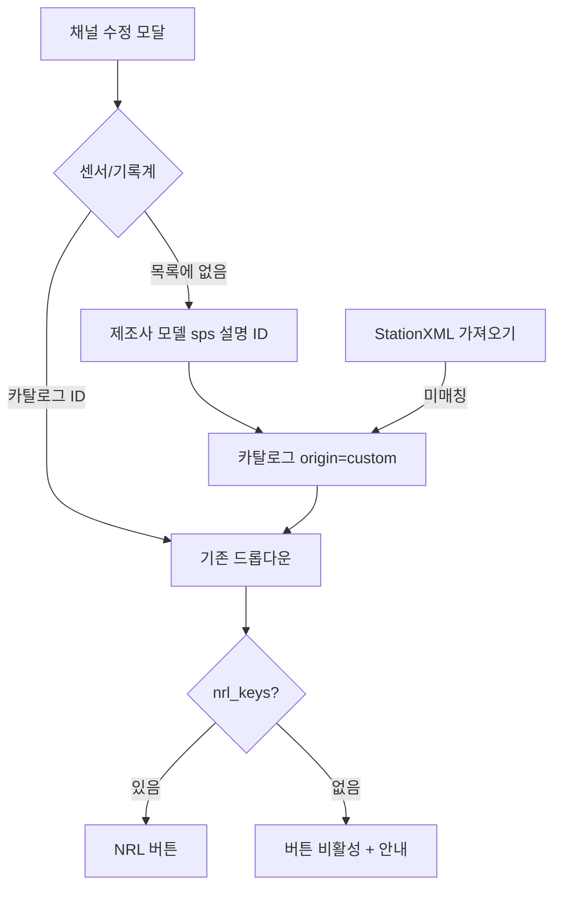

# NRL에 없는 장비 — 사용자 정의 메타데이터

상태: **제안** (코드 미착수). 아래 **선택이 필요한 항목**에 답이 오면 결정을 잠근다.

NRL 사전에 없는 센서·기록계도 제조사·모델·일련번호 등을 넣고, StationXML 장비 칸에 나가게 한다. 채널의 `extra` 키-값은 만들지 않는다 (v1 결정 4).

---

## 지금 빈칸

카탈로그에는 이미 NRL 키 없는 항목을 넣을 수 있다 (`nrl_keys` 빈 값, 카탈로그 탭 추가). 그래도 아래가 막혀 있다.

| 상황 | 지금 |
|------|------|
| 채널 수정 | 카탈로그 ID 드롭다운만. 목록에 없으면 제조사·모델을 채널에서 바로 못 넣음 |
| StationXML 가져오기 | 제조사·모델이 카탈로그와 안 맞으면 `sensor_id`/`datalogger_id`가 비고, **제조사·모델 문자열은 버려짐**. 일련번호·유형만 채널에 남음 |
| 엑셀 | 카탈로그에 없는 ID는 거절 |
| NRL 버튼 | 키가 없으면 400 |
| 응답 | NRL 키가 없으면 응답을 새로 만들 방법이 없음 (가져오기 blob 또는 이후 PZ 편집) |

시드 YAML에도 키가 빈 장비가 있다 (`Trillium120QA`, `Centaur`, `Episensor` 등). 메타데이터는 되지만 NRL·곡선·dataless는 응답이 따로 있어야 한다.

---

## 선택이 필요한 항목 (다지선다)

구현 전에 답을 고른다. 괄호는 문서 작성 시점의 **제안 기본값**이다.

### Q1. 사용자 정의 장비는 어디에 저장하나?

- **A (제안).** 카탈로그 행으로 저장 (`origin=custom`). 채널은 지금처럼 ID만 가리킨다. 같은 장비를 여러 채널이 재사용.
- **B.** 채널에 제조사·모델을 직접 저장하고 카탈로그를 우회한다.
- **C.** 카탈로그 + 채널별 제조사·모델 덮어쓰기.

B·C는 v1 “카탈로그 ID만”과 엑셀 드롭다운이 깨진다.

### Q2. 사용자 정의 장비의 계측기 응답은?

- **A (제안).** 이 단계에서는 **메타데이터만**. 응답은 StationXML/SEED 가져오기, 이후 PZ로 새로 만들기, 또는 나중에 NRL 키를 채운 뒤 NRL 적용.
- **B.** 같은 화면에서 Poles/Zeros + 단계 게인으로 응답을 **처음부터** 만든다 (`response_source=custom`).
- **C.** StationXML Response 조각 파일만 업로드.
- **D.** B와 C 둘 다.

A면 사용자 정의 장비만 있는 채널은 dataless S11에서 막힌다. B·D는 응답 곡선 PZ와 API를 공유한다.

### Q3. StationXML/SEED에서 카탈로그에 없는 장비는?

- **A (제안).** 제조사·모델이 있으면 `origin=custom` 카탈로그 항목을 **자동 생성**하고 ID를 연결. 같은 제조사·모델·(기록계면 sps)가 있으면 재사용.
- **B.** 지금처럼 ID를 비우고 경고. 제조사·모델은 계속 버려짐.
- **C.** ID는 비우되 채널에 제조사·모델 열을 추가해 보관 (Q1-B와 같음).

### Q4. 엑셀에서 없는 장비 ID는?

- **A (제안).** 지금처럼 거절. 카탈로그 시트에 먼저 넣거나, 웹에서 사용자 정의로 만든 뒤 ID를 쓴다.
- **B.** 채널 행의 새 열(제조사·모델)로 카탈로그를 자동 생성.
- **C.** 알 수 없는 ID면 제조사·모델이 비어 있어도 `CUSTOM_<ID>` 항목을 만든다.

### Q5. 사용자 정의 카탈로그 ID는 누가 정하나?

- **A.** 사용자가 항상 직접 입력.
- **B (제안).** 비우면 `CUSTOM_{제조사}_{모델}` (기록계는 `_100sps` 등). 충돌하면 `_2`. 사용자가 쓰면 그 값을 사용.
- **C.** 항상 자동. 사용자는 제조사·모델만.

### Q6. NRL 키가 없는 채널의 NRL 버튼은?

- **A (제안).** 비활성. 안내: `이 장비는 NRL 키가 없습니다. 사용자 정의 응답을 쓰거나 카탈로그에 키를 넣으세요.`
- **B.** 지금은 그대로 누르면 400.
- **C.** 센서·기록계 중 키 있는 쪽만 NRL (보통 실패하므로 비추천).

### Q7. 구현 순서는?

- **A.** 단곡선 → 겹치기 → PNG → PZ (기존 응답 곡선 계획).
- **B.** dataless SEED부터.
- **C (제안).** **사용자 정의 장비 메타데이터**를 곡선/SEED보다 먼저. 응답 생성(Q2-B)은 PZ와 같이.
- **D.** 단곡선과 사용자 정의 장비를 같이.

### Q8. 겹치기 최대 채널 수는? (응답 곡선 R3)

- **A (제안).** 8
- **B.** 4
- **C.** 제한 없음 (성능 위험)

### Q9. 나중에 같은 장비에 NRL 키를 넣으면?

- **A (제안).** 카탈로그만 갱신. 이미 `custom`/`edited`/`imported`인 채널 응답은 덮지 않음. NRL은 채널마다 버튼을 눌러야 함.
- **B.** 키를 넣는 순간 그 ID를 쓰는 모든 채널에 NRL을 다시 적용 (확인 후).

---

## 답이 오기 전 가정 (Q 기본값)

Q1-A, Q2-A, Q3-A, Q4-A, Q5-B, Q6-A, Q7-C, Q8-A, Q9-A.

답이 바뀌면 이 절과 아래 표를 고친다.

---

## 확정으로 제안하는 결정

| # | 제안 | 이유 |
|---|------|------|
| C1 | 채널 장비 FK는 계속 카탈로그 ID만 | v1 결정 4, 엑셀 드롭다운, 재사용 |
| C2 | 카탈로그에 `origin` (`seed` / `custom`)과 선택 `description` | NRL 시드와 현장 장비를 구분. 임의 키-값은 없음 |
| C3 | NRL 키는 선택. 없으면 NRL 적용 불가 (Q6) | 지금 `apply_nrl`과 같음 |
| C4 | 채널 모달에 **목록에 없음** → 제조사·모델·(기록계 sps)·설명·ID(선택) | 카탈로그 탭을 몰라도 입력 가능 |
| C5 | StationXML 미매칭 장비는 custom 카탈로그로 승격 (Q3-A) | 지금처럼 제조사·모델이 사라지지 않게 |
| C6 | 엑셀 채널 시트에 제조사·모델 열을 열지 않음 (Q4-A) | 스키마 고정. 카탈로그 시트 / 웹으로만 추가 |
| C7 | 사용자 정의 응답 생성은 Q2가 B/D일 때만. 기본(A)은 메타만 | PZ·곡선 계획과 순서를 맞춤 |
| C8 | `response_source=custom`은 Q2-B/D로 **처음부터** 만든 응답에만 | 가져온 blob은 `imported`, NRL은 `nrl`, PZ 수정은 `edited` |

---

## 화면

채널 수정:

- 센서/기록계 `<select>` 마지막에 `목록에 없음…`.
- 고르면 같은 모달에 제조사·모델 필수, 기록계는 sps 필수, 설명·ID 선택.
- 저장 시 카탈로그 POST 후 그 ID를 채널에 넣는다. 제조사·모델·sps가 이미 있으면 그 행을 쓰고 새로 만들지 않는다 (대소문자 무시, 기록계는 sps 포함).
- 드롭다운 라벨: `Guralp_CMG-3T (NRL)` / `Acme_Geophone (사용자 정의)`.
- NRL 키가 없으면 NRL 버튼 비활성 (Q6-A).

카탈로그 탭:

- `origin` 열: 시드 / 사용자 정의.
- 설명 칸. NRL 키는 계속 선택.
- 사용 중 삭제 금지는 그대로.

관측소 탭에는 장비 입력을 두지 않는다.

---

## 데이터

`equipment_catalog`에 열 추가 (SQLite는 앱 시작 시 `ALTER` 또는 재생성 안내).

| 열 | 형 | 설명 |
|----|----|------|
| `origin` | `String(16)` 기본 `seed` | `seed` 또는 `custom` |
| `description` | `Text` 선택 | 비고. 응답 수식은 넣지 않음 |

기존 시드 행은 `origin=seed`. YAML 시드에도 `origin`은 넣지 않고 적재 시 `seed`로 둔다.

채널 테이블은 그대로다. 일련번호·유형·설치/철거일은 지금처럼 채널 칸.

허용 메타데이터 (고정 스키마, extra 없음):

- 카탈로그: ID, 제조사, 모델, 기록계 sps, NRL 키(선택), 설명, origin
- 채널: 일련번호, 유형, 설치일, 철거일

넣지 않는 것: 임의 JSON, 벤더 URL, 채널별 제조사 덮어쓰기(Q1-A).

---

## API

기존 `POST /api/catalog`에 `origin` (기본 `custom` — 웹에서 만들면 custom, 시드만 seed), `description`.

채널 저장은 지금처럼 `sensor_id` / `datalogger_id`만. “목록에 없음”은 프론트가 카탈로그를 만든 뒤 ID를 넣는다.

가져오기 경고 예: `KG.SEO.--.HHZ: 카탈로그에 없는 센서 Guralp / CMG-3ESP를 사용자 정의 항목 CUSTOM_Guralp_CMG-3ESP로 추가했습니다`.

NRL 키가 없는데 `POST .../apply-nrl` → 400 유지. UI만 버튼을 숨긴다.

Q2-B/D를 고르면 추가로:

- `POST /api/channels/{id}/custom-response` — PZ 단계 + 전체 sensitivity로 blob 생성. 기존 blob이 있으면 확인 후에만 덮음.
- 또는 응답 곡선 계획의 stages API를 “응답 없음 → 생성”까지 확장.

---

## 가져오기 · 내보내기

StationXML (C5):

1. 지금처럼 제조사·모델·(기록계 sps)로 카탈로그 매칭.
2. 실패하고 제조사·모델이 있으면 custom 항목 생성/재사용 후 ID 연결.
3. 장비 칸이 비어 있으면 ID는 비움 (지금과 같음).
4. 응답 blob이 있으면 `imported` (장비 origin과 무관).

엑셀 (C6): 카탈로그 시트에 `origin`, `description` 열을 추가. 채널 시트는 그대로 ID만.

내보내기: 카탈로그 제조사·모델이 StationXML `Equipment`로 나간다. custom도 seed와 같다. NRL 키는 StationXML에 쓰지 않는다.

dataless S8: B33 문자열은 카탈로그 제조사·모델. custom도 동일.

---

## 응답 곡선 · SEED와의 관계

- 사용자 정의 장비 + 응답 없음 → 곡선 안내, dataless S11 실패 목록에 그 NSLC.
- Q2-A면 “응답 처음부터 만들기”는 PZ 구현 때 다시 연다.
- Q2-B면 PZ보다 먼저 `custom-response` 생성이 필요하다.

---

## 구현 단계 (Q7-C 기준)

1. `origin` / `description` 열, 카탈로그 API·엑셀 시트, 시드 행은 `seed`.
2. 채널 모달 “목록에 없음”, 중복 제조사·모델 재사용, ID 자동(Q5-B).
3. StationXML 미매칭 → custom 승격 + 경고 (C5).
4. NRL 버튼 비활성 안내 (Q6-A).
5. README·카탈로그 탭 라벨.
6. Q2-B/D이면 응답 생성 API (곡선/PZ와 맞춤).

---

## 테스트 (구현 시)

- 목록에 없음 → 카탈로그 `origin=custom` + 채널 ID.
- 같은 제조사·모델 두 번째 채널은 행을 재사용.
- StationXML 미매칭 장비가 재내보내기에서 제조사·모델이 살아 있음.
- 엑셀에 없는 센서ID는 계속 400 (Q4-A).
- NRL 키 없는 항목에 apply-nrl → 400.
- 사용 중 custom 항목 삭제 불가.

---

## 이번 범위 밖

- 채널 `extra` 키-값, 알 수 없는 엑셀 열 흡수
- NRL 트리를 앱 안에서 탐색하는 브라우저
- 제조사 로고·데이터시트 파일 첨부
- 채널마다 다른 제조사로 같은 ID를 덮어쓰기
- FIR 계수를 손으로 넣는 기록계 응답 설계기 (Q2-B여도 PZ+게인만)

---

## 위험

| 위험 | 대응 |
|------|------|
| 자동 생성 ID가 시드 ID와 충돌 | 충돌 시 `_2`. 시드 코드 규칙(`Guralp_…`)과 `CUSTOM_` 접두로 구분 |
| 가져오기마다 custom 행이 늘어남 | 제조사·모델·sps로 재사용 |
| custom만 있고 응답 없음인데 dataless 요청 | S11·S12가 NSLC를 보여 줌 |
| Q1-B로 바꾸면 엑셀·내보내기 분기 | 기본은 Q1-A로 고정해 분기 없음 |
