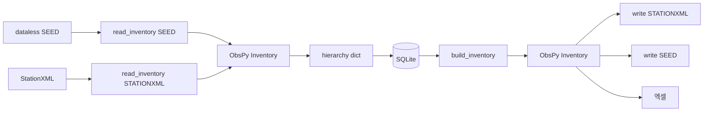
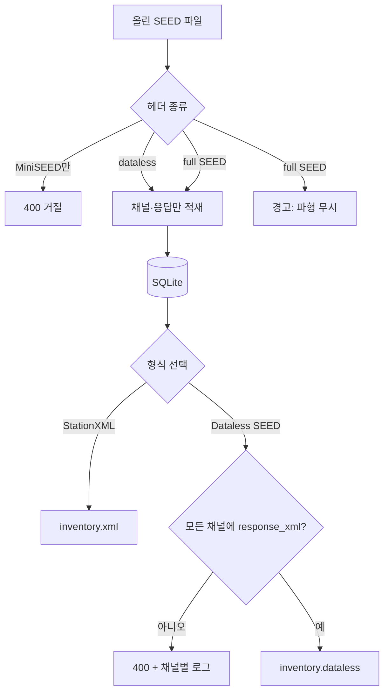

# Dataless SEED 가져오기·내보내기 — 구현 전 계획

상태: **결정 확정** (코드 미착수). 구현 착수 가능.

참조: [SEED Reference Manual V2.4](https://www.fdsn.org/pdf/SEEDManual_V2.4.pdf) (FDSN, May 2012).  
현재 앱: 엑셀·StationXML만 지원. 내부 원본은 SQLite 계층 + `response_xml`(StationXML blob).

---

## 목표

지진 메타데이터를 **dataless SEED**로도 넣고 빼게 한다. 파형(MiniSEED / full SEED data records)은 다루지 않는다.

매뉴얼(Ch.1, p. 권장 사용): dataless SEED는 Volume · Abbreviation · Station Control Header만 포함하고, Time Span Header와 data record는 생략한다. 메타데이터가 파형보다 자주 바뀌므로 따로 배포하기 위한 형식이다.

성공 기준:

1. `.seed` / `.dataless` / `.dlsv` 파일을 올리면 기존과 같은 Network → Station → Channel 행이 생긴다.
2. 채널 Response가 있으면 지금처럼 `response_xml` blob으로 남는다.
3. 웹·CLI에서 dataless SEED를 내려받을 수 있다.
4. StationXML ↔ DB ↔ dataless SEED 왕복에서 NSLC·좌표·sps·응답 단계(poles/zeros, gain)가 유지된다. **바이트 단위 동일 SEED 파일은 보장하지 않는다.**

---

## 왜 블록ette를 직접 짜지 않는가

SEED는 고정 폭 ASCII 블록ette(10, 11, 30–34, 50–62 등)의 논리 레코드(권장 4096바이트)다. 직접 직렬화하면 약어 사전 교차참조·레코드 패딩·업데이트 플래그를 모두 재구현해야 한다.

ObsPy 1.4.1 `Inventory`가 이미 이 변환을 한다.

- 읽기: `read_inventory(..., format="SEED")`
- 쓰기: `inv.write(..., format="SEED")` → dataless (파형 없음)

앱은 **Inventory를 허브**로 두고, 기존 `xml_io` 매핑을 StationXML 전용이 아니라 Inventory 전용으로 끌어올린다.



블록ette를 손으로 쓰거나 원본 SEED를 DB에 보관하지 않는다.



---

## 확정 결정

2026-08-17 사용자 확인: **S4 메타만+경고**, **S11 응답 없는 채널이면 내보내기 전체 실패**.

| # | 결정 | 이유 |
|---|------|------|
| S1 | 내부 원본은 계속 계층 DB + StationXML `response_xml` | v1 왕복·NRL·엑셀 재import 보존 로직을 그대로 씀 |
| S2 | ObsPy `format="SEED"`만 사용. 커스텀 블록ette writer 없음 | 매뉴얼 준수는 ObsPy xseed가 담당 |
| S3 | 저장·배포 대상은 dataless만. 파형 레코드는 DB에 넣지 않음 | 이 앱은 메타데이터 관리기 |
| S4 | full SEED(헤더+파형)는 **메타데이터만** 가져오고 경고 | 현장 배포본에 파형이 붙어 있어도 메타는 살린다 |
| S5 | MiniSEED만 있는 파일(블록ette 50/52 없음)은 거절 | 가져올 채널이 없음. 빈 import 가드와 동일 |
| S6 | SEED 필드는 ASCII. 한글 사이트명 등은 내보내기 때 ASCII로 줄이거나 관측소 코드로 대체하고 경고 | 매뉴얼: 제어 헤더는 ANSI ASCII, 대문자 권장 |
| S7 | 네트워크 코드 2자, 관측소 5자, 채널 3자, 위치코드 2자를 내보내기 전 검사 | B50 F16 / B50 F3 / B52 F4 / B52 F3 길이 |
| S8 | 장비는 B33 Generic Abbreviation(계측기 이름) → 카탈로그 제조사·모델 매칭 | SEED에는 StationXML Equipment 객체가 없음 |
| S9 | 응답 왕복은 StationXML blob 경유. SEED 약어 사전(B41–48, B60) 재현은 ObsPy에 맡김 | 바이트 동일성 불필요 |
| S10 | NRL 자동 부착 없음 (v1과 동일) | 명시적 NRL만 |
| S11 | 응답(`response_xml`)이 없는 채널이 **하나라도** 있으면 dataless 내보내기 **전체 실패** (400). 부분 파일은 만들지 않음 | 불완전한 SEED가 조용히 나가지 않게 |
| S12 | 내보내기 실패는 **채널(NSLC)마다 원인**을 서버 로그·API 본문·화면·CLI에 남긴다 | 어느 채널이 왜 막혔는지 바로 확인 |
| S13 | 웹 내보내기에 **형식 선택**(StationXML / Dataless SEED)을 둔다. 지금은 선택지가 없음 | 한 화면에서 목적 형식을 고른 뒤 받는다 |

### S4 — 가져오기: 메타만 + 경고

- 파일에 Volume/Station Control과 data record가 같이 있어도 채널·응답만 적재한다.
- 경고 예: `파형 레코드는 무시하고 메타데이터만 가져왔습니다`.
- 파형은 디스크·DB에 남기지 않는다.
- Time Span Header(B70–74)도 저장하지 않는다.
- 스테이션 헤더가 없는 MiniSEED는 S5로 거절한다 (경고가 아니라 400).

### S11 — 내보내기: 전체 실패

- `GET /api/export/dataless`와 CLI SEED 출력 전에 모든 채널의 `response_xml`을 검사한다.
- 비어 있는 채널이 있으면 파일을 쓰지 않고 400. 메시지에 NSLC 목록을 넣는다.
  예: `Dataless SEED를 만들 수 없습니다. 응답이 없는 채널: KG.SEO.--.HHZ, KG.BUS.--.HHN`
- 웹은 기존 오류 배너로 보여 준다. 잘린 `.dataless`를 내려주지 않는다.
- 해결: 해당 채널에 NRL을 적용하거나, StationXML에서 응답이 있는 상태로 다시 가져온다.
- 실패 채널은 S12로 한 줄씩 로그한다.

### S12 — 내보내기 실패 로그 (채널 단위)

지금은 서버에 전용 export 로거가 없고, 웹은 빨간 배너 한 줄만 보여 준다. dataless(그리고 StationXML writer 실패)는 아래처럼 남긴다.

**검사 항목과 로그 문구**

| 원인 | 로그/화면 문구 예 |
|------|-------------------|
| `response_xml` 없음 | `KG.SEO.--.HHZ: 계측기 응답이 없습니다` |
| 네트워크 코드 길이 | `KGX: 네트워크 코드는 2자여야 합니다` |
| 관측소/채널/위치 코드 길이 | `KG.SEOUL.--.HHZ: 관측소 코드는 5자 이하여야 합니다` |
| `response_xml` 파싱 실패 | `KG.SEO.--.HHZ: 저장된 응답 XML을 읽지 못했습니다: …` |
| ObsPy SEED writer 예외 | `KG.SEO.--.HHZ: SEED 응답 단계를 쓰지 못했습니다: …` |

**어디에 남기는가**

- 서버: `logging.getLogger("stationxml_manager.export")` ERROR. 한 채널 한 줄. `response_xml` 본문은 넣지 않는다.
- API 400 JSON:
  ```json
  {
    "detail": "Dataless SEED를 만들 수 없습니다. 문제 채널 2개",
    "errors": [
      {"nslc": "KG.SEO.--.HHZ", "reason": "계측기 응답이 없습니다"},
      {"nslc": "KG.BUS.--.HHN", "reason": "계측기 응답이 없습니다"}
    ]
  }
  ```
- 웹: 배너 + 채널별 목록. 다운로드는 시작하지 않음.
- CLI: 같은 줄을 stderr에 찍고 종료 코드 ≠ 0.

S11과 같이 **파일을 만들지 않은 뒤에** 로그를 남긴다. 성공한 내보내기는 INFO 한 줄(`dataless 36 channels`).

### S13 — 지금 선택 옵션이 있는가 / 어떻게 둘 것인가

**지금(v1):** 없다. 가져오기/내보내기 탭은 버튼이 나뉘어 있다.

- StationXML 다운로드 → `/api/export/stationxml`
- 엑셀 다운로드 → `/api/export/xlsx`
- 엑셀 템플릿
- Dataless SEED 버튼·형식 콤보는 **아직 없음**

**계획:** 메타데이터 볼륨은 라디오로 고른 뒤 한 번 받는다.

- 형식: `StationXML` / `Dataless SEED` (기본 StationXML)
- 버튼: **다운로드** → 고른 형식의 API를 호출
- 엑셀·템플릿은 표 왕복용이므로 옆에 그대로 둔다
- CLI는 출력 확장자로 고른다: `-o inventory.xml` / `-o inventory.seed`
- API는 경로를 유지한다 (`/api/export/stationxml`, `/api/export/dataless`). 콤보는 UI만의 선택이다.

StationXML 내보내기는 응답이 없어도 지금처럼 허용한다. S11·S12의 “전체 실패 + 채널 로그”는 **Dataless SEED를 골랐을 때**만 적용한다.

---

## 매뉴얼 필드 ↔ 우리 모델

### Volume / Abbreviation (읽기만, 저장 안 함)

| SEED | 역할 | 앱 |
|------|------|-----|
| B10 Volume Identifier | 볼륨 시각, 논리 레코드 길이 | 무시 (ObsPy가 소비) |
| B11 Volume Station Index | 관측소 인덱스 | 무시 |
| B30 Data Format Dictionary | 채널이 참조 | 내보내기는 ObsPy 기본값 |
| B33 Generic Abbreviation | 계측기 이름 | 센서/기록계 카탈로그 매칭 문자열 |
| B34 Units Abbreviation | M/S, V 등 | Response 단계 단위. blob에 포함 |

### Station Control — 저장 대상

| SEED | 우리 필드 |
|------|-----------|
| B50 F3 Station call letters | `stations.code` |
| B50 F4–6 lat / lon / elev | 관측소 좌표·고도 |
| B50 F9 Site name (최대 60자 ASCII) | `site_name` (가져오기). 내보내기 때 ASCII 제약 |
| B50 F13–14 유효 시작·끝 | `creation_date` / `termination_date` |
| B50 F16 Network Code (2자, v2.3+) | `networks.code`. 없거나 공백이면 **거절** |
| B51 Station Comment | `station_description` 또는 첫 댓글. 다중 댓글은 첫 건만 (엑셀과 같음) |
| B52 F3 Location ID (2자) | `channels.location` |
| B52 F4 Channel ID (3자) | `channels.channel` |
| B52 F6 Instrument identifier → B33 | 센서 카탈로그 매칭. 실패 시 경고, ID 비움 |
| B52 F7 Optional comment (≤30자) | `sensor_serial` 후보 또는 `comment` |
| B52 F10–13 채널 lat/lon/elev/depth | 채널 좌표·심도 |
| B52 F14–15 azimuth / dip | 방위각·경사. 없으면 채널 코드로 추정 |
| B52 F18 Sample rate | `sample_rate` (필수) |
| B52 F19 Max clock drift | `clock_drift` |
| B52 F21 Channel flags | `channel_types` (C/G/T 등 → 기존 콤마 목록으로 매핑) |
| B52 F22–23 start / end | 채널 시작·끝. 시작 없으면 거절 |
| B53–58, 61, 62 응답 단계 | ObsPy `Channel.response` → `dump_response_xml` |
| B60 Response Reference | ObsPy가 사전을 풀어 Response로 만듦 |

기록계는 SEED에 별도 블록ette가 없다. 가져오기 때는 기록계 ID를 비우고 경고할 수 있다. 내보내기 때는 카탈로그 제조사·모델을 B33 문자열에 합친다 (`Guralp CMG-3T` 또는 `sensor + datalogger`).

---

## 왕복 한계 (UI에 명시할 문구)

엑셀과 같은 성격의 한계다.

- 한글·비ASCII 사이트명·설명·댓글은 SEED에 그대로 못 넣는다.
- 네트워크 설명, 운영기관, `restricted_status`는 StationXML 전용에 가깝다. SEED에 없으면 내보내기에서 빠지거나 B33/B51에 우겨 넣지 않는다 (손실 허용).
- 카탈로그 ID는 SEED에 없다. 다시 가져오면 제조사·모델 문자열이 맞을 때만 ID가 복구된다.
- 응답은 수학적으로 같아야 하지만, 블록ette 번호·약어 사전 키·레코드 패딩은 달라질 수 있다.
- 채널 유형 플래그(B52 F21)와 StationXML `types`의 매핑이 1:1이 아닐 수 있다.

---

## 구현 단계

코드는 이 순서로만 넣는다. 한 단계가 테스트 통과한 뒤에 다음으로 간다.

### 1. Inventory 허브 리팩터

- `xml_io.read_stationxml`에서 Inventory → hierarchy 매핑을 `inventory_to_hierarchy(inv, session)`로 분리.
- StationXML 읽기는 `read_inventory(..., format="STATIONXML")` 후 그 함수 호출.
- 기존 StationXML·엑셀 테스트가 그대로 통과해야 함.

### 2. dataless 읽기

- `read_seed(path_or_buf, session)`: `format="SEED"`.
- 확장자 `.seed`, `.dataless`, `.dlsv` 및 내용 스니프(논리 레코드 헤더 `V` volume).
- MiniSEED만이면 ValidationError: 한글 메시지 (S5).
- full SEED면 가져오기는 성공하고 경고에 “파형 레코드는 무시하고 메타데이터만 가져왔습니다” (S4).
- 네트워크 코드 없음/길이 위반은 거절.
- 응답은 기존 `dump_response_xml`.
- import `source="seed"`.

### 3. dataless 쓰기

- `inventory_to_seed_bytes(inv) -> bytes`: `inv.write(format="SEED")`.
- 내보내기 전 코드 길이·ASCII 검사. 길이 위반은 400. 한글 사이트명은 관측소 코드로 대체하고 경고 (S6–S7).
- **S11:** 채널 중 `response_xml`이 비어 있으면 즉시 400. `inv.write`를 호출하지 않는다.
- Response는 있으나 ObsPy writer가 단계 오류로 실패해도 마찬가지로 전체 실패 (부분 파일 없음).
- `GET /api/export/dataless` → `inventory.dataless` (`application/vnd.fdsn.seed` 또는 `application/octet-stream`).

### 4. API · CLI · UI

- `POST /api/import`: 확장자·스니프에 seed 추가. 업로드 용량 제한 그대로.
- CLI: 입력 확장자 인식, `-o inventory.seed`.
- 가져오기 탭: `accept`에 seed 추가. **형식 라디오**(StationXML / Dataless SEED) + 다운로드 (S13).
- 실패 시 채널별 `errors`를 배너 아래 목록으로 표시하고, 서버 로그에도 동일 문구 (S12).

### 5. 테스트

- ObsPy로 만든 합성 Inventory를 SEED로 쓴 뒤 import → NSLC·좌표·sps.
- poles/zeros + sensitivity가 있는 채널: SEED → DB → StationXML → 다시 SEED → 다시 읽었을 때 단계 수·단위 유지.
- MiniSEED 샘플 거절 (S5).
- 합성 full SEED(헤더+더미 파형): import 성공, `warnings`에 파형 무시 문구, DB에 파형 없음 (S4).
- 한글 `site_name` 내보내기 경고/대체.
- 네트워크 코드 3자 내보내기 400.
- 채널 하나라도 응답이 없으면 `/api/export/dataless`와 CLI SEED 출력이 400이고 바이트가 없음 (S11).
- 그 400 본문에 `errors[].nslc` / `reason`이 있고, caplog에 같은 NSLC 줄이 있다 (S12).
- StationXML 내보내기는 응답 없는 채널이 있어도 200 (S13).
- 모든 채널에 응답이 있을 때만 SEED 파일이 나오고, 다시 읽으면 NSLC가 같다.
- 엑셀 재import가 seed로 넣은 `response_xml`을 지우지 않음 (기존 보존 테스트 확장).

### 6. 문서

- README 형식 표, PLAN 체크리스트, 이 파일의 한계 절을 UI 노트와 맞춤.
- `docs.html` 탭에 이 문서 포함.

---

## 손대지 않는 것 (이번 범위 밖)

- MiniSEED 파형 저장·뷰어
- RESP / SC3ML / XSEED 파일
- 블록ette 60 사전을 DB에 별도 테이블로 보관
- SEED 논리 레코드 길이·엔디안을 사용자가 고르게 하기 (ObsPy 기본, 보통 4096·big-endian)
- 다중 B51/B59 댓글을 배열로 저장 (지금도 첫 댓글만)
- FDSNWS에서 dataless를 원격으로 받기

---

## 위험

| 위험 | 대응 |
|------|------|
| ObsPy SEED writer가 불완전 응답 단계에서 예외 | S11: 내보내기 전 전 채널 Response 검사. writer 예외도 한글 400, 파일 없음 |
| 구버전 SEED(네트워크 코드 없음) | 거절 + “네트워크 코드(B50 F16)가 필요합니다” |
| 위치코드 공백 vs `"--"` vs `""` | 가져오기 때 `""`로 정규화 (지금 StationXML과 동일) |
| B33 문자열이 카탈로그와 다름 | 경고만, 채널은 저장 (지금 XML 장비 미매칭과 동일) |
| 한글 ASCII 손실 | 경고 목록 + README |

---

## 작업량 감각

침습은 중간이다. DB 스키마 변경은 없다. 핵심은 `inventory` 변환 한 곳과 import/export 입구 세 곳(API, CLI, UI)이다. 응답이 있는 합성 SEED 왕복 테스트가 공수의 상당 부분을 차지한다.

S4·S11이 확정되었으므로 구현은 위 1→6 단계 순으로 시작한다.
