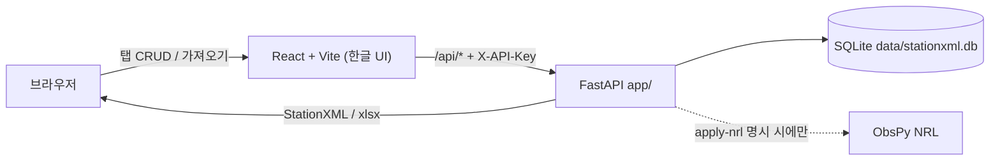
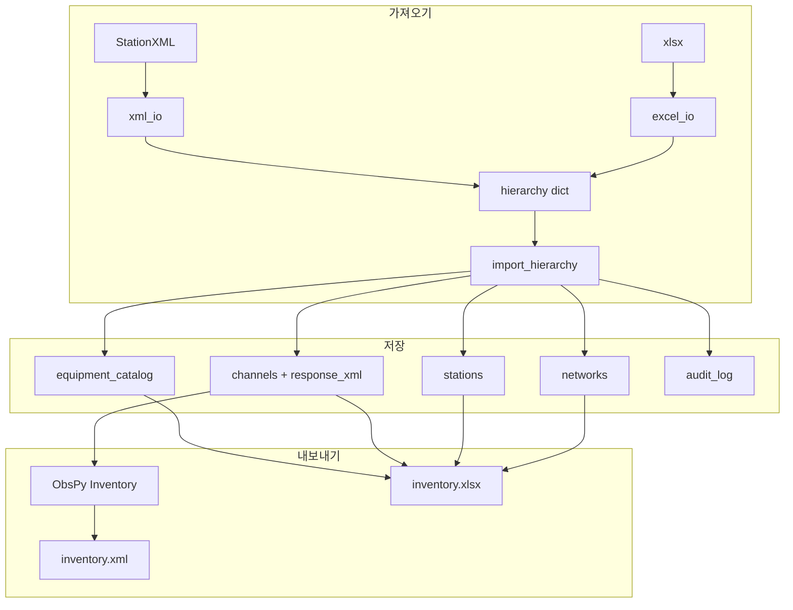

# StationXML 메타데이터 관리 — 계획과 구현

엑셀·StationXML을 읽고 고친 뒤 다시 내보내는 로컬 웹 관리기의 **확정 계획**과 **구현 결과**입니다.

- 상태 표기: [x] 구현 완료
- 스택: FastAPI + ObsPy + SQLite (`app/`), React + Vite + TypeScript (`frontend/`)
- 사용법·API·엑셀 열: [`README.md`](README.md)
- HTML 보기: [`docs.html`](docs.html)
- 다음 작업(결정 확정): [`DATALESS_SEED.md`](DATALESS_SEED.md) — dataless SEED 가져오기·내보내기

실제 백엔드 경로는 `backend/`이 아니라 `app/`입니다. CLI는 `python -m app.cli`입니다.

---

## 목표

1. 엑셀(한 행 = 한 채널)과 StationXML을 같은 DB 계층(Network → Station → Channel)으로 가져온다.
2. 웹에서 네트워크·관측소·채널·장비 카탈로그를 CRUD한다.
3. StationXML / 엑셀로 내보낸다. 계측기 Response는 StationXML blob으로 보존한다.
4. 센서·기록계는 자유 입력이 아니라 카탈로그 ID만 허용한다.
5. 변경이력을 남긴다. 복원·로그인 계정은 v1 밖이다.

---

## 확정 결정

| # | 결정 | 이유 |
|---|------|------|
| 1 | 가져온 StationXML Response는 `response_xml` blob으로 보관. NRL은 선택 | 엑셀에 응답이 없어도 StationXML 왕복이 깨지지 않게 |
| 2 | 네트워크·관측소 필드는 부모 수준에 저장·편집 | 엑셀 행마다 좌표가 갈리면 거절 |
| 3 | 카탈로그는 웹 + 엑셀 카탈로그 시트로 편집 | YAML은 최초 시드만. 이후 원본은 DB |
| 4 | `extra` 키-값 없음. 알 수 없는 엑셀 열은 거절 | 스키마를 고정해 왕복을 예측 가능하게 |
| 5 | 내보내기 때 NRL 자동 부착 없음 | 명시적 **NRL** / `--apply-nrl`만 |

나중에 고정한 동작:

- 엑셀 재가져오기가 기존 응답을 지우지 않음 (전체 교체 포함, NSLC+시작시간 매칭)
- 사용 중인 카탈로그 항목은 삭제 불가
- 엑셀 왕복 한계를 UI·문서에 명시
- UI는 한국어
- 위경도·시간 순서·기록계 sps 검사

---

## 아키텍처

---

## 구현 범위

### 백엔드 (`app/`)

- [x] SQLite + SQLAlchemy 1.4 classic `declarative_base` (ObsPy 1.4.1 호환)
- [x] Network / Station / Channel / EquipmentCatalog / AuditLog
- [x] 엑셀 읽기: 한글·영문 별칭, 필수 열, 알 수 없는 열 거절
- [x] 엑셀 쓰기: 채널 + 카탈로그 시트, 드롭다운 템플릿
- [x] 빈 템플릿: `write_excel(..., include_channels=False)` — 현재 인벤토리를 넣지 않음
- [x] StationXML 읽기: Response → `response_xml`, 장비는 카탈로그 ID로 매칭
- [x] StationXML 쓰기: blob을 Channel.response에 복원
- [x] upsert + `canonical_time()`으로 시작시간 중복 방지
- [x] `replace_all` 시 매칭 채널의 응답 보존, 빈 파일 거절
- [x] 카탈로그 시드 YAML, 웹 CRUD, 사용 중 삭제 차단
- [x] 제조사·모델 매칭 시 sps가 다르면 다른 기록계로 보지 않음
- [x] NRL은 채널 단위 명시 적용만
- [x] 위경도, 시간 순서, sps, 심도 0 허용
- [x] 로컬 전용 API, `STATIONXML_API_KEY`, 프록시 차단, CORS, 업로드 용량
- [x] 파싱 오류 400 한글, IntegrityError 409
- [x] CLI `python -m app.cli`

### 프론트엔드 (`frontend/`)

- [x] 채널 / 관측소 / 네트워크 / 카탈로그 / 가져오기·내보내기 / 변경이력 탭
- [x] 센서·기록계 드롭다운 (카탈로그 ID만)
- [x] API 키 입력, `localStorage` 즉시 동기화, 다운로드에도 헤더
- [x] 전체 교체 확인, 삭제·필터 오류 처리, 이력 JSON 파싱 보호
- [x] 관측소 `network_id` 변경 UI

### 테스트 (`tests/`)

- [x] 코어: 엑셀 왕복, 응답 보존, 시간 정규화, 카탈로그, 검증
- [x] API: 접근 제어, 업로드 제한, `confirm_replace`, 템플릿, 관측소 이동

---

## 코드 리뷰 반영

리뷰에서 나온 동작 오류·보안·UX를 반영한 내용입니다.

| 이슈 | 반영 |
|------|------|
| `depth=0` PUT이 `0 or None`으로 NOT NULL 500 | 0을 유지하는 갱신 |
| `replace_all`이 `response_xml`을 지움 | NSLC+시작시간으로 blob 보존. 빈 import 거절. UI 확인 + `confirm_replace` |
| 시작시간 문자열 불일치로 중복 행 | `canonical_time()` 후 비교·저장 |
| 카탈로그 제조사·모델이 다른 sps로 떨어짐 | sps가 다르면 매칭 실패 |
| 카탈로그 upsert가 `nrl_keys`/`sample_rate`를 None으로 지움 | 값이 있을 때만 덮어씀. 사용 중 기록계 sps 비우기 금지 |
| `/api/template.xlsx`가 전체 인벤토리를 넣음 | 채널 없는 템플릿 |
| 관측소 `network_id` 변경이 무시됨 | 중복 검사 후 갱신 |
| 인증 없는 API + CORS `*` | 로컬만 허용. 키 설정 시 전체 요구. CORS Origin 제한. 프록시 키 필수 |
| CORS가 인증보다 안쪽 | 401/403에도 CORS 헤더 |
| 업로드 크기 제한 없음 | `STATIONXML_MAX_UPLOAD_MB` (기본 20, 잘못된 env는 기본값) |
| 파싱 예외가 500 | 400 한글. 고유키 409 |
| 프론트 다운로드·삭제·필터 레이스 | fetch+헤더, 오류 표시, request-id로 필터 레이스 방지 |

---

## v1에 넣지 않은 것

- `extra` 키-값, 알 수 없는 엑셀 열을 extra로 흡수
- 내보내기 시 NRL 자동 부착
- 변경이력에서 복원
- 로그인 계정·권한 모델
- 다중 사용자 동시 편집 잠금
- FDSN 원격 조회
- dataless SEED (계획만: [`DATALESS_SEED.md`](DATALESS_SEED.md))

---

## v1.1 — dataless SEED (결정 확정)

SEED Manual V2.4의 dataless 볼륨(Volume + Abbreviation + Station Control, 파형 없음)을 엑셀·StationXML과 같은 입구로 넣는다.

- 상태: [ ] 결정 확정, 구현 대기
- 내부 원본은 그대로 DB + `response_xml`. ObsPy `Inventory.write/read format="SEED"`가 변환 허브
- **S4** full SEED → 메타만 적재 + 파형 무시 경고. MiniSEED 전용은 거절
- **S11** 응답 없는 채널이 하나라도 있으면 dataless 내보내기 전체 실패 (400, 파일 없음)
- 한글 사이트명은 ASCII 제약. 상세: [`DATALESS_SEED.md`](DATALESS_SEED.md)

---

## 파일 역할

| 경로 | 역할 |
|------|------|
| `app/main.py` | FastAPI, 접근 제어, import/export 엔드포인트 |
| `app/crud.py` | 계층 upsert, 응답 보존, NRL, 카탈로그 가드 |
| `app/excel_io.py` | 엑셀 I/O, 템플릿 |
| `app/xml_io.py` | StationXML → hierarchy |
| `app/inventory.py` | DB → ObsPy Inventory / Response blob |
| `app/catalog.py` | YAML 시드, 제조사·모델·sps 매칭 |
| `app/columns.py` | 열 별칭과 네트워크/관측소/채널 수준 |
| `app/validation.py` | 위경도·시간·sps, `canonical_time` |
| `app/cli.py` | 템플릿·변환·`--apply-nrl` |
| `frontend/src/App.tsx` | 한글 탭 UI |
| `frontend/src/api.ts` | API 키 헤더, 업로드/다운로드 |
| `equipment_catalog.yaml` | 빈 DB일 때만 시드 |
| `docs.html` | README/PLAN/SEED 계획 HTML 로더 |
| `scripts/build_docs_html.py` | 마크다운을 docs.html에 내장 |
| `DATALESS_SEED.md` | dataless SEED 구현 전 계획 |
