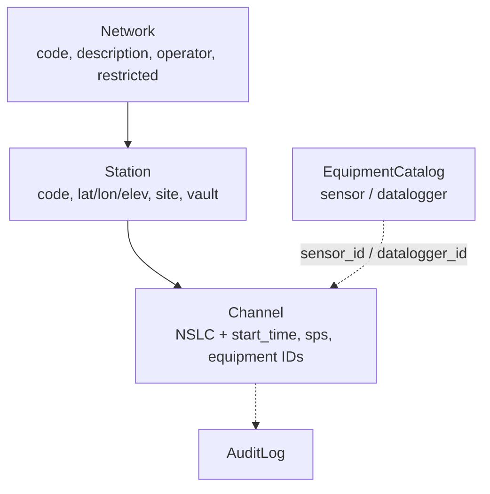
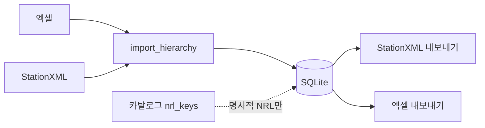

# StationXML 메타데이터 관리

엑셀 또는 StationXML을 올려 네트워크·관측소·채널 메타데이터를 고치고, 다시 StationXML·엑셀로 내보내는 로컬 웹 도구입니다. 센서와 기록계는 장비 카탈로그 ID만 고를 수 있습니다.

가독성 있는 HTML 문서는 [`docs.html`](docs.html)에서 이 파일과 [`PLAN.md`](PLAN.md), [`DATALESS_SEED.md`](DATALESS_SEED.md), [`RESPONSE_CHART.md`](RESPONSE_CHART.md)를 불러와 봅니다.

- 상태: v1 구현 완료 (코드 리뷰 반영 포함)
- 스택: FastAPI + ObsPy + SQLite (`app/`), React + Vite + TypeScript (`frontend/`)
- UI: 한국어

---

## 구성

```
stationxml_manager/
├── app/                      FastAPI · ObsPy · SQLite
│   ├── main.py               HTTP API, 접근 제어, 업로드 제한
│   ├── cli.py                템플릿·가져오기·내보내기 CLI
│   ├── models.py             Network / Station / Channel / Catalog / Audit
│   ├── crud.py               upsert, NRL, 응답(Response) 보존
│   ├── excel_io.py           엑셀 읽기/쓰기, 빈 템플릿
│   ├── xml_io.py             StationXML → 계층 구조
│   ├── inventory.py          DB → ObsPy Inventory
│   ├── catalog.py            시드 YAML, 제조사·모델 매칭
│   ├── columns.py            엑셀 열 이름·수준(네트워크/관측소/채널)
│   ├── validation.py         위경도·시간·sps 검사, 시간 정규화
│   ├── audit.py              변경이력 JSON
│   ├── db.py                 SQLite 세션
│   └── errors.py             ValidationError / AppError
├── frontend/                 React + Vite (한글 UI)
├── tests/                    pytest (코어 + API)
├── equipment_catalog.yaml    최초 장비 목록(이후는 DB가 원본)
├── data/stationxml.db        SQLite (실행 후 생성)
├── scripts/build_docs_html.py  README/PLAN을 docs.html에 내장
├── README.md · PLAN.md · DATALESS_SEED.md · RESPONSE_CHART.md
└── docs.html                 마크다운 HTML 로더
```

SQLite 파일은 `data/stationxml.db`에 저장됩니다.

---

## 데이터 모델

엑셀 한 행은 한 채널입니다. DB는 계층 구조입니다.



| 수준 | 저장 위치 | 엑셀에서 |
|------|-----------|----------|
| 네트워크 | `networks` | 같은 네트워크 코드의 행은 설명이 일치해야 함 |
| 관측소 | `stations` | 사이트명·좌표 등이 행마다 다르면 가져오기 실패 |
| 채널 | `channels` | 한 행 = 한 채널. 고유키는 관측소 + 위치코드 + 채널 + 시작시간 |
| 장비 | `equipment_catalog` | `catalog_sensors` / `catalog_dataloggers` 시트 또는 웹 카탈로그 탭 |
| 이력 | `audit_log` | 웹 변경이력 탭 (복원 기능 없음) |

채널의 계측기 응답은 `response_xml` blob으로 보관합니다. 출처는 `response_source` (`none` / `imported` / `nrl`)입니다. Poles/Zeros 편집이 생기면 `edited`를 추가할 예정입니다 ([`RESPONSE_CHART.md`](RESPONSE_CHART.md)).

---

## 웹으로 실행

```bash
cd stationxml_manager
python -m venv .venv
source .venv/bin/activate   # Windows: .venv\Scripts\activate
pip install -r requirements.txt

# 백엔드
uvicorn app.main:app --reload --host 127.0.0.1 --port 8000

# 프론트엔드 (다른 터미널)
cd frontend
npm install
npm run dev
```

브라우저에서 `http://localhost:5173`을 엽니다. Vite가 `/api`를 `8000`으로 프록시합니다. API 문서: `http://localhost:8000/docs`.

프론트를 빌드해 백엔드와 같이 쓰려면:

```bash
cd frontend && npm install && npm run build
cd ..
uvicorn app.main:app --host 127.0.0.1 --port 8000
```

### 문서 HTML 로더

`docs.html`은 `README.md`와 `PLAN.md`를 읽어 목차·표·Mermaid 다이어그램으로 보여 줍니다.

```bash
cd stationxml_manager
python -m http.server 8080
# http://localhost:8080/docs.html
```

마크다운을 고친 뒤 내장 사본을 갱신하려면:

```bash
python scripts/build_docs_html.py
```

`file://`로 바로 열면 최신 `.md`를 fetch하지 못할 수 있습니다. 그때는 내장 사본을 쓰거나, 로더의 **파일 열기**로 로컬 마크다운을 고릅니다.

---

## 접근 제어

기본 API는 **로컬 요청만** 허용합니다 (`127.0.0.1`, `::1`).

다른 컴퓨터에서 접속하려면 API 키와 허용 Origin을 설정하고, 웹 화면 상단에도 같은 API 키를 입력합니다. API 키를 설정하면 **로컬 접속도 키가 필요**합니다.

리버스 프록시를 사용하는 경우에도 반드시 API 키를 설정해야 합니다. `X-Forwarded-For` / `Forwarded`가 붙은 요청은 키가 없으면 차단됩니다. CORS 미들웨어는 인증보다 바깥에 있어 401/403에도 브라우저가 오류 본문을 읽습니다.

```bash
export STATIONXML_API_KEY="충분히-긴-임의의-값"
export STATIONXML_CORS_ORIGINS="http://192.168.0.10:5173"
uvicorn app.main:app --host 0.0.0.0 --port 8000
```

| 환경 변수 | 기본 | 설명 |
|-----------|------|------|
| `STATIONXML_API_KEY` | (없음) | 있으면 모든 `/api`에 `X-API-Key` 필요 |
| `STATIONXML_CORS_ORIGINS` | `http://localhost:5173,http://127.0.0.1:5173` | 허용 Origin 목록 |
| `STATIONXML_MAX_UPLOAD_MB` | `20` | 가져오기 파일 크기. 잘못된 값은 기본값으로 되돌림 |

프론트 상단 **API 키** 칸은 입력 즉시 `localStorage`에 저장되고, 내보내기 다운로드에도 같은 헤더를 붙입니다.

---

## CLI

```bash
# 드롭다운이 있는 엑셀 템플릿 (채널 행 없음, 카탈로그 시트만)
python -m app.cli --write-template stations.xlsx

# 엑셀 또는 StationXML → DB 적재 후 StationXML 저장
python -m app.cli stations.xlsx -o inventory.xml
python -m app.cli inventory.xml -o inventory.xml --replace-all

# 카탈로그 NRL 키로 응답을 붙인 뒤 저장
python -m app.cli inventory.xml -o inventory.xml --apply-nrl
```

NRL 응답은 내보내기 때 자동으로 붙지 않습니다. 웹의 **NRL** 버튼 또는 `--apply-nrl`일 때만 적용합니다.

`--replace-all`은 네트워크·관측소·채널을 지운 뒤 다시 넣습니다. 같은 NSLC+시작시간에 있던 `response_xml`은 새 파일에 응답이 없어도 유지합니다. 채널이 하나도 없는 파일은 거절하며 기존 자료는 바꾸지 않습니다.

---

## 웹 UI

| 탭 | 역할 |
|----|------|
| 채널 | 필터, 추가/수정/삭제, 센서·기록계 드롭다운, NRL 적용 |
| 관측소 | 좌표·사이트 정보. 네트워크 이동 가능(중복 코드 검사) |
| 네트워크 | 설명·운영기관·공개제한 |
| 장비 카탈로그 | 센서/기록계 CRUD. 사용 중인 ID는 삭제 불가 |
| 가져오기/내보내기 | xlsx·xml 업로드, StationXML/엑셀/템플릿 다운로드 |
| 변경이력 | 감사 로그 조회. 복원 없음 |

작업자 이름은 이력에만 남습니다. 로그인 계정은 없습니다.

전체 교체 가져오기는 확인 대화상자와 `confirm_replace` 폼 값이 있어야 실행됩니다.

---

## 엑셀 사용

한 행 = 한 채널입니다. 같은 관측소의 사이트명·좌표 등이 행마다 다르면 가져오기가 실패합니다.

**필수 열:** 네트워크, 관측소, 채널, 위도, 경도, 시작시간, 샘플링레이트

센서ID·기록계ID는 `catalog_sensors` / `catalog_dataloggers` 시트 값만 쓸 수 있습니다. 알 수 없는 열 이름은 거절됩니다. `extra` 키-값 열은 없습니다.

### 시트

| 시트 | 내용 |
|------|------|
| `channels` | 채널 행 (한글 헤더 또는 영문 별칭) |
| `catalog_sensors` | 센서 카탈로그 |
| `catalog_dataloggers` | 기록계 카탈로그 (sps 포함) |

웹 **템플릿 받기**와 CLI `--write-template`는 카탈로그 시트와 헤더만 넣고 **채널 행은 비웁니다**. 현재 DB 인벤토리를 엑셀로 받으려면 **엑셀 내보내기**를 씁니다.

### 열 이름 (한글 헤더 / 영문)

네트워크: 네트워크, 네트워크설명, 운영기관, 공개제한

관측소: 관측소, 위도, 경도, 고도, 관측소명, 위치설명, 시군구, 지역, 국가, 설치환경, 지질, 관측소설명, 설치일, 철거일

채널: 채널, 시작시간, 샘플링레이트, 위치코드, 심도, 끝시간, 방위각, 경사, 채널설명, 비고, 채널유형, 시각오차, 채널위도, 채널경도, 채널고도, 센서ID, 센서일련번호, 센서유형, 센서설치일, 센서철거일, 기록계ID, 기록계일련번호, 기록계유형, 기록계설치일, 기록계철거일

방위각·경사를 비우면 채널 코드 마지막 글자(`Z`/`N`/`E`/`1`/`2`)로 추정합니다. 심도 `0`은 유효한 값입니다.

### 엑셀 왕복 한계

계측기 응답(Response)은 StationXML에만 있습니다. 엑셀은 표 메타데이터용입니다.

- StationXML을 올린 뒤 엑셀을 다시 가져와도, 같은 NSLC+시작시간의 기존 응답은 유지됩니다.
- 전체 교체(`replace_all`)도 매칭되는 채널의 응답 blob을 보존합니다.
- 엑셀만으로 NRL 응답을 실을 수는 없습니다. 웹 **NRL** 또는 CLI `--apply-nrl`을 씁니다.

---

## 가져오기 · 내보내기 · NRL



- **upsert:** 같은 네트워크/관측소/NSLC+시작시간이 있으면 수정, 없으면 추가.
- **시간 정규화:** `canonical_time()`으로 UTC 문자열을 맞춰, `...00`과 `...000000Z`가 다른 행으로 들어가지 않습니다.
- **응답:** 들어오는 파일에 Response가 있으면 덮어쓰고, 없으면 기존 blob을 유지합니다.
- **빈 가져오기:** 채널 0건이면 400으로 거절하고 DB를 비우지 않습니다.
- **NRL:** 채널마다 카탈로그 `nrl_keys`로 ObsPy NRL을 붙입니다. 키가 없거나 매칭 실패면 오류입니다. 내보내기 때 자동 적용하지 않습니다.

---

## 값 검사

- 위도 -90~90, 경도 -180~180
- 시작시간 < 끝시간
- 고도 0이면 경고(저장은 허용)
- 기록계 카탈로그 sps와 채널 샘플링레이트 일치 (제조사·모델만 같고 sps가 다르면 매칭 실패)
- 채널이 쓰는 장비 ID는 카탈로그에서 삭제 불가
- 사용 중인 기록계의 샘플링레이트를 비울 수 없음
- 카탈로그 upsert 때 `nrl_keys` / `sample_rate`는 값이 있을 때만 덮어씀
- 파싱 오류는 400 한글 메시지, 고유키 충돌은 409

---

## HTTP API

인증: 로컬이거나 `X-API-Key`. 업로드는 `STATIONXML_MAX_UPLOAD_MB` 제한.

| 방법 | 경로 | 설명 |
|------|------|------|
| GET | `/api/health` | 상태 |
| GET/PUT | `/api/networks`, `/api/networks/{id}` | 네트워크 |
| GET/POST/PUT/DELETE | `/api/stations`, `/api/stations/{id}` | 관측소. PUT으로 `network_id` 이동 가능 |
| GET/POST/PUT/DELETE | `/api/channels`, `/api/channels/{id}` | 채널 |
| POST | `/api/channels/{id}/apply-nrl` | NRL 응답 적용 |
| GET/POST/PUT/DELETE | `/api/catalog`, `/api/catalog/{id}` | 장비 카탈로그 |
| POST | `/api/import` | `file` + `replace_all` + `confirm_replace` + `actor` |
| GET | `/api/export/stationxml` | StationXML 다운로드 |
| GET | `/api/export/xlsx` | 엑셀 다운로드 (채널 포함) |
| GET | `/api/template.xlsx` | 빈 템플릿 (카탈로그만) |
| GET | `/api/history` | 변경이력 (`limit`, `nslc`) |

---

## 테스트

```bash
cd stationxml_manager
PYTHONPATH=. pytest -q
```

ObsPy 1.4.1은 SQLAlchemy 1.4가 필요합니다 (`requirements.txt`의 `sqlalchemy==1.4.54`).

---

## 계획과 범위

확정 결정, 구현 체크리스트, 코드 리뷰 반영은 [`PLAN.md`](PLAN.md)를 봅니다. dataless SEED는 [`DATALESS_SEED.md`](DATALESS_SEED.md), 응답 곡선·겹치기·PZ 편집·PNG는 [`RESPONSE_CHART.md`](RESPONSE_CHART.md)에 계획이 있습니다.
