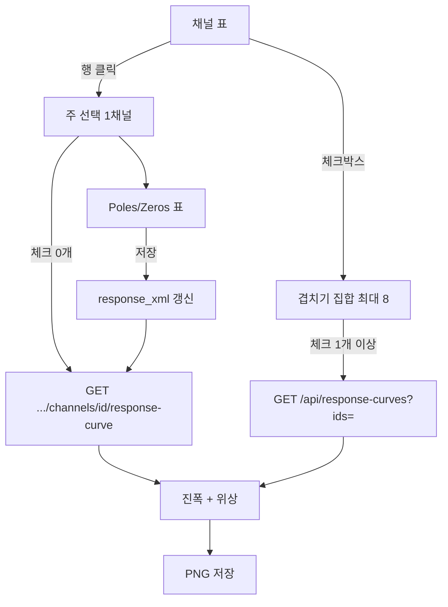

# 채널 응답 곡선 차트 — 구현 전 계획

상태: **제안** (코드 미착수).

웹에서 관측소·채널을 고르면 저장된 계측기 응답(`response_xml`)을 **진폭·위상 곡선**으로 보여 준다. 여러 채널을 겹치고, Poles/Zeros를 고치고, 보이는 차트를 PNG로 저장한다.

dataless SEED 계획과 별개이며, 이미 DB에 있는 StationXML Response blob을 쓴다. 지금 채널 탭은 `imported` / `nrl` / `없음`만 보여 주고 곡선은 없다.

---

## 목표

1. 네트워크 → 관측소 → 채널(시작시간 포함)을 고르면 응답 곡선을 본다.
2. **주파수–진폭(로그)** 과 **주파수–위상** 두 패널.
3. 체크한 여러 채널을 **같은 축에 겹친다** (범례·색).
4. Poles/Zeros 단계 값을 표에서 고치고 저장하면 blob·곡선·이력이 갱신된다.
5. 화면에 보이는 차트를 **PNG로 저장**한다.
6. 응답이 없으면 안내만. `response_xml` 원문은 브라우저에 보내지 않는다.

성공 기준:

- 응답 있는 채널 하나: 1초 안에 곡선.
- 최대 8채널 겹치기. 실패한 채널은 목록으로 남고 나머지는 그린다 (S11 전체 실패와 다름).
- PZ 저장 후 곡선이 바뀌고 `response_source`가 `edited`. evalresp가 실패하면 blob은 그대로.
- PNG에 제목·범례·두 패널이 들어가고, 화면과 같은 그림이다.

---

## 확정으로 제안하는 결정

| # | 제안 | 이유 |
|---|------|------|
| R1 | 백엔드가 ObsPy로 주파수용답을 계산해 JSON을 주고, 프론트가 그린다 | PPSD_v1과 같음. 미리보기와 PNG가 같은 그림 |
| R2 | 채널 탭 아래 패널. 행 클릭 = 주 선택, 체크박스 = 겹치기 | 이미 필터·목록이 있음. 탭을 새로 만들지 않음 |
| R3 | 겹치기 최대 **8**채널. 공통 주파수 격자. 일부 실패는 경고만 | 축이 읽히게. SEED 내보내기(S11)와 다름 |
| R4 | 기본 출력 `VEL`. `DIS` / `ACC`는 겹친 채널 모두에 동일 적용 | 비교가 같으려면 단위가 같아야 함 |
| R5 | 주파수: 로그 `npts` 200, `0.001 Hz` ~ 선택 채널 Nyquist의 **최솟값**(최대 100) | 한 채널만 고주파로 튀지 않게 |
| R6 | 단일 채널 응답 없음 → 400 + 안내. 겹치기에서 일부 없음 → 그 채널만 빼고 그림 | 빈 축을 기본으로 두지 않음 |
| R7 | 실패는 `stationxml_manager.response`에 NSLC·원인. API와 화면 동일 | 내보내기 S12와 같은 확인 방식 |
| R8 | 차트는 `d3`. PNG는 **화면 SVG를 래스터** (서버 matplotlib PNG 아님) | 저장 그림 = 보고 있는 그림 |
| R9 | PZ 편집은 `PolesZeros` 단계만. FIR·계수·다항식은 읽기 전용 | 잘못된 계수 편집을 막음 |
| R10 | PZ 저장 시 확인 대화 + audit. `response_source=edited` | 응답을 바꾸면 dataless·곡선이 달라짐 |
| R11 | 겹치기 배치는 `GET /api/response-curves` (채널 id 경로와 분리) | `/api/channels/response-curves`는 `{id}`와 충돌하기 쉬움 |
| R12 | PZ 저장 후 evalresp로 검증. 실패하면 **트랜잭션 롤백** (blob 불변) | 깨진 응답을 DB에 남기지 않음 |
| R13 | A0(`normalization_factor`)는 저장 시 재계산. 전체 InstrumentSensitivity는 건드리지 않음 | 단계 이득과 센서 PZ를 섞지 않음 |
| R14 | 켤레 짝이 아니면 **경고 후 저장**(200). evalresp 실패만 400 | 강제 짝맞추기는 하지 않음 |

구현 순서는 **단곡선 → 겹치기 → PNG → PZ 편집**. PZ가 데이터 원본을 바꾸므로 마지막이다.

---

## 화면



- 위: 기존 채널 표. 첫 열에 겹치기 체크박스. 행 클릭은 주 선택(하이라이트).
- 아래: 곡선 패널. 주 선택이 있고 응답이 있으면 PZ 패널을 펼 수 있다.
- **곡선 대상**
  - 체크 0개: 주 선택만 (단채널 API).
  - 체크 1–8개: 체크된 채널만 (배치 API). 주 선택이 체크되어 있지 않으면 곡선에 안 그린다.
- `has_response`가 아닌 행은 체크 불가(비활성). 9번째 체크는 거절 토스트: `겹치기는 최대 8채널입니다`.
- 헤더: 주 선택 NSLC·시작·센서/기록계·`response_source`. 겹치면 범례에 최대 8개 NSLC.
- 컨트롤: `DIS | VEL | ACC`, 새로고침, **PNG 저장**(곡선이 있을 때만), (주 선택) **Poles/Zeros**.
- 응답 없음(주 선택, 체크 0개): `이 채널에는 계측기 응답이 없습니다. StationXML/SEED를 가져오거나 NRL을 적용하세요.`
- 겹치기 부분 실패: 성공분 곡선 + 위 경고 `KG.BUS.--.HHN: 계측기 응답이 없습니다`.
- 배치 결과가 전부 실패: 빈 축 대신 안내. HTTP는 200.

관측소 탭에는 곡선을 두지 않는다. 채널 수정 모달과 곡선 패널은 별개다.

---

## API

### 단채널 곡선

`GET /api/channels/{channel_id}/response-curve`

| 쿼리 | 기본 | 설명 |
|------|------|------|
| `output` | `VEL` | `DIS` / `VEL` / `ACC` |
| `min_freq` | `0.001` | Hz |
| `max_freq` | `min(sps/2, 100)` | Nyquist 초과는 400 |
| `npts` | `200` | 50–1000 |

**200** 본문: `channel_id`, `nslc`, `start_time`, `sample_rate`, `output`, `input_units`, `output_units`, `frequencies`, `amplitude`, `phase_deg`, `response_source`.

### 겹치기 (R3, R11)

`GET /api/response-curves?ids=1,2,3&output=VEL&min_freq=0.001&npts=200`

- `ids` 1–8개(쉼표). 중복 제거, 순서 유지. 빈 값·9개 이상·숫자가 아니면 400.
- `max_freq`를 주면 그 값을 쓰고, 선택한 채널 Nyquist 최솟값보다 크면 400.
- `max_freq` 생략 시 `min(각 채널 Nyquist, 100)`. 응답 없는 채널의 sps는 격자 계산에 **포함**한다 (목록에 올린 채널의 공통 대역).
- **200** (부분 성공 허용):

```json
{
  "output": "VEL",
  "min_freq": 0.001,
  "max_freq": 50,
  "npts": 200,
  "frequencies": [0.001, 0.0011],
  "series": [
    {
      "channel_id": 1,
      "nslc": "KG.SEO.--.HHZ",
      "start_time": "2020-01-01T00:00:00",
      "sample_rate": 100,
      "amplitude": [],
      "phase_deg": [],
      "response_source": "nrl"
    }
  ],
  "errors": [
    {"channel_id": 2, "nslc": "KG.BUS.--.HHN", "reason": "계측기 응답이 없습니다"}
  ]
}
```

`series`가 비고 `errors`만 있어도 200. 클라이언트가 안내를 보여 준다.

단채널 API를 N번 호출하지 않는다. 겹치기는 **공통 주파수**가 필요하므로 배치 API만 쓴다.

### Poles/Zeros 읽기·저장 (R9, R10, R12–R14)

`GET /api/channels/{channel_id}/response-stages`

```json
{
  "channel_id": 1,
  "nslc": "KG.SEO.--.HHZ",
  "response_source": "imported",
  "stages": [
    {
      "stage_sequence_number": 1,
      "type": "PolesZeros",
      "editable": true,
      "input_units": "M/S",
      "output_units": "V",
      "pz_transfer_function_type": "LAPLACE (RADIANS/SECOND)",
      "normalization_frequency": 1.0,
      "normalization_factor": 1.0,
      "stage_gain": 2000.0,
      "stage_gain_frequency": 1.0,
      "poles": [{"real": -0.037, "imag": 0.037}],
      "zeros": [{"real": 0.0, "imag": 0.0}]
    },
    {
      "stage_sequence_number": 3,
      "type": "Coefficients",
      "editable": false,
      "input_units": "V",
      "output_units": "COUNTS"
    }
  ]
}
```

- PZ가 아니면 `poles`/`zeros`를 주지 않고 `editable: false`.
- `pz_transfer_function_type`은 표시만. PUT으로 바꾸지 않는다.

`PUT /api/channels/{channel_id}/response-stages/{stage_number}?actor=`

```json
{
  "poles": [{"real": -0.037, "imag": 0.037}, {"real": -0.037, "imag": -0.037}],
  "zeros": [{"real": 0.0, "imag": 0.0}],
  "stage_gain": 2000.0,
  "normalization_frequency": 1.0
}
```

허용 필드만 받는다. `pz_transfer_function_type`, `normalization_factor`, FIR 계수는 거절(400).

저장 절차 (한 트랜잭션):

1. 현재 `response_xml`을 읽는다. 없으면 400.
2. ObsPy로 Response를 연다. `stage_sequence_number`가 PZ가 아니면 400.
3. poles/zeros/stage_gain/normalization_frequency를 넣는다. 극·영점은 각 최대 64개. 유한 실수만.
4. 해당 단계 A0를 재계산한다. **InstrumentSensitivity / 다른 단계는 그대로**.
5. blob으로 직렬화한 뒤, 기본 격자에서 evalresp를 한 번 돌린다.
6. evalresp 실패 → 롤백, 400. 성공 → `response_source=edited`, audit, 커밋.
7. 응답 본문은 GET stages와 같고, 켤레 경고가 있으면 `warnings: ["켤레가 아닌 극이 있습니다"]`.

감사 기록:

- `action=update`, `entity_type=channel`, `summary=Poles/Zeros 수정 (stage 1)`.
- `before_json` / `after_json`에는 **해당 단계 스냅샷만** (poles, zeros, gain, fnorm, A0, `response_source`). `response_xml` 전문은 넣지 않는다.

곡선은 클라이언트가 단채널 또는 배치 GET을 다시 호출한다.

**오류**

| 상황 | 코드 | detail 예 |
|------|------|-----------|
| 채널 없음 | 404 | 채널을 찾을 수 없습니다 |
| 응답 없음 | 400 | KG.SEO.--.HHZ: 계측기 응답이 없습니다 |
| 주파수/output 잘못 | 400 | max_freq는 Nyquist 이하여야 합니다 |
| ids 9개 이상 | 400 | 겹치기는 최대 8채널입니다 |
| evalresp 실패 (단채널 GET) | 400 | KG.SEO.--.HHZ: 응답 곡선을 계산하지 못했습니다: … |
| evalresp 실패 (PZ PUT) | 400 | KG.SEO.--.HHZ: 수정한 응답을 계산하지 못해 저장하지 않았습니다: … |
| PZ 단계 아님 | 400 | stage 3은 Poles/Zeros가 아닙니다 |
| 허용 외 필드 | 400 | normalization_factor는 직접 수정할 수 없습니다 |
| 켤레 짝 불일치 | **200** + `warnings` | 켤레가 아닌 극이 있습니다 |

서버 로그: `ERROR/WARNING stationxml_manager.response` + NSLC + 원인.

---

## 계산

`load_response` 후 `get_evalresp_response_for_frequencies`.

- 단채널: 그 채널 격자, `max_freq = min(요청 또는 Nyquist, 100)`.
- 겹치기: 공통 로그 격자, `max_freq = min(각 Nyquist, 요청값, 100)`.
- 곡선은 **합성 응답** 한 줄/채널. 단계별 분해 곡선은 범위 밖.
- 캐시 없음. PZ 저장 직후 다시 계산하면 새 blob을 쓴다.

---

## 겹치기 (R3, R11)

채널 표 체크와 주 선택은 독립이다.

- 색: 고정 8색, 색맹 구분 가능한 팔레트. 체크 순서 = 색 인덱스.
- 범례: `NSLC`. 같은 NSLC가 시작시간이 다르면 `NSLC 2020-01-01`처럼 날짜를 붙인다.
- 호버: 해당 곡선만 강조, 나머지는 흐리게. 툴팁에 NSLC·주파수·진폭·위상.
- 체크 해제·단위 변경·새로고침: 배치 API를 다시 호출.
- 필터로 표에서 사라진 채널은 체크 집합에서 빼지 않는다. 다시 보이면 체크 유지. 탭을 떠나면 체크는 초기화해도 된다 (세션 저장 없음).

S11(dataless 전체 실패)과 달리, 여기 실패는 **부분 성공**이 기본이다.

---

## PNG 저장 (R8)

PPSD_v1 `frontend/src/charts/exportPng.ts`와 같이 **보이는 SVG를 캔버스에 그려 PNG**로 받는다. 응답 차트는 WebGL이 없으므로 SVG만 래스터하면 된다.

- 버튼 **PNG 저장**. `series`가 1개 이상일 때만 활성.
- 파일명:
  - 단채널(체크 0개 또는 성공 1개): `{NSLC}_{OUTPUT}_response.png`  
    예: `KG.SEO.--.HHZ_VEL_response.png`
  - 겹치기(성공 2개 이상): `response_compare_{N}ch_{OUTPUT}.png`  
    예: `response_compare_3ch_VEL.png`
- 그림 안에 넣을 것: 제목(단채널 NSLC 또는 `응답 비교 (N채널)`), 출력 단위, 두 패널, 축 제목, 범례, 부분 실패가 있으면 작은 주석.
- 픽셀은 CSS 크기의 2배(레티나, 상한 3배). 배경은 현재 테마(밝음/어둠)와 같게. PPSD exportPng의 고정 흰 배경을 그대로 쓰지 않는다.
- 텍스트는 SVG `<text>`만 쓴다 (`foreignObject` 금지). 래스터가 깨지지 않게.
- 서버 `/api/export/response.png`는 두지 않는다. 화면과 다른 그림이 나오지 않게.

---

## Poles/Zeros 편집 (R9, R10, R12–R14)

주 선택 채널만 편집한다. 겹친 다른 채널의 PZ는 열지 않는다.

- PZ 단계마다 접는 표. 극/영점 행: 실수·허수. 행 추가/삭제.
- 단계 게인·정규화 주파수는 수정 가능. A0는 읽기 전용(저장 시 재계산 안내).
- `pz_transfer_function_type`·입력/출력 단위는 읽기 전용.
- FIR / Coefficients / Polynomial / ResponseList 단계는 이름·단위만 읽기 전용.
- **저장** 전 확인: `계측기 응답을 수정합니다. 곡선과 Dataless SEED 내용이 바뀝니다. 계속할까요?`
- 켤레가 아니면 저장은 하고 노란 경고. 자동으로 켤레를 만들지 않는다.
- 저장 성공 후 주 선택 곡선(그리고 그 채널이 체크되어 있으면 겹치기)을 다시 그린다. 표의 응답 칸은 `edited`.
- NRL을 다시 적용하면 `edited`가 `nrl`로 덮인다 (기존 NRL 확인과 동일).
- 엑셀 재가져오기의 응답 보존 규칙 그대로: NSLC+시작이 같으면 `edited` blob도 유지. StationXML/SEED로 같은 채널을 다시 가져오면 `imported`가 덮는다.
- blob 전체 XML 편집기는 두지 않는다.

`response_source` 열은 `String(16)`이라 `edited`(6)는 스키마 변경 없이 추가한다. README의 출처 목록(`none` / `imported` / `nrl`)은 구현 때 `edited`를 덧붙인다.

---

## 프론트

`d3` + `src/charts/responseCurve.ts` (다중 series) + `src/charts/exportResponsePng.ts`.

- 위 진폭 로그–로그, 아래 위상 로그 x · 선형 ° (−180~180 또는 데이터 범위).
- 리사이즈 시 재렌더. PNG는 그 SVG를 래스터.
- 채널 탭을 목록 + 아래 차트 패널로 나눈다. 기존 수정/NRL/삭제 버튼은 유지.

---

## 구현 단계

1. 단채널 `eval_response_curve` + GET + 테스트.
2. 채널 탭 주 선택·빈 안내·D3 단곡선·단위 전환.
3. 체크박스 + `GET /api/response-curves` + 범례·부분 실패.
4. PNG 저장 (단곡선·겹치기 모두, 테마 배경).
5. stages GET/PUT, 확인, A0 재계산, evalresp 검증·롤백, audit, 저장 후 곡선 갱신.
6. README 출처에 `edited` 추가, 이 문서 체크리스트.

SEED(v1.1)와 병행할 필요 없다. blob만 있으면 된다.

---

## 테스트 (구현 시)

- 단채널: 응답 있음 / 없음 / Nyquist 초과 / 잘못된 output.
- 겹치기: 공통 `max_freq` = min Nyquist, ids 9개 → 400, 일부 없음 → 200 + `errors`, 전부 없음 → 200 + 빈 `series`.
- PZ: FIR PUT → 400, 허용 외 필드 → 400, 성공 후 `response_source=edited`·audit 단계 스냅샷, evalresp 실패 시 blob 불변, 켤레 불일치 → 200 + warnings.
- PNG는 프론트 헬퍼(파일명)만 단위 테스트. 서버 PNG API는 없음.

---

## 이번 범위 밖

- 단계별(센서만 / 기록계만) 곡선
- 관측소 탭에 전 채널 곡선 나열
- 차트에서 극·영점을 드래그로 이동
- 응답 XML 원문 편집
- A0·변환함수 유형·InstrumentSensitivity 직접 수정
- 서버 matplotlib PNG
- 겹치기 집합을 로컬스토리지에 저장

---

## 위험

| 위험 | 대응 |
|------|------|
| evalresp 실패 | R7 로그. 단채널 GET은 400, 겹치기는 해당 채널만 `errors`, PZ PUT은 롤백 후 400 |
| PZ 수정으로 SEED 내보내기 실패 | S11·S12가 NSLC를 보여 줌. 저장 확인 문구로 인지 |
| 8채널·npts 1000 느림 | npts 기본 200, 상한 8 |
| PNG와 화면 불일치 | 서버 렌더 없이 SVG 래스터만. 테마 배경을 같이 그림 |
| 켤레 아닌 극 | 경고 후 저장. 계산이 안 되면 PUT 롤백 |
| `/api/channels/response-curves` 라우팅 충돌 | R11, 최상위 `/api/response-curves` |
| audit에 blob 전문 | 단계 스냅샷만 기록 |
