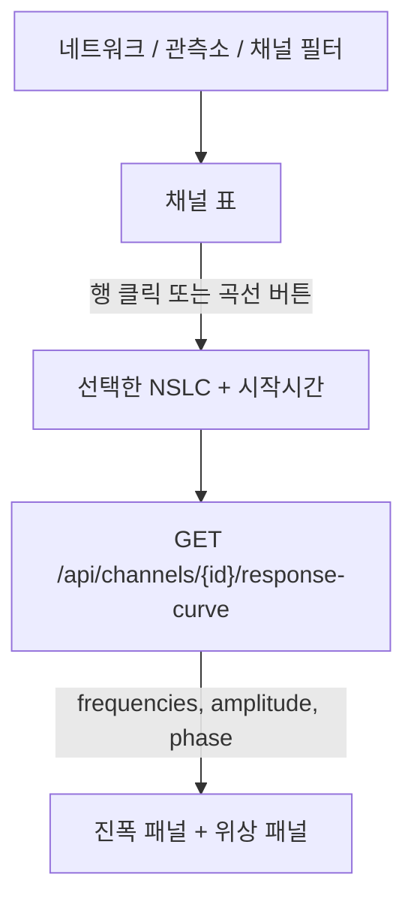

# 채널 응답 곡선 차트 — 구현 전 계획

상태: **제안** (코드 미착수).

웹에서 관측소·채널 메타데이터를 고르면, 저장된 계측기 응답(`response_xml`)을 **진폭·위상 곡선**으로 보여 준다. dataless SEED 계획과 별개이며, 이미 DB에 있는 StationXML Response blob을 쓴다.

지금 채널 탭은 응답 칸에 `imported` / `nrl` / `없음`만 보여 주고, 곡선은 없다. 프론트에 차트 라이브러리도 없다.

---

## 목표

1. 네트워크 → 관측소 → 채널(시작시간 포함)을 고르면 그 채널의 응답 곡선을 본다.
2. 표준 계측기 응답 그림과 같이 **주파수–진폭(로그)** 과 **주파수–위상** 두 패널을 그린다.
3. 응답이 없으면 곡선을 그리지 않고, NRL 적용 또는 StationXML/SEED 가져오기를 안내한다.
4. 브라우저에 `response_xml` 원문을 보내지 않는다. 백엔드가 숫자만 계산한다.

성공 기준:

- `has_response`인 채널을 고르면 1초 안에 곡선이 나온다 (로컬, 채널 하나).
- 진폭은 로그–로그, 위상은 로그 주파수·선형 각도.
- 응답 없는 채널은 한글 안내만 보이고 500이 나지 않는다.

---

## 확정으로 제안하는 결정

| # | 제안 | 이유 |
|---|------|------|
| R1 | 백엔드가 ObsPy로 주파수용답을 계산해 JSON을 주고, 프론트가 그린다 | PPSD_v1과 같음. matplotlib PNG는 확대·비교가 불편 |
| R2 | 채널 탭에서 행을 선택(또는 **곡선** 버튼)하고, 네트워크/관측소/채널 콤보로도 고른다 | 이미 필터·목록이 있음. 탭을 새로 만들지 않음 |
| R3 | 한 번에 채널 **하나**. 여러 채널 겹쳐 그리기는 다음 단계 | 첫 구현을 단순하게 |
| R4 | 기본 출력 단위는 속도(`VEL`). `DIS` / `ACC` 전환 가능 | ObsPy `plot(output="VEL")` 관행 |
| R5 | 주파수: 로그 간격 `npts`(기본 200), 기본 구간 `0.001 Hz` ~ `min(Nyquist, 100)` | evalresp 안정 구간 |
| R6 | `response_xml` 없음 → 200이 아니라 **404/400** + 한글. 차트 영역에 안내 | 빈 축을 그리지 않음 |
| R7 | 계산 실패는 `stationxml_manager.response` 로거에 NSLC와 원인. API `detail`과 동일 | 내보내기 S12와 같은 확인 방식 |
| R8 | 차트 라이브러리는 `d3` (축·로그 스케일). 히트맵/WebGL 없음 | 같은 저장소 PPSD_v1과 맞춤. 의존성 하나 |

---

## 화면

채널 탭을 위(목록) / 아래(곡선)로 나눈다.



- 표 행을 클릭하면 선택(기존 **수정**과 구분). 선택된 행은 배경만 다르게.
- **곡선** 버튼은 `has_response`일 때만 활성.
- 패널 헤더: `KG.SEO.--.HHZ` · 시작시간 · 센서/기록계 ID · 출처(`nrl`/`imported`).
- 컨트롤: 출력 단위 `DIS|VEL|ACC`, 새로고침.
- 응답 없음: `이 채널에는 계측기 응답이 없습니다. StationXML/SEED를 가져오거나 NRL을 적용하세요.`
- 관측소만 고르고 채널을 안 고르면 곡선을 그리지 않고 `채널을 선택하세요`.

관측소 탭에서는 곡선을 그리지 않는다. 응답은 채널 단위다. 관측소를 고르면 채널 탭 필터에 관측소 코드를 넣고 이동하는 정도는 선택 사항(이번 범위 밖이어도 됨).

---

## API

`GET /api/channels/{channel_id}/response-curve`

| 쿼리 | 기본 | 설명 |
|------|------|------|
| `output` | `VEL` | `DIS` / `VEL` / `ACC` |
| `min_freq` | `0.001` | Hz, 0보다 커야 함 |
| `max_freq` | `min(sps/2, 100)` | Nyquist를 넘으면 거절 |
| `npts` | `200` | 50–1000 |

인증·CORS는 다른 `/api`와 같다.

**200**

```json
{
  "channel_id": 1,
  "nslc": "KG.SEO.--.HHZ",
  "start_time": "2024-01-01T00:00:00.000000Z",
  "sample_rate": 100.0,
  "output": "VEL",
  "input_units": "M/S",
  "output_units": "COUNTS",
  "frequencies": [0.001, 0.0011],
  "amplitude": [1.2e3, 1.21e3],
  "phase_deg": [-90.0, -89.5],
  "response_source": "imported"
}
```

`amplitude`는 복소 응답의 절댓값, `phase_deg`는 도(degree).

**오류**

| 상황 | 코드 | detail 예 |
|------|------|-----------|
| 채널 없음 | 404 | 채널을 찾을 수 없습니다 |
| 응답 없음 | 400 | KG.SEO.--.HHZ: 계측기 응답이 없습니다 |
| output/주파수 잘못됨 | 400 | max_freq는 Nyquist 이하여야 합니다 |
| blob 파싱·evalresp 실패 | 400 | KG.SEO.--.HHZ: 응답 곡선을 계산하지 못했습니다: … |

서버 로그 한 줄: `ERROR stationxml_manager.response KG.SEO.--.HHZ: 계측기 응답이 없습니다`

---

## 계산

`app/inventory.py`의 `load_response`로 blob을 읽은 뒤 ObsPy `Response.get_evalresp_response(t_samp, nfft, output=...)` 또는 주파수 배열에 대한 `get_evalresp_response_for_frequencies`를 쓴다.

- 주파수 배열은 로그 간격.
- `t_samp = 1 / sample_rate`.
- 단계(poles/zeros, FIR)를 프론트에서 분해해 그리지 않는다. **합성 응답 한 곡선**만.
- 계산은 요청마다. 채널 수가 적고 npts≤1000이라 캐시는 넣지 않는다.

matplotlib `response.plot()` PNG는 쓰지 않는다. `requirements.txt`의 matplotlib는 ObsPy 의존용으로 남긴다.

---

## 프론트 그리기

`frontend`에 `d3`를 추가한다. `src/charts/responseCurve.ts`:

- 위: 진폭, x·y 로그, 단위 라벨 (`Hz`, 출력 단위).
- 아래: 위상, x 로그, y −180~180 또는 데이터 범위.
- 그리드, 선택 NSLC를 제목으로.
- 리사이즈에 다시 그림.
- PNG 저장은 이번 범위 밖(필요하면 다음 단계).

---

## 구현 단계

1. `eval_response_curve(channel_row, output, min_freq, max_freq, npts)` + 단위 테스트 (합성 poles/zeros).
2. `GET /api/channels/{id}/response-curve` + 응답 없음/잘못된 주파수 테스트.
3. 채널 탭 선택 + 빈 패널 안내.
4. D3 두 패널 연결, 단위 전환.
5. README·이 문서 체크리스트.

SEED 가져오기(v1.1)와 동시에 할 필요는 없다. 응답 blob만 있으면 된다. SEED를 나중에 넣어도 곡선 API는 그대로다.

---

## 이번 범위 밖

- 여러 채널 곡선 겹치기
- poles/zeros를 차트에서 편집
- 단계별(센서만 / 기록계만) 곡선
- 응답 PNG·SVG 다운로드
- 관측소 탭에 채널 곡선을 모두 나열

---

## 위험

| 위험 | 대응 |
|------|------|
| evalresp가 일부 FIR/다항식에서 실패 | R7 로그 + 400. 빈 차트 없음 |
| Nyquist 밖 주파수 | max_freq 검사 |
| 로그 축 0·음수 | 주파수·진폭 ≤0 점은 제외하고 로그 |
| 큰 blob | 원문을 응답 JSON에 넣지 않음 |
